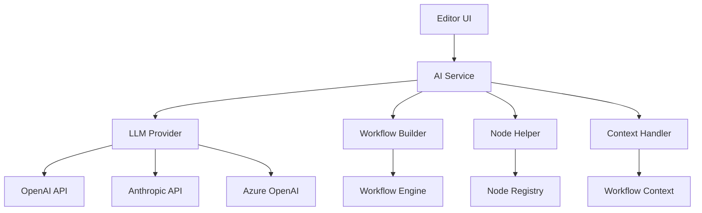

# AI Assistant Feature

## Overview

The AI Assistant feature provides intelligent workflow building assistance powered by large language models (LLMs). It helps users create workflows through natural language descriptions, suggests improvements, and provides contextual help throughout the n8n interface.

## Quick Start

### Basic Setup

1. **Configure AI Provider**:
```bash
# For OpenAI
export N8N_AI_PROVIDER=openai
export N8N_AI_OPENAI_API_KEY=your-api-key

# For Anthropic
export N8N_AI_PROVIDER=anthropic
export N8N_AI_ANTHROPIC_API_KEY=your-api-key

# For Azure OpenAI
export N8N_AI_PROVIDER=azure-openai
export N8N_AI_AZURE_OPENAI_API_KEY=your-api-key
export N8N_AI_AZURE_OPENAI_ENDPOINT=your-endpoint
```

2. **Enable AI Assistant**:
```bash
export N8N_AI_ENABLED=true
export N8N_AI_ASSISTANT_ENABLED=true
```

3. **Start n8n**:
```bash
pnpm dev
```

### Using AI Assistant

1. **Open Workflow Editor**: Navigate to any workflow
2. **Access AI Assistant**: Click the AI icon in the toolbar or press `Ctrl+Shift+A`
3. **Describe Your Need**: Type what you want to accomplish
4. **Review Suggestions**: AI will suggest nodes and connections
5. **Apply Changes**: Click to apply suggested workflow

## Architecture

### System Components



### Data Flow

1. **User Input**: Natural language request from UI
2. **Context Gathering**: Current workflow state, available nodes
3. **LLM Processing**: Generate workflow suggestions
4. **Validation**: Verify node compatibility and connections
5. **Presentation**: Show preview to user
6. **Application**: Apply changes to workflow

## Configuration

### Environment Variables

| Variable | Description | Default | Required |
|----------|-------------|---------|----------|
| `N8N_AI_ENABLED` | Enable AI features | `false` | Yes |
| `N8N_AI_ASSISTANT_ENABLED` | Enable AI Assistant specifically | `false` | Yes |
| `N8N_AI_PROVIDER` | LLM provider (openai/anthropic/azure-openai) | - | Yes |
| `N8N_AI_OPENAI_API_KEY` | OpenAI API key | - | If OpenAI |
| `N8N_AI_ANTHROPIC_API_KEY` | Anthropic API key | - | If Anthropic |
| `N8N_AI_MODEL` | Model to use | `gpt-4` | No |
| `N8N_AI_TEMPERATURE` | Response creativity (0-1) | `0.3` | No |
| `N8N_AI_MAX_TOKENS` | Max response length | `2000` | No |
| `N8N_AI_ASSISTANT_BASE_URL` | AI service endpoint | `https://ai-assistant.n8n.io` | No |

### Feature Flags

```typescript
// PostHog feature flags
{
  "ai-assistant": true,
  "ai-assistant-streaming": false,
  "ai-assistant-node-suggestions": true,
  "ai-assistant-workflow-templates": true
}
```

## API Reference

### AI Service Endpoints

#### Generate Workflow
```http
POST /api/ai-assistant/generate-workflow
Content-Type: application/json

{
  "prompt": "Create a workflow that sends Slack notifications for new GitHub issues",
  "context": {
    "currentWorkflow": {...},
    "availableNodes": [...]
  }
}
```

#### Suggest Nodes
```http
POST /api/ai-assistant/suggest-nodes
Content-Type: application/json

{
  "description": "I need to filter data based on a condition",
  "currentNode": {...},
  "workflow": {...}
}
```

#### Improve Workflow
```http
POST /api/ai-assistant/improve-workflow
Content-Type: application/json

{
  "workflow": {...},
  "goals": ["performance", "error-handling", "simplification"]
}
```

### TypeScript Interfaces

```typescript
interface IAIAssistantService {
  generateWorkflow(prompt: string, context?: WorkflowContext): Promise<IWorkflow>;
  suggestNodes(description: string, context: NodeContext): Promise<INode[]>;
  improveWorkflow(workflow: IWorkflow, goals: string[]): Promise<IWorkflow>;
  explainNode(node: INode): Promise<string>;
  generateNodeParameters(node: INode, description: string): Promise<INodeParameters>;
}

interface AIAssistantConfig {
  enabled: boolean;
  provider: 'openai' | 'anthropic' | 'azure-openai';
  apiKey: string;
  model?: string;
  temperature?: number;
  maxTokens?: number;
  baseUrl?: string;
}

interface WorkflowSuggestion {
  workflow: IWorkflow;
  explanation: string;
  confidence: number;
  alternatives?: IWorkflow[];
}
```

## Key Files

### Core Implementation
- `/packages/cli/src/services/ai-assistant.service.ts` - Main AI service
- `/packages/cli/src/ai/providers/` - LLM provider implementations
- `/packages/cli/src/ai/workflow-builder.ts` - Workflow generation logic
- `/packages/cli/src/ai/node-suggester.ts` - Node suggestion engine

### Frontend Components
- `/packages/editor-ui/src/components/AIAssistant/` - UI components
- `/packages/editor-ui/src/stores/ai-assistant.store.ts` - State management
- `/packages/editor-ui/src/api/ai-assistant.ts` - API client

### Configuration
- `/packages/@n8n/config/src/configs/ai-assistant.config.ts` - Config schema
- `/packages/cli/src/config/schema.ts` - Environment variables

## Development

### Running Locally

```bash
# Install dependencies
pnpm install

# Set up environment
cp .env.example .env
# Add your AI API keys to .env

# Start development server
pnpm dev:ai

# Access at http://localhost:5678
```

### Testing AI Features

```bash
# Unit tests
pnpm test packages/cli/test/unit/services/ai-assistant.test.ts

# Integration tests
pnpm test packages/cli/test/integration/ai-assistant.test.ts

# E2E tests
pnpm --filter=n8n-playwright test:ai
```

### Adding New AI Capabilities

1. **Define Interface**: Add to `IAIAssistantService`
2. **Implement Logic**: Create method in `ai-assistant.service.ts`
3. **Add Endpoint**: Create route in controller
4. **Update UI**: Add component in editor-ui
5. **Write Tests**: Cover with unit and integration tests

## Integration with Other Features

### Workflow Builder Integration
- AI Assistant enhances the workflow builder
- Can generate complete workflows from descriptions
- Suggests connections between nodes

### Node Creator Integration
- AI helps find the right nodes
- Suggests node parameters
- Explains node functionality

### Template Integration
- AI can recommend templates
- Modifies templates to fit needs
- Creates custom templates from descriptions

## Security Considerations

### API Key Management
- Store API keys securely (use environment variables)
- Never commit API keys to version control
- Rotate keys regularly
- Use separate keys for dev/staging/production

### Data Privacy
- User prompts are sent to external LLM providers
- Workflow data may be included in context
- Ensure compliance with data protection regulations
- Consider on-premise LLM deployment for sensitive data

### Rate Limiting
- Implement rate limits on AI endpoints
- Monitor API usage and costs
- Cache common responses
- Use streaming for long responses

## Monitoring

### Metrics to Track
- AI request volume
- Response times
- Error rates
- Token usage
- Cost per request
- User satisfaction scores

### Logging
```typescript
// Log AI interactions
logger.info('AI Assistant request', {
  userId,
  prompt,
  provider,
  model,
  tokensUsed,
  responseTime
});
```

### Alerts
- High error rates
- Excessive token usage
- Slow response times
- API quota approaching

## Troubleshooting

### Common Issues

#### AI Assistant Not Appearing
```bash
# Check if enabled
curl http://localhost:5678/rest/settings | jq '.ai'

# Verify API key is set
echo $N8N_AI_OPENAI_API_KEY

# Check logs
tail -f packages/cli/logs/n8n.log | grep ai-assistant
```

#### Poor Quality Suggestions
- Adjust temperature setting (lower = more focused)
- Provide more context in prompts
- Use more specific model (GPT-4 vs GPT-3.5)
- Include examples in prompts

#### Rate Limit Errors
- Implement exponential backoff
- Use caching for common requests
- Consider upgrading API tier
- Distribute load across multiple keys

## Best Practices

### Prompt Engineering
- Be specific about requirements
- Include context about data types
- Specify error handling needs
- Mention performance considerations

### Context Management
- Only send necessary workflow context
- Sanitize sensitive data
- Limit context size to reduce tokens
- Cache context when possible

### User Experience
- Show loading states during generation
- Provide preview before applying changes
- Allow undo/redo of AI changes
- Offer alternative suggestions

## Future Enhancements

### Planned Features
- Local LLM support (Ollama, LocalAI)
- Custom model fine-tuning
- Workflow explanation generation
- Automated testing suggestions
- Performance optimization recommendations

### Experimental Features
- Voice input for commands
- Multi-language support
- Code generation for custom nodes
- Automated documentation writing
- Workflow debugging assistance

## Related Documentation

- [AI Workflow Builder](../ai-workflow-builder/README.md)
- [Workflow Feature](../workflows/README.md)
- [Node Development](../nodes-base/README.md)
- [Chat Hub](../chat-hub/README.md)

## Support

### Getting Help
- GitHub Issues: [n8n/n8n](https://github.com/n8n-io/n8n/issues)
- Community Forum: [community.n8n.io](https://community.n8n.io)
- Discord: [n8n Discord](https://discord.gg/n8n)
- Documentation: [docs.n8n.io](https://docs.n8n.io)

### Contributing
- See CONTRIBUTING.md for guidelines
- AI feature discussions in #ai-features channel
- Submit PRs for AI improvements
- Share prompts that work well