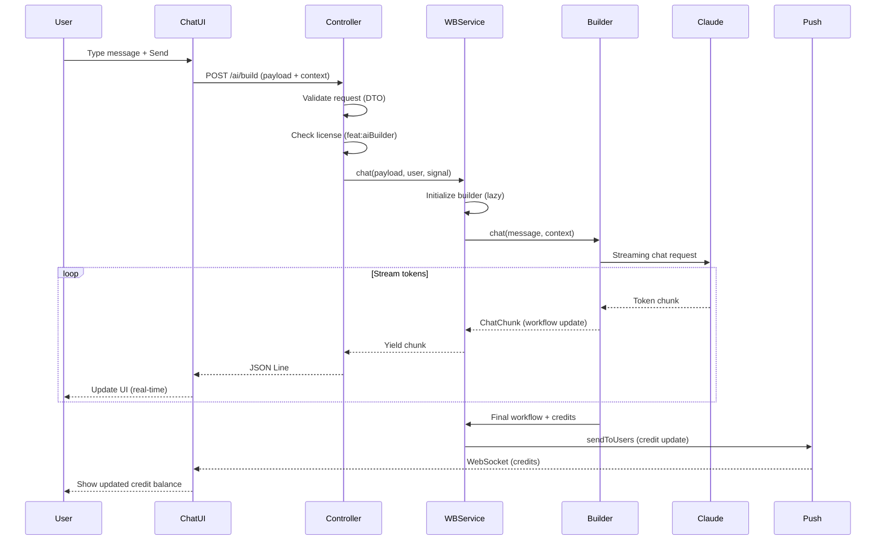
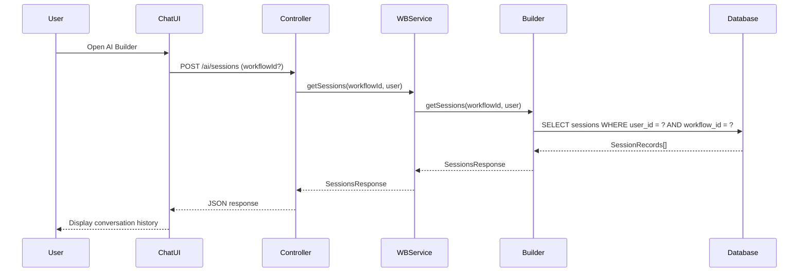
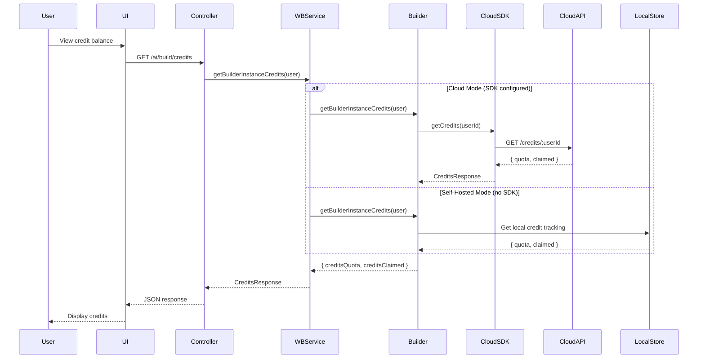

# AI Workflow Builder - Component Architecture

**Feature**: AI Workflow Builder
**Last Updated**: 2025-11-10
**Status**: Production

---

## System Overview

The AI Workflow Builder is architected as a **three-tier system** with frontend UI, backend orchestration, and external AI services. The system supports both **cloud-hosted** and **self-hosted** deployment modes.

```mermaid
graph TB
    subgraph "Frontend Layer (Vue 3)"
        UI[Chat UI Components]
        Assistant[AI Assistant Panel]
        Credits[Credit Display]
        Context[Workflow Context Provider]
    end

    subgraph "Backend Layer (Express + TypeORM)"
        Controller[AI Controller]
        WBService[WorkflowBuilderService]
        AIService[AiService]
        License[License Service]
        Push[Push Service]
        Nodes[LoadNodesAndCredentials]
    end

    subgraph "AI Layer (External)"
        Builder[@n8n/ai-workflow-builder]
        SDK[@n8n_io/ai-assistant-sdk]
        Anthropic[Anthropic Claude API]
        Cloud[n8n AI Assistant Service]
    end

    UI -->|WebSocket Stream| Controller
    Assistant -->|REST API| Controller
    Credits -->|GET /credits| Controller
    Context -->|Workflow JSON| Controller

    Controller -->|Delegate| WBService
    Controller -->|Delegate| AIService

    WBService -->|Use| Builder
    WBService -->|License Check| License
    WBService -->|Credit Updates| Push
    WBService -->|Node Types| Nodes

    AIService -->|Cloud Mode| SDK
    Builder -->|Self-Hosted Mode| Anthropic
    SDK -->|API Calls| Cloud

    style UI fill:#e1f5ff
    style Controller fill:#fff4e6
    style Builder fill:#f3e5f5
    style Anthropic fill:#e8f5e9
    style Cloud fill:#e8f5e9
```

---

## Component Catalog

### Frontend Components

#### 1. Chat UI (`packages/frontend/editor-ui/src/features/ai/chatHub/`)

**Purpose**: Main conversational interface for AI Builder

**Responsibilities:**
- Render chat messages (user + AI)
- Handle user input and submission
- Display streaming responses in real-time
- Show error states and retry options
- Manage chat session UI state

**Key Files:**
- `ChatHub.vue` - Main chat container
- `ChatMessage.vue` - Individual message component
- `ChatInput.vue` - User input field
- `ChatHistory.vue` - Conversation history

**Data Flow:**
```
User Input → ChatHub → API Request → Stream Handler → Message Display
```

**State Management:**
- Pinia store for chat state
- WebSocket connection for streaming
- Local storage for draft messages

---

#### 2. AI Assistant Panel (`packages/frontend/editor-ui/src/features/ai/assistant/`)

**Purpose**: Sidebar panel for AI assistance in workflow editor

**Responsibilities:**
- Contextual workflow suggestions
- Trigger AI Builder chat
- Display credit balance
- Show AI feature availability

**Key Files:**
- `AssistantPanel.vue` - Main panel container
- `AssistantTrigger.vue` - Button to open AI chat
- `AssistantSuggestions.vue` - Context suggestions

**Integration Points:**
- Workflow editor (sidebar slot)
- Credit service (balance display)
- License service (feature availability)

---

#### 3. Credit Display Component

**Purpose**: Show remaining AI Builder credits to users

**Responsibilities:**
- Fetch and display credit balance
- Show credit consumption per request
- Alert users when credits are low
- Link to credit purchase (enterprise)

**API Integration:**
```typescript
GET /ai/build/credits → { creditsRemaining, creditsQuota }
```

---

#### 4. Workflow Context Provider

**Purpose**: Collect and serialize workflow context for AI requests

**Responsibilities:**
- Serialize current workflow JSON
- Extract execution data (recent runs)
- Generate execution schema
- Collect expression values
- Sanitize sensitive data before sending

**Context Structure:**
```typescript
{
  currentWorkflow: WorkflowJSON;
  executionData?: ExecutionSummary[];
  executionSchema?: JSONSchema;
  expressionValues?: Record<string, any>;
}
```

---

### Backend Components

#### 1. AI Controller (`packages/cli/src/controllers/ai.controller.ts`)

**Purpose**: REST API endpoints for AI Builder feature

**Endpoints:**

| Method | Path | Purpose | Rate Limit |
|--------|------|---------|------------|
| POST | `/ai/build` | Workflow builder chat (streaming) | 100/min |
| POST | `/ai/sessions` | Retrieve chat sessions | 100/min |
| POST | `/ai/sessions/metadata` | Get session metadata | 100/min |
| GET | `/ai/build/credits` | Get credit balance | None |
| POST | `/ai/chat` | AI assistant chat | 100/min |
| POST | `/ai/chat/apply-suggestion` | Apply AI suggestion | 100/min |
| POST | `/ai/ask-ai` | Ask AI questions | 100/min |
| POST | `/ai/free-credits` | Generate free credits | None |

**Responsibilities:**
- Request validation (DTO schemas)
- Authentication & authorization
- License feature gating (`@Licensed('feat:aiBuilder')`)
- Rate limiting enforcement
- Streaming response handling
- Error transformation (domain → HTTP)

**Key Patterns:**
- **Streaming**: Uses `application/json-lines` + `res.flush()`
- **Error Handling**: Try-catch with domain error mapping
- **Abort Signals**: Support request cancellation via AbortController

---

#### 2. WorkflowBuilderService (`packages/cli/src/services/ai-workflow-builder.service.ts`)

**Purpose**: Wrapper/orchestrator for @n8n/ai-workflow-builder package

**Responsibilities:**
- Lazy-initialize AI workflow builder service
- Configure AI client (cloud vs self-hosted)
- Provide workflow context (node types)
- Handle credit updates (via Push service)
- Session management (getSessions, getSessionsMetadata)

**Key Methods:**

```typescript
class WorkflowBuilderService {
  // Main chat interface (streaming)
  async *chat(
    payload: ChatPayload,
    user: IUser,
    abortSignal?: AbortSignal
  ): AsyncGenerator<ChatResponse>;

  // Session retrieval
  async getSessions(
    workflowId: string | undefined,
    user: IUser
  ): Promise<SessionsResponse>;

  // Session metadata
  async getSessionsMetadata(
    workflowId: string | undefined,
    user: IUser
  ): Promise<{ hasMessages: boolean }>;

  // Credit balance
  async getBuilderInstanceCredits(
    user: IUser
  ): Promise<CreditsResponse>;
}
```

**Dependencies:**
- `LoadNodesAndCredentials` - Get available node types
- `License` - Feature gating & license cert
- `GlobalConfig` - AI service configuration
- `Logger` - Request/response logging
- `UrlService` - Instance base URL
- `Push` - WebSocket credit updates

**Configuration:**
```typescript
// Cloud mode
config.aiAssistant.baseUrl → Use n8n AI Assistant

// Self-hosted mode
config.aiBuilder.apiKey → Use Anthropic API directly
```

---

#### 3. AiService (`packages/cli/src/services/ai.service.ts`)

**Purpose**: Client wrapper for n8n AI Assistant SDK (cloud mode)

**Responsibilities:**
- Initialize AI assistant client
- Proxy chat requests to cloud service
- Apply AI suggestions
- Generate free AI credits
- Handle API errors

**Key Methods:**

```typescript
class AiService {
  // Initialize client (lazy)
  async init(): Promise<void>;

  // Chat with AI assistant
  async chat(
    payload: AiChatRequestDto,
    user: IUser
  ): Promise<ReadableStream>;

  // Apply AI suggestion to workflow
  async applySuggestion(
    payload: AiApplySuggestionRequestDto,
    user: IUser
  ): Promise<ApplySuggestionResponse>;

  // Ask AI a question (non-workflow)
  async askAi(
    payload: AiAskRequestDto,
    user: IUser
  ): Promise<AskAiResponse>;

  // Generate free OpenAI credits (managed credential)
  async createFreeAiCredits(
    user: IUser
  ): Promise<Credential>;
}
```

**Dependencies:**
- `@n8n_io/ai-assistant-sdk` - Cloud AI client
- `License` - Feature availability check
- `GlobalConfig` - AI service base URL

---

#### 4. Configuration Modules

##### AI Builder Config (`packages/@n8n/config/src/configs/ai-builder.config.ts`)

**Purpose**: Configuration for self-hosted AI Builder mode

```typescript
@Config
export class AiBuilderConfig {
  @Env('N8N_AI_ANTHROPIC_KEY')
  apiKey: string = '';
}
```

**Environment Variables:**
- `N8N_AI_ANTHROPIC_KEY` - Anthropic API key (optional, for self-hosted)

##### AI Assistant Config (`packages/@n8n/config/src/configs/ai-assistant.config.ts`)

**Purpose**: Configuration for cloud AI Assistant mode

```typescript
@Config
export class AiAssistantConfig {
  @Env('N8N_AI_ASSISTANT_BASE_URL')
  baseUrl: string = 'https://ai-assistant.n8n.io';
}
```

**Environment Variables:**
- `N8N_AI_ASSISTANT_BASE_URL` - Cloud AI service URL

---

### External Packages

#### 1. @n8n/ai-workflow-builder (Internal Package)

**Purpose**: Core AI workflow generation logic

**Responsibilities:**
- Claude API integration (Anthropic SDK)
- Workflow JSON generation
- Node type matching (user intent → node types)
- Context analysis (workflow patterns)
- Session persistence logic
- Credit tracking

**Key Exports:**

```typescript
class AiWorkflowBuilderService {
  constructor(
    nodeTypeDescriptions: INodeTypeDescription[],
    aiAssistantClient?: AiAssistantClient,
    logger: Logger,
    instanceBaseUrl: string,
    onCreditsUpdated: (userId, quota, claimed) => void
  );

  async *chat(
    payload: ChatPayload,
    user: IUser,
    abortSignal?: AbortSignal
  ): AsyncGenerator<ChatChunk>;
}
```

**Internal Architecture:**
- Workflow Builder Agent (orchestrator)
- Node Matcher (intent → node types)
- Workflow Generator (node creation)
- Context Analyzer (workflow understanding)

---

#### 2. @n8n_io/ai-assistant-sdk (Cloud Client)

**Purpose**: Client SDK for n8n AI Assistant cloud service

**Responsibilities:**
- HTTP client for AI service API
- Authentication (license cert)
- Credit management
- Session persistence (cloud storage)
- Error handling & retries

**Key Exports:**

```typescript
class AiAssistantClient {
  constructor(config: {
    licenseCert: string;
    consumerId: string;
    baseUrl: string;
    n8nVersion: string;
    logLevel?: string;
  });

  async chat(
    payload: AiChatRequestDto,
    user: { id: string }
  ): Promise<ReadableStream>;

  async generateAiCreditsCredentials(
    user: IUser
  ): Promise<{ apiKey: string; url: string }>;
}
```

**API Endpoints** (Cloud Service):
- `POST /chat` - Chat with AI assistant
- `POST /credits` - Generate free AI credits
- `GET /sessions` - Retrieve user sessions
- `GET /credits/:userId` - Get credit balance

---

## Data Flow Diagrams

### 1. Workflow Builder Chat Flow (Streaming)



---

### 2. Session Retrieval Flow



---

### 3. Credit Balance Check Flow



---

## Technology Stack

### Frontend
- **Framework**: Vue 3 (Composition API)
- **State Management**: Pinia
- **HTTP Client**: Axios
- **WebSocket**: Native WebSocket API
- **Streaming**: JSON Lines parser

### Backend
- **Runtime**: Node.js 22+
- **Framework**: Express.js
- **Database ORM**: TypeORM
- **DI Container**: @n8n/di (custom)
- **Logging**: Winston/Pino
- **Validation**: class-validator (DTOs)

### AI Layer
- **LLM**: Claude Sonnet 4.5 (Anthropic)
- **SDK**: Anthropic TypeScript SDK
- **Protocol**: HTTP/2 (streaming)

---

## Security Architecture

### Authentication & Authorization

```typescript
// License-based feature gating
@Licensed('feat:aiBuilder')
@Post('/ai/build')
async build() { ... }

// JWT session validation
@AuthenticatedRequest req → req.user.id
```

### Data Protection

1. **In Transit**: TLS 1.3 for all API calls
2. **At Rest**: Encrypted session storage (AES-256)
3. **Privacy**: User data isolated per tenant
4. **Sanitization**: Sensitive data removed before AI requests

### Rate Limiting

```typescript
// Per-user rate limits
@Post('/ai/build', { rateLimit: { limit: 100 } })
// 100 requests per minute per user ID
```

---

## Performance Optimizations

### 1. Lazy Initialization
```typescript
// AI service created on-demand (not at startup)
private async getService(): Promise<AiWorkflowBuilderService> {
  if (!this.service) {
    this.service = new AiWorkflowBuilderService(...);
  }
  return this.service;
}
```

### 2. Streaming Responses
```typescript
// Token-by-token delivery (not waiting for full response)
for await (const chunk of aiResponse) {
  res.write(JSON.stringify(chunk) + STREAM_SEPARATOR);
  res.flush(); // Flush immediately
}
```

### 3. Abort Signal Support
```typescript
// Allow request cancellation
const abortController = new AbortController();
res.on('close', () => abortController.abort());
yield* service.chat(payload, user, abortController.signal);
```

### 4. Credit Update Batching
```typescript
// Push service batches WebSocket updates
this.push.sendToUsers({ type: 'updateBuilderCredits', data }, [userId]);
```

---

## Deployment Modes

### Cloud Mode (Default)

**Configuration:**
```bash
export N8N_AI_ASSISTANT_BASE_URL="https://ai-assistant.n8n.io"
```

**Data Flow:**
```
n8n Backend → @n8n_io/ai-assistant-sdk → n8n AI Service → Claude API
```

**Advantages:**
- ✅ Managed infrastructure
- ✅ Built-in credit management
- ✅ Session persistence (cloud)
- ✅ No API key management

**Disadvantages:**
- ❌ Requires internet connectivity
- ❌ Data leaves user infrastructure
- ❌ Subject to n8n service SLA

---

### Self-Hosted Mode

**Configuration:**
```bash
export N8N_AI_ANTHROPIC_KEY="sk-ant-api03-..."
```

**Data Flow:**
```
n8n Backend → @n8n/ai-workflow-builder → Anthropic API (direct)
```

**Advantages:**
- ✅ Full control over data
- ✅ No external dependencies
- ✅ Works offline (if Anthropic accessible)
- ✅ Customizable quotas

**Disadvantages:**
- ❌ Must manage Anthropic API key
- ❌ Credit tracking is local (no cloud sync)
- ❌ Session persistence is local (database)

---

## Monitoring & Observability

### Key Metrics

| Metric | Target | Alert Threshold |
|--------|--------|-----------------|
| First token latency (p95) | <2s | >3s |
| Streaming throughput (p50) | >50 tokens/s | <30 tokens/s |
| Error rate | <0.1% | >1% |
| API uptime | 99.9% | <99.5% |
| Credit balance API (p95) | <200ms | >500ms |

### Logging

```typescript
// Structured logging with sanitization
logger.info('AI Builder request', {
  userId: user.id,
  workflowId: payload.workflowContext.currentWorkflow?.id,
  messageLength: payload.text.length,
  // NO sensitive data (workflow content, user messages)
});
```

### Error Tracking

```typescript
// Sentry/Datadog integration
try {
  yield* service.chat(payload, user, signal);
} catch (error) {
  logger.error('AI Builder error', { error, userId: user.id });
  throw new InternalServerError(error.message);
}
```

---

## Appendix

### Related Documentation
- PRD: `01-planning/PRD.md`
- API Contracts: `02-architecture/api-contracts/`
- Data Models: `02-architecture/data-models/`
- Test Plans: `05-testing/test-plans/`

### Component File Locations

**Frontend:**
```
packages/frontend/editor-ui/src/
  features/ai/
    assistant/          # AI assistant panel
    chatHub/            # Chat UI
    evaluation.ee/      # Evaluation (enterprise)
    mcpAccess/          # MCP server access
  app/
    constants/ai.ts     # AI constants
    utils/aiUtils.ts    # AI utilities
```

**Backend:**
```
packages/cli/src/
  controllers/ai.controller.ts          # REST API
  services/
    ai-workflow-builder.service.ts      # Wrapper service
    ai.service.ts                       # AI assistant client
  __tests__/
    ai.controller.test.ts               # Controller tests
    ai.service.test.ts                  # Service tests
    ai-workflow-builder.service.test.ts # Service tests
```

**Config:**
```
packages/@n8n/config/src/configs/
  ai-builder.config.ts     # Self-hosted config
  ai-assistant.config.ts   # Cloud config
```

**Tests:**
```
packages/testing/playwright/
  config/
    ai-builder-fixtures.ts    # E2E fixtures
    ai-assistant-fixtures.ts  # E2E fixtures
  tests/ui/
    45-ai-assistant.spec.ts   # E2E test spec
```

---

**Document Status**: Initial Draft (Pilot)
**Last Updated**: 2025-11-10
**Maintainer**: n8n Core Team
