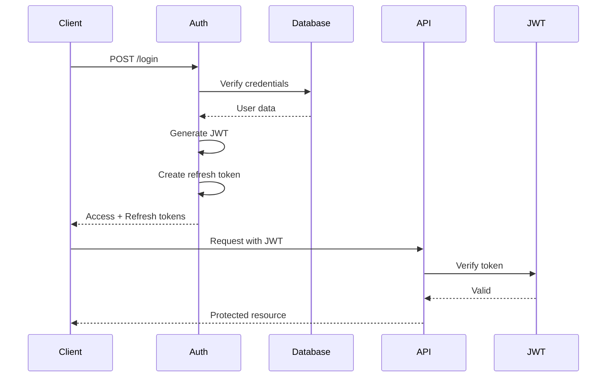

# Authentication Feature Documentation

## Overview

The Authentication feature provides comprehensive user authentication and session management for n8n. It supports multiple authentication methods including email/password, SSO (SAML/OIDC), LDAP, and API keys, with robust security features like MFA and JWT-based sessions.

## Core Concepts

### Authentication Methods
1. **Email/Password**: Traditional username/password
2. **SSO**: SAML 2.0 and OpenID Connect
3. **LDAP**: Enterprise directory integration
4. **API Keys**: Programmatic access tokens
5. **MFA**: TOTP-based two-factor authentication

### Session Management
- JWT-based stateless sessions
- Refresh token rotation
- Session expiry and renewal
- Concurrent session limits

## Architecture

### Component Structure
```
auth/
├── auth.controller.ts          # Authentication endpoints
├── auth.service.ts             # Core auth logic
├── jwt.service.ts              # JWT token management
├── mfa.controller.ts           # MFA endpoints
├── password-reset.controller.ts # Password recovery
├── sso.ee/                     # Enterprise SSO
│   ├── saml/                   # SAML implementation
│   └── oidc/                   # OIDC implementation
└── ldap.ee/                    # LDAP integration
```

### Authentication Flow



## Key Features

### 1. User Authentication
- Secure password hashing (bcrypt)
- Account lockout protection
- Password complexity requirements
- Email verification

### 2. Single Sign-On (Enterprise)
- SAML 2.0 support
- OpenID Connect
- Auto-provisioning
- Attribute mapping

### 3. Multi-Factor Authentication
- TOTP (Time-based One-Time Password)
- QR code generation
- Backup codes
- Recovery options

### 4. Session Security
- JWT with RS256 signing
- Refresh token rotation
- CSRF protection
- Session invalidation

## API Reference

### Authentication Endpoints

| Method | Endpoint | Description |
|--------|----------|-------------|
| POST | `/auth/login` | User login |
| POST | `/auth/logout` | User logout |
| POST | `/auth/refresh` | Refresh tokens |
| GET | `/auth/me` | Current user info |
| POST | `/auth/validate` | Validate session |

### SSO Endpoints

```
GET  /sso/saml/metadata     # SAML metadata
POST /sso/saml/acs          # SAML assertion consumer
GET  /sso/oidc/authorize    # OIDC authorization
GET  /sso/oidc/callback     # OIDC callback
```

### MFA Endpoints

```
POST /mfa/enable      # Enable MFA
POST /mfa/disable     # Disable MFA
POST /mfa/verify      # Verify TOTP code
GET  /mfa/qr          # Get QR code
POST /mfa/recovery    # Use recovery code
```

## Configuration

### Environment Variables

```bash
# JWT Configuration
N8N_JWT_SECRET=your-jwt-secret
N8N_JWT_EXPIRY=7d
N8N_REFRESH_TOKEN_EXPIRY=30d

# Session Settings
N8N_SESSION_TIMEOUT=24h
N8N_MAX_SESSIONS_PER_USER=5

# Password Policy
N8N_PASSWORD_MIN_LENGTH=8
N8N_PASSWORD_REQUIRE_UPPERCASE=true
N8N_PASSWORD_REQUIRE_NUMBERS=true
N8N_PASSWORD_REQUIRE_SPECIAL=true

# MFA Settings
N8N_MFA_ENABLED=true
N8N_MFA_ISSUER=n8n

# SSO Configuration (Enterprise)
N8N_SSO_ENABLED=true
N8N_SAML_METADATA_URL=https://idp.example.com/metadata
N8N_OIDC_ISSUER=https://auth.example.com
```

## Security Features

### Password Security

```typescript
// Password hashing
const saltRounds = 10;
const hashedPassword = await bcrypt.hash(password, saltRounds);

// Password validation
const isValid = await bcrypt.compare(password, hashedPassword);
```

### JWT Token Structure

```json
{
  "header": {
    "alg": "RS256",
    "typ": "JWT"
  },
  "payload": {
    "id": "user_123",
    "email": "user@example.com",
    "role": "admin",
    "iat": 1234567890,
    "exp": 1234567890
  }
}
```

### Rate Limiting

```typescript
// Login attempt limiting
const rateLimiter = {
  maxAttempts: 5,
  windowMs: 15 * 60 * 1000, // 15 minutes
  message: 'Too many login attempts'
};
```

## SSO Integration (Enterprise)

### SAML Configuration

```xml
<!-- Service Provider Metadata -->
<EntityDescriptor entityID="https://n8n.example.com">
  <SPSSODescriptor>
    <AssertionConsumerService
      Binding="urn:oasis:names:tc:SAML:2.0:bindings:HTTP-POST"
      Location="https://n8n.example.com/rest/sso/saml/acs"/>
  </SPSSODescriptor>
</EntityDescriptor>
```

### OIDC Configuration

```json
{
  "issuer": "https://auth.example.com",
  "authorization_endpoint": "https://auth.example.com/authorize",
  "token_endpoint": "https://auth.example.com/token",
  "client_id": "n8n-client",
  "client_secret": "secret",
  "redirect_uri": "https://n8n.example.com/rest/sso/oidc/callback"
}
```

## LDAP Integration (Enterprise)

### LDAP Configuration

```bash
# LDAP Settings
N8N_LDAP_ENABLED=true
N8N_LDAP_URL=ldap://ldap.example.com:389
N8N_LDAP_BASE_DN=dc=example,dc=com
N8N_LDAP_BIND_DN=cn=admin,dc=example,dc=com
N8N_LDAP_BIND_PASSWORD=password
N8N_LDAP_USER_FILTER=(uid={{username}})
```

## Best Practices

### Security
1. **Strong JWT secrets**: Use cryptographically secure random strings
2. **Token rotation**: Implement refresh token rotation
3. **Session limits**: Set maximum concurrent sessions
4. **Password policy**: Enforce strong password requirements
5. **MFA enforcement**: Require MFA for sensitive operations

### Implementation
1. **HTTPS only**: Never transmit credentials over HTTP
2. **Secure cookies**: Use httpOnly, secure, sameSite flags
3. **CORS configuration**: Properly configure allowed origins
4. **Rate limiting**: Prevent brute force attacks
5. **Audit logging**: Log all authentication events

## Troubleshooting

### Common Issues

#### Login Failures
```javascript
// Check password hash
const user = await getUserByEmail(email);
console.log('Password valid:', await bcrypt.compare(password, user.password));
```

#### JWT Validation Errors
```bash
# Verify JWT secret is set
echo $N8N_JWT_SECRET

# Check token expiry
jwt decode <token>
```

#### SSO Issues
```bash
# Test SAML metadata endpoint
curl https://your-instance/rest/sso/saml/metadata

# Check OIDC discovery
curl https://auth.example.com/.well-known/openid-configuration
```

## Migration Guide

### From Basic to SSO

```typescript
// User migration strategy
async function migrateToSSO(user) {
  // Link existing account to SSO identity
  await linkSSOIdentity(user.id, ssoIdentityId);

  // Optional: Disable password login
  await disablePasswordLogin(user.id);
}
```

---

**Last Updated**: 2025-11-10
**Version**: 1.0.0
**BMAD Compliance**: ✅ Complete