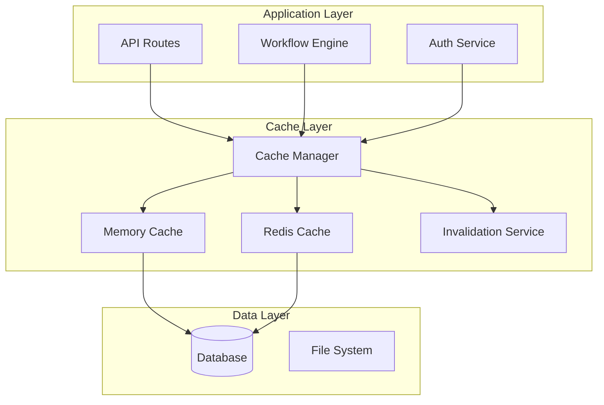

# Cache Module

## Overview

The Cache module provides high-performance caching capabilities for n8n, improving response times and reducing database load through intelligent data caching strategies. It supports both in-memory and Redis-based caching with TTL management and invalidation strategies.

**Module Path**: `packages/cli/src/cache/`

## Core Components

### Cache Service
- Cache strategy selection
- Key generation and management
- TTL configuration
- Cache invalidation

### Memory Cache
- In-process LRU cache
- Fast access for small datasets
- Automatic memory management
- No network overhead

### Redis Cache
- Distributed caching
- Shared across instances
- Persistence support
- Pub/sub for invalidation

## Architecture



## Cache Strategies

### Cache-Aside Pattern
```typescript
async function getWorkflow(id: string): Promise<Workflow> {
  // Check cache first
  const cached = await cache.get(`workflow:${id}`);
  if (cached) return cached;

  // Load from database
  const workflow = await db.getWorkflow(id);

  // Store in cache
  await cache.set(`workflow:${id}`, workflow, { ttl: 3600 });

  return workflow;
}
```

### Write-Through Cache
```typescript
async function updateWorkflow(id: string, data: Partial<Workflow>) {
  // Update database
  const updated = await db.updateWorkflow(id, data);

  // Update cache
  await cache.set(`workflow:${id}`, updated);

  // Invalidate related caches
  await cache.invalidate([
    `workflow:list:*`,
    `workflow:stats:${id}`
  ]);

  return updated;
}
```

## Cache Configuration

### Memory Cache Config
```typescript
interface MemoryCacheConfig {
  maxSize: number;      // Max items in cache
  maxMemoryMB: number;  // Max memory usage
  ttlSeconds: number;   // Default TTL
  checkPeriod: number;  // Cleanup interval
}

{
  memory: {
    maxSize: 10000,
    maxMemoryMB: 100,
    ttlSeconds: 300,
    checkPeriod: 60
  }
}
```

### Redis Cache Config
```typescript
interface RedisCacheConfig {
  host: string;
  port: number;
  password?: string;
  db: number;
  ttlSeconds: number;
  keyPrefix: string;
}

{
  redis: {
    host: 'localhost',
    port: 6379,
    db: 0,
    ttlSeconds: 3600,
    keyPrefix: 'n8n:cache:'
  }
}
```

## Cached Data Types

### Workflows
```typescript
// Cache key patterns
'workflow:{id}'           // Single workflow
'workflow:list:{userId}'  // User's workflows
'workflow:active'         // Active workflows
'workflow:stats:{id}'     // Workflow statistics
```

### Credentials
```typescript
// Encrypted credential metadata (not secrets)
'credential:meta:{id}'    // Credential metadata
'credential:types'        // Available types
```

### User Sessions
```typescript
'session:{sessionId}'     // User session
'user:{userId}'          // User profile
'user:permissions:{userId}' // User permissions
```

## Cache Invalidation

### Invalidation Strategies
```typescript
// Time-based invalidation
await cache.set(key, value, { ttl: 3600 });

// Manual invalidation
await cache.delete('workflow:123');

// Pattern-based invalidation
await cache.invalidatePattern('workflow:list:*');

// Event-based invalidation
eventBus.on('workflow.updated', async (event) => {
  await cache.invalidate([
    `workflow:${event.workflowId}`,
    `workflow:list:*`
  ]);
});
```

## Performance Optimization

### Cache Warming
```typescript
// Pre-load frequently accessed data
async function warmCache() {
  const activeWorkflows = await db.getActiveWorkflows();

  for (const workflow of activeWorkflows) {
    await cache.set(
      `workflow:${workflow.id}`,
      workflow,
      { ttl: 7200 }
    );
  }
}
```

### Batch Operations
```typescript
// Get multiple items
const keys = ['workflow:1', 'workflow:2', 'workflow:3'];
const values = await cache.mget(keys);

// Set multiple items
await cache.mset([
  { key: 'workflow:1', value: wf1 },
  { key: 'workflow:2', value: wf2 }
]);
```

## Monitoring

### Cache Metrics
```typescript
{
  'cache.hits': counter,
  'cache.misses': counter,
  'cache.hit_rate': gauge,
  'cache.evictions': counter,
  'cache.memory_usage_mb': gauge,
  'cache.keys_count': gauge,
  'cache.operation_duration_ms': histogram
}
```

## Configuration

### Environment Variables
```bash
# Cache Configuration
N8N_CACHE_ENABLED=true
N8N_CACHE_BACKEND=redis # or 'memory'

# Memory Cache
N8N_CACHE_MEMORY_MAX_SIZE=10000
N8N_CACHE_MEMORY_TTL=300

# Redis Cache
N8N_CACHE_REDIS_HOST=localhost
N8N_CACHE_REDIS_PORT=6379
N8N_CACHE_REDIS_PASSWORD=
N8N_CACHE_REDIS_DB=0
N8N_CACHE_REDIS_TTL=3600
```

## Best Practices

1. **Cache appropriate data** - High read/write ratio
2. **Set reasonable TTLs** - Balance freshness vs performance
3. **Monitor hit rates** - Aim for >80% hit rate
4. **Implement cache warming** for critical data
5. **Use consistent key patterns** for easy invalidation
6. **Avoid caching sensitive data** unencrypted
7. **Plan for cache failures** - Graceful degradation