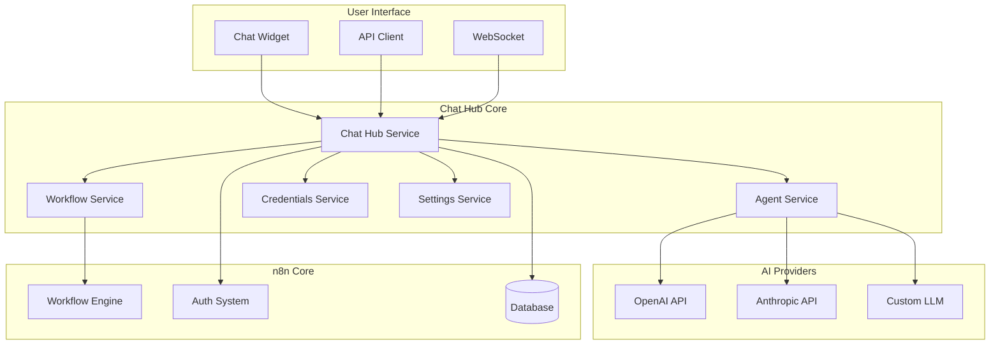

# Chat Hub Module

## Overview

The Chat Hub module provides a conversational AI interface for n8n, enabling chat-based workflow interaction and AI-powered workflow building. It serves as a bridge between natural language input and workflow execution, allowing users to interact with their automation through a chat interface.

**Module Path**: `packages/cli/src/modules/chat-hub/`

## Core Components

### 1. Chat Hub Service (`chat-hub.service.ts`)
- **Purpose**: Main orchestrator for chat interactions
- **Key Features**:
  - Chat session management
  - Message processing and routing
  - AI model integration (OpenAI, Anthropic)
  - Context preservation across conversations

### 2. Chat Hub Agent Service (`chat-hub-agent.service.ts`)
- **Purpose**: AI agent management for chat interactions
- **Key Features**:
  - Agent personality configuration
  - Tool/function calling capabilities
  - Multi-turn conversation handling
  - Agent memory and context management

### 3. Chat Hub Workflow Service (`chat-hub-workflow.service.ts`)
- **Purpose**: Workflow execution through chat commands
- **Key Features**:
  - Natural language to workflow mapping
  - Parameter extraction from chat messages
  - Workflow execution and result formatting
  - Error handling and user feedback

### 4. Chat Hub Credentials Service (`chat-hub-credentials.service.ts`)
- **Purpose**: Manage AI provider credentials
- **Key Features**:
  - Secure credential storage for AI providers
  - API key rotation and management
  - Provider-specific configuration
  - Usage tracking and limits

### 5. Chat Hub Settings Service (`chat-hub.settings.service.ts`)
- **Purpose**: Configuration management for chat hub
- **Key Features**:
  - Model selection and configuration
  - Temperature and token settings
  - System prompts and templates
  - Feature flags for chat capabilities

## Architecture



## Chat Session Management

### Session Structure
```typescript
interface ChatSession {
  id: string;
  userId: string;
  agentId: string;
  startedAt: Date;
  lastActivityAt: Date;
  context: ChatContext;
  messages: ChatMessage[];
  metadata: SessionMetadata;
}

interface ChatContext {
  workflowId?: string;
  projectId?: string;
  variables: Record<string, any>;
  history: ConversationTurn[];
  preferences: UserPreferences;
}

interface ChatMessage {
  id: string;
  role: 'user' | 'assistant' | 'system';
  content: string;
  timestamp: Date;
  toolCalls?: ToolCall[];
  metadata?: MessageMetadata;
}
```

## AI Integration

### Supported Providers
```typescript
enum AIProvider {
  OPENAI = 'openai',
  ANTHROPIC = 'anthropic',
  AZURE_OPENAI = 'azure-openai',
  CUSTOM = 'custom'
}

interface AIConfiguration {
  provider: AIProvider;
  model: string;
  apiKey: string;
  endpoint?: string;
  temperature: number;
  maxTokens: number;
  systemPrompt: string;
}
```

### Tool/Function Calling
```typescript
// Define available tools for the AI
const tools = [
  {
    name: 'execute_workflow',
    description: 'Execute a workflow by ID or name',
    parameters: {
      workflowId: { type: 'string', required: true },
      inputData: { type: 'object', required: false }
    }
  },
  {
    name: 'create_workflow',
    description: 'Create a new workflow from description',
    parameters: {
      name: { type: 'string', required: true },
      description: { type: 'string', required: true },
      nodes: { type: 'array', required: false }
    }
  },
  {
    name: 'search_workflows',
    description: 'Search for workflows',
    parameters: {
      query: { type: 'string', required: true },
      tags: { type: 'array', required: false }
    }
  }
];
```

## Natural Language Processing

### Intent Recognition
```typescript
enum ChatIntent {
  EXECUTE_WORKFLOW = 'execute_workflow',
  CREATE_WORKFLOW = 'create_workflow',
  MODIFY_WORKFLOW = 'modify_workflow',
  GET_STATUS = 'get_status',
  HELP = 'help',
  GENERAL_CHAT = 'general_chat'
}

// Intent detection
async function detectIntent(message: string): Promise<ChatIntent> {
  const patterns = {
    EXECUTE_WORKFLOW: /run|execute|trigger|start/i,
    CREATE_WORKFLOW: /create|build|make|new workflow/i,
    MODIFY_WORKFLOW: /change|update|modify|edit/i,
    GET_STATUS: /status|check|progress|result/i,
    HELP: /help|how to|what can/i
  };

  for (const [intent, pattern] of Object.entries(patterns)) {
    if (pattern.test(message)) {
      return intent as ChatIntent;
    }
  }

  return ChatIntent.GENERAL_CHAT;
}
```

### Parameter Extraction
```typescript
// Extract parameters from natural language
async function extractParameters(
  message: string,
  intent: ChatIntent
): Promise<Record<string, any>> {
  const prompt = `
    Extract parameters from the following message for ${intent}:
    Message: "${message}"

    Return as JSON with appropriate parameter names and values.
  `;

  const response = await aiService.complete(prompt);
  return JSON.parse(response);
}
```

## API Reference

### Start Chat Session
```http
POST /api/v1/chat/sessions
Authorization: Bearer {token}
Content-Type: application/json

{
  "agentId": "default",
  "context": {
    "workflowId": "workflow_123"
  }
}

Response:
{
  "sessionId": "session_xyz",
  "agentId": "default",
  "welcomeMessage": "Hello! How can I help you with your workflows today?"
}
```

### Send Message
```http
POST /api/v1/chat/sessions/{sessionId}/messages
Authorization: Bearer {token}
Content-Type: application/json

{
  "content": "Run my daily report workflow",
  "attachments": []
}

Response:
{
  "messageId": "msg_123",
  "response": "I'll run your daily report workflow now...",
  "toolCalls": [
    {
      "tool": "execute_workflow",
      "parameters": {
        "workflowId": "daily_report_workflow"
      },
      "result": {
        "executionId": "exec_456",
        "status": "running"
      }
    }
  ]
}
```

## WebSocket Integration

### Real-time Chat
```typescript
// Client-side WebSocket connection
const ws = new WebSocket('ws://localhost:5678/chat');

// Send message
ws.send(JSON.stringify({
  type: 'message',
  sessionId: 'session_xyz',
  content: 'Create a workflow to send emails'
}));

// Receive streaming response
ws.on('message', (data) => {
  const response = JSON.parse(data);
  if (response.type === 'stream') {
    // Partial response (streaming)
    appendToChat(response.content);
  } else if (response.type === 'complete') {
    // Full response received
    finalizeChat(response);
  }
});
```

## Agent Configuration

### System Prompts
```typescript
const systemPrompts = {
  default: `You are an n8n workflow assistant. Help users create, modify, and execute workflows.
    Available workflows: {workflowList}
    User context: {userContext}

    Guidelines:
    - Be concise and helpful
    - Ask for clarification when needed
    - Provide workflow suggestions
    - Explain errors clearly`,

  technical: `You are a technical n8n expert. Provide detailed technical assistance...`,

  beginner: `You are a friendly n8n guide for beginners. Use simple language...`
};
```

### Agent Personalities
```typescript
interface AgentPersonality {
  id: string;
  name: string;
  description: string;
  systemPrompt: string;
  temperature: number;
  capabilities: string[];
  restrictions: string[];
}

const agents: AgentPersonality[] = [
  {
    id: 'helper',
    name: 'Workflow Helper',
    description: 'General assistance with workflows',
    temperature: 0.7,
    capabilities: ['execute', 'search', 'explain'],
    restrictions: ['no_delete', 'no_credentials']
  },
  {
    id: 'builder',
    name: 'Workflow Builder',
    description: 'Creates and modifies workflows',
    temperature: 0.8,
    capabilities: ['create', 'modify', 'optimize'],
    restrictions: ['requires_approval']
  }
];
```

## Error Handling

### Chat-Specific Errors
```typescript
class ChatSessionExpiredError extends Error {
  constructor(sessionId: string) {
    super(`Chat session ${sessionId} has expired`);
  }
}

class AIProviderError extends Error {
  constructor(provider: string, message: string) {
    super(`AI Provider ${provider} error: ${message}`);
  }
}

class WorkflowExecutionError extends Error {
  constructor(workflowId: string, error: any) {
    super(`Failed to execute workflow ${workflowId}: ${error.message}`);
  }
}
```

## Configuration

### Environment Variables
```bash
# Chat Hub Configuration
N8N_CHAT_HUB_ENABLED=true
N8N_CHAT_HUB_DEFAULT_AGENT=helper

# AI Provider Settings
N8N_CHAT_HUB_AI_PROVIDER=openai
N8N_CHAT_HUB_AI_MODEL=gpt-4
N8N_CHAT_HUB_AI_TEMPERATURE=0.7
N8N_CHAT_HUB_AI_MAX_TOKENS=2000

# Session Management
N8N_CHAT_HUB_SESSION_TIMEOUT=3600
N8N_CHAT_HUB_MAX_MESSAGES_PER_SESSION=100
N8N_CHAT_HUB_HISTORY_RETENTION_DAYS=30
```

## Monitoring

### Metrics
```typescript
{
  'chat_hub.sessions_created': counter,
  'chat_hub.messages_processed': counter,
  'chat_hub.ai_calls': counter,
  'chat_hub.workflows_executed': counter,
  'chat_hub.errors': counter,
  'chat_hub.response_time': histogram,
  'chat_hub.token_usage': counter
}
```

### Audit Logging
```typescript
interface ChatAuditLog {
  timestamp: Date;
  sessionId: string;
  userId: string;
  action: 'message' | 'workflow_execution' | 'ai_call';
  details: {
    message?: string;
    workflowId?: string;
    aiProvider?: string;
    tokensUsed?: number;
    error?: string;
  };
}
```

## Security Considerations

### Input Sanitization
- Validate and sanitize all user input
- Prevent prompt injection attacks
- Limit message length and frequency
- Filter sensitive information from responses

### Access Control
- Verify user permissions for workflow execution
- Restrict agent capabilities based on user role
- Audit all workflow modifications
- Implement rate limiting per user

### Data Privacy
- Don't log sensitive conversation content
- Implement conversation encryption at rest
- Allow users to delete chat history
- Comply with data retention policies

## Future Enhancements

### Planned Features
1. **Voice Interface**: Speech-to-text and text-to-speech
2. **Multi-modal Input**: Support for images and files
3. **Collaborative Chat**: Multiple users in same session
4. **Custom Agents**: User-defined agent personalities
5. **Advanced Analytics**: Chat interaction insights

### Roadmap
- Q1 2025: Voice interface support
- Q2 2025: Multi-modal capabilities
- Q3 2025: Collaborative features
- Q4 2025: Analytics dashboard