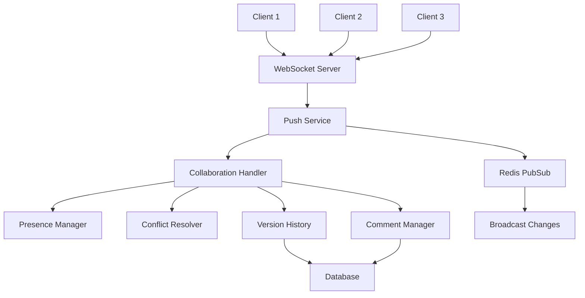
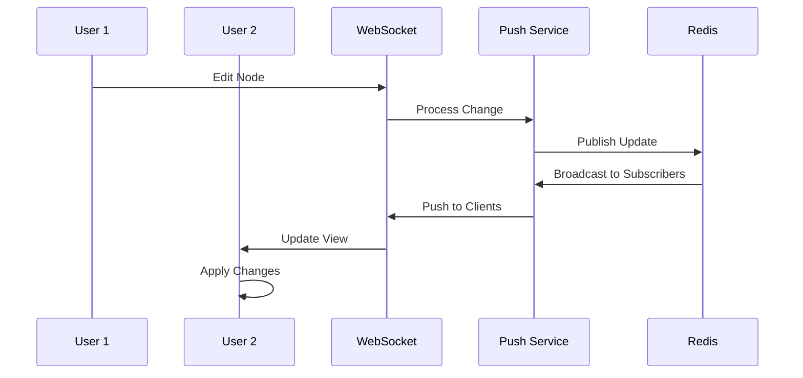

# Collaboration Feature

## Overview

The Collaboration feature enables real-time multi-user collaboration within n8n workflows. It provides shared editing capabilities, presence awareness, conflict resolution, and team coordination tools to enable teams to work together effectively on workflow automation.

## Quick Start

### Basic Setup

1. **Enable Collaboration Features**:
```bash
# Enable collaboration
export N8N_COLLABORATION_ENABLED=true
export N8N_PUSH_ENABLED=true

# Configure WebSocket
export N8N_PUSH_BACKEND=websocket
export N8N_WEBSOCKET_ENABLED=true
```

2. **Set Up Redis (Required for Multi-Instance)**:
```bash
# Redis configuration
export N8N_REDIS_HOST=localhost
export N8N_REDIS_PORT=6379
export N8N_REDIS_PASSWORD=your-password

# Or use Redis URL
export N8N_REDIS_URL=redis://localhost:6379
```

3. **Start n8n**:
```bash
pnpm dev
```

### Using Collaboration

1. **Share Workflow**: Click "Share" button in workflow editor
2. **Invite Team Members**: Add users via email or share link
3. **Real-time Editing**: See live cursors and changes
4. **Comments**: Add comments to nodes and connections
5. **Version History**: Track changes and restore versions

## Architecture

### System Components



### Real-time Synchronization



## Configuration

### Environment Variables

| Variable | Description | Default | Required |
|----------|-------------|---------|----------|
| `N8N_COLLABORATION_ENABLED` | Enable collaboration features | `false` | Yes |
| `N8N_PUSH_ENABLED` | Enable real-time push | `false` | Yes |
| `N8N_PUSH_BACKEND` | Push backend type | `websocket` | No |
| `N8N_WEBSOCKET_ENABLED` | Enable WebSocket server | `false` | Yes |
| `N8N_REDIS_HOST` | Redis server host | `localhost` | For scaling |
| `N8N_REDIS_PORT` | Redis server port | `6379` | For scaling |
| `N8N_COLLABORATION_MAX_USERS` | Max concurrent editors | `10` | No |
| `N8N_COLLABORATION_IDLE_TIME` | Idle timeout (ms) | `300000` | No |

### Feature Flags

```typescript
// PostHog feature flags
{
  "collaboration": true,
  "collaboration-presence": true,
  "collaboration-comments": true,
  "collaboration-versions": true,
  "collaboration-mentions": false
}
```

## API Reference

### WebSocket Events

#### Client → Server Events

```typescript
// Join collaboration session
{
  type: 'collaboration:join',
  workflowId: string,
  userId: string,
  cursor?: { x: number, y: number }
}

// Send workflow change
{
  type: 'collaboration:change',
  workflowId: string,
  change: {
    type: 'node' | 'connection' | 'settings',
    operation: 'add' | 'update' | 'delete',
    data: any
  }
}

// Update cursor position
{
  type: 'collaboration:cursor',
  workflowId: string,
  position: { x: number, y: number }
}

// Add comment
{
  type: 'collaboration:comment',
  workflowId: string,
  nodeId?: string,
  comment: string
}
```

#### Server → Client Events

```typescript
// User joined session
{
  type: 'collaboration:user-joined',
  user: {
    id: string,
    name: string,
    email: string,
    color: string
  }
}

// Workflow changed
{
  type: 'collaboration:changed',
  change: {
    userId: string,
    timestamp: number,
    data: any
  }
}

// Cursor moved
{
  type: 'collaboration:cursor-moved',
  userId: string,
  position: { x: number, y: number }
}

// Conflict detected
{
  type: 'collaboration:conflict',
  conflict: {
    type: string,
    localChange: any,
    remoteChange: any,
    resolution?: any
  }
}
```

### REST API Endpoints

#### Get Active Collaborators
```http
GET /api/collaboration/workflows/:id/users
Authorization: Bearer <token>
```

#### Get Collaboration History
```http
GET /api/collaboration/workflows/:id/history
Authorization: Bearer <token>
```

#### Add Comment
```http
POST /api/collaboration/workflows/:id/comments
Content-Type: application/json
Authorization: Bearer <token>

{
  "nodeId": "node-123",
  "text": "This node needs optimization",
  "mentions": ["user-456"]
}
```

### TypeScript Interfaces

```typescript
interface ICollaborationService {
  joinSession(workflowId: string, userId: string): Promise<CollaborationSession>;
  leaveSession(workflowId: string, userId: string): Promise<void>;
  broadcastChange(workflowId: string, change: WorkflowChange): Promise<void>;
  getActiveUsers(workflowId: string): Promise<CollaborationUser[]>;
  resolveConflict(conflict: Conflict): Promise<Resolution>;
}

interface CollaborationSession {
  id: string;
  workflowId: string;
  users: CollaborationUser[];
  version: number;
  locked: boolean;
  startedAt: Date;
}

interface CollaborationUser {
  id: string;
  name: string;
  email: string;
  color: string;
  cursor?: { x: number; y: number };
  lastActivity: Date;
  permissions: string[];
}

interface WorkflowChange {
  id: string;
  userId: string;
  type: 'node' | 'connection' | 'settings' | 'metadata';
  operation: 'create' | 'update' | 'delete';
  path: string[];
  oldValue?: any;
  newValue?: any;
  timestamp: number;
}
```

## Key Files

### Core Implementation
- `/packages/cli/src/collaboration/collaboration.service.ts` - Main service
- `/packages/cli/src/collaboration/presence.manager.ts` - Presence tracking
- `/packages/cli/src/collaboration/conflict.resolver.ts` - Conflict resolution
- `/packages/cli/src/push/push.service.ts` - Real-time push service

### WebSocket
- `/packages/cli/src/push/websocket.push.ts` - WebSocket implementation
- `/packages/cli/src/push/sse.push.ts` - Server-sent events fallback
- `/packages/cli/src/push/long-polling.push.ts` - Long polling fallback

### Frontend
- `/packages/editor-ui/src/stores/collaboration.store.ts` - State management
- `/packages/editor-ui/src/components/Collaboration/` - UI components
- `/packages/editor-ui/src/api/collaboration.ts` - API client

## Features

### Presence Awareness
- See who's currently editing
- Live cursor tracking
- User color coding
- Activity indicators
- Idle detection

### Conflict Resolution
- Optimistic updates
- Operational transformation
- Last-write-wins for simple conflicts
- Manual resolution for complex conflicts
- Automatic merging when possible

### Version History
- Track all changes
- Compare versions
- Restore previous versions
- Blame view
- Change annotations

### Comments & Mentions
- Node-level comments
- Connection comments
- @mentions with notifications
- Thread discussions
- Comment resolution

### Permissions
- Read-only viewers
- Editors
- Workflow owners
- Permission inheritance
- Role-based access

## Development

### Running Locally

```bash
# Start Redis
docker run -d -p 6379:6379 redis

# Install dependencies
pnpm install

# Configure environment
export N8N_COLLABORATION_ENABLED=true
export N8N_PUSH_ENABLED=true
export N8N_WEBSOCKET_ENABLED=true

# Start dev server
pnpm dev

# Open multiple browser windows to test
```

### Testing Collaboration

```bash
# Unit tests
pnpm test packages/cli/test/unit/collaboration

# Integration tests
pnpm test packages/cli/test/integration/collaboration

# E2E tests with multiple users
pnpm --filter=n8n-playwright test:collaboration
```

### Simulating Multiple Users

```javascript
// Test helper for multiple users
const users = await Promise.all([
  createTestUser('alice'),
  createTestUser('bob'),
  createTestUser('charlie')
]);

// Join collaboration session
await Promise.all(users.map(u =>
  collaborationService.joinSession(workflowId, u.id)
));

// Simulate concurrent edits
await Promise.all([
  users[0].addNode('n8n-nodes-base.httpRequest'),
  users[1].addNode('n8n-nodes-base.set'),
  users[2].updateConnection('node1', 'node2')
]);
```

## Scaling Considerations

### Redis Clustering
```yaml
# Redis cluster configuration
redis-cluster:
  nodes:
    - redis-1:6379
    - redis-2:6379
    - redis-3:6379
  replication-factor: 1
```

### Load Balancing WebSockets
```nginx
# Nginx WebSocket configuration
upstream n8n_websocket {
  ip_hash;
  server n8n-1:5678;
  server n8n-2:5678;
  server n8n-3:5678;
}

location /ws {
  proxy_pass http://n8n_websocket;
  proxy_http_version 1.1;
  proxy_set_header Upgrade $http_upgrade;
  proxy_set_header Connection "upgrade";
}
```

### Performance Optimization
- Use Redis Streams for event sourcing
- Implement message batching
- Add client-side caching
- Use compression for large payloads
- Implement connection pooling

## Security

### Authentication
- WebSocket authentication via JWT
- Token refresh mechanism
- Session validation
- Permission checks per operation

### Data Protection
- Encrypt sensitive workflow data
- Sanitize user inputs
- Rate limit operations
- Audit log all changes

### Network Security
- Use WSS (WebSocket Secure)
- Implement CORS properly
- Validate origins
- Use secure cookies

## Monitoring

### Metrics
- Active collaboration sessions
- WebSocket connections
- Message throughput
- Conflict rate
- Resolution time
- User engagement

### Logging
```typescript
logger.info('Collaboration event', {
  type: 'user-joined',
  workflowId,
  userId,
  sessionId,
  timestamp
});
```

### Dashboards
- Real-time user activity
- Collaboration patterns
- Performance metrics
- Error tracking

## Troubleshooting

### WebSocket Connection Issues
```bash
# Check WebSocket status
curl -i -N \
  -H "Connection: Upgrade" \
  -H "Upgrade: websocket" \
  -H "Sec-WebSocket-Version: 13" \
  -H "Sec-WebSocket-Key: dGhlIHNhbXBsZSBub25jZQ==" \
  http://localhost:5678/ws

# Check Redis connection
redis-cli ping

# Check push service logs
tail -f packages/cli/logs/push.log
```

### Sync Issues
- Clear Redis cache: `redis-cli FLUSHDB`
- Restart WebSocket server
- Check for version mismatches
- Verify user permissions

### Performance Issues
- Monitor Redis memory usage
- Check WebSocket connection count
- Analyze message frequency
- Review conflict resolution logs

## Best Practices

### Client Implementation
- Implement reconnection logic
- Handle offline mode gracefully
- Batch updates when possible
- Use optimistic UI updates
- Cache collaboration state

### Server Implementation
- Use connection pooling
- Implement circuit breakers
- Add request debouncing
- Use efficient data structures
- Monitor resource usage

### Conflict Resolution
- Prefer automatic resolution
- Keep conflicts granular
- Provide clear UI for manual resolution
- Log all resolutions
- Allow undo/redo

## Integration with Other Features

### Project Management
- Collaboration is project-scoped
- Inherit project permissions
- Share within project boundaries

### Version Control
- Git integration for version history
- Branch collaboration sessions
- Merge collaboration changes

### Audit Logging
- Track all collaboration events
- Record user actions
- Compliance reporting

## Future Enhancements

### Planned Features
- Voice/video chat integration
- Screen sharing capabilities
- Collaborative debugging
- Pair programming mode
- AI-assisted collaboration

### Experimental Features
- CRDT-based sync
- P2P collaboration
- Offline-first architecture
- Blockchain-based audit trail

## Related Documentation

- [Push Service](../push-service/README.md)
- [WebSocket Implementation](../websocket/README.md)
- [Project Management](../project/README.md)
- [Permissions](../permissions/README.md)

## Support

### Getting Help
- GitHub Issues: [n8n/n8n](https://github.com/n8n-io/n8n/issues)
- Community Forum: [community.n8n.io](https://community.n8n.io)
- Enterprise Support: support@n8n.io

### Contributing
- See CONTRIBUTING.md
- Join #collaboration channel
- Submit collaboration PRs
- Share use cases