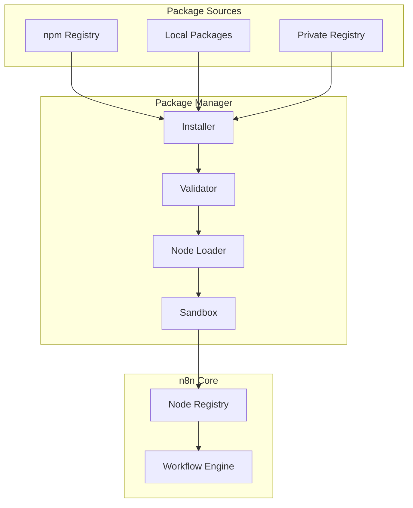

# Community Packages Module

## Overview

The Community Packages module enables users to install, manage, and share custom n8n nodes developed by the community. It provides a npm-based package management system for extending n8n's capabilities beyond built-in nodes.

**Module Path**: `packages/cli/src/community-packages/`

## Core Components

### Package Manager Service
- Install/uninstall npm packages
- Version management and updates
- Dependency resolution
- Security scanning

### Package Registry
- Community node discovery
- Package metadata management
- Version tracking
- Download statistics

### Node Loader
- Dynamic node loading
- Package validation
- Compatibility checking
- Error isolation

## Architecture



## Package Management

### Installing Packages
```bash
# Install from npm
n8n community-package:install n8n-nodes-custom-integration

# Install specific version
n8n community-package:install n8n-nodes-custom-integration@1.2.3

# Install from local path
n8n community-package:install file:./my-custom-nodes
```

### Package Structure
```typescript
interface CommunityPackage {
  name: string;
  version: string;
  description: string;
  nodes: string[];
  credentials?: string[];
  dependencies: Record<string, string>;
  n8nNodesApiVersion: number;
}
```

## Security

### Package Validation
- Sandboxed execution environment
- Permission restrictions
- Dependency scanning
- Code analysis for malicious patterns

### Trust Levels
```typescript
enum TrustLevel {
  VERIFIED = 'verified',    // n8n team verified
  COMMUNITY = 'community',  // Community reviewed
  UNVERIFIED = 'unverified' // Use with caution
}
```

## Configuration

```bash
N8N_COMMUNITY_PACKAGES_ENABLED=true
N8N_CUSTOM_EXTENSIONS=/data/n8n/custom
N8N_COMMUNITY_PACKAGE_REGISTRY=https://registry.npmjs.org
```

## Best Practices

1. **Review package code** before installation
2. **Test in development** environment first
3. **Monitor package updates** for security fixes
4. **Use verified packages** when possible
5. **Isolate custom nodes** from production initially