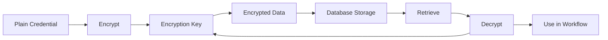
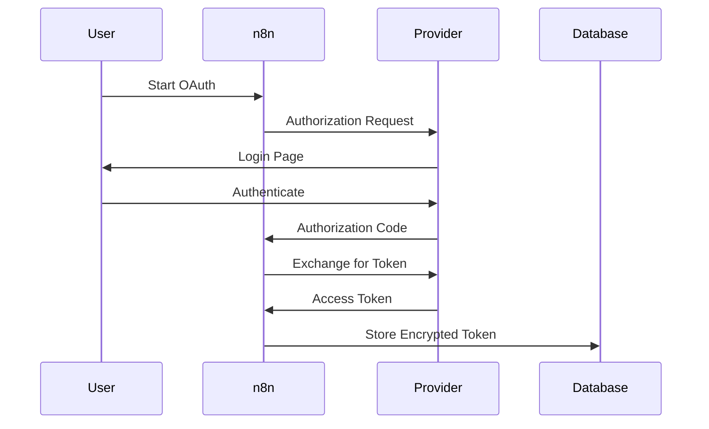

# Credentials Feature Documentation

## Overview

The Credentials feature provides secure management of authentication credentials for n8n integrations. It handles encryption, storage, sharing, and access control for sensitive authentication data across all workflow nodes.

## Core Concepts

### Credential Types
- **OAuth2**: Token-based authentication
- **API Key**: Simple key authentication
- **Basic Auth**: Username/password
- **Custom**: Integration-specific

### Security Model
- AES-256 encryption at rest
- Credential isolation per workflow
- Role-based access control
- Audit logging for all access

## Architecture

### Component Structure
```
credentials/
├── credentials.service.ts       # Business logic
├── credentials.controller.ts    # API endpoints
├── credentials.repository.ts    # Data access
├── credentials-helper.ts        # Utility functions
├── credentials-tester.service.ts # Connection testing
└── credentials.types.ts         # Type definitions
```

### Data Model

```typescript
interface ICredentials {
  id: string;
  name: string;
  type: string;
  data: ICredentialDataEncrypted;
  settings?: ICredentialSettings;
  shared?: ICredentialSharing[];
}

interface ICredentialDataEncrypted {
  // Encrypted credential data
  [key: string]: string;
}
```

## Key Features

### 1. Credential Management
- Create, read, update, delete credentials
- Credential duplication and import/export
- Bulk operations for migration
- Template credentials for quick setup

### 2. Encryption & Security
- AES-256-GCM encryption
- Per-instance encryption keys
- Secure key derivation (PBKDF2)
- Zero-knowledge architecture

### 3. Credential Sharing
- Project-based sharing
- Granular permissions (use, edit, share)
- Ownership transfer
- Access audit trail

### 4. Credential Testing
- Connection validation
- Real-time testing
- Error diagnostics
- OAuth flow handling

## API Reference

### REST Endpoints

| Method | Endpoint | Description |
|--------|----------|-------------|
| GET | `/credentials` | List all credentials |
| POST | `/credentials` | Create new credential |
| GET | `/credentials/:id` | Get credential details |
| PATCH | `/credentials/:id` | Update credential |
| DELETE | `/credentials/:id` | Delete credential |
| POST | `/credentials/test` | Test credential |
| GET | `/credentials/types` | List credential types |

### OAuth Endpoints

```
GET  /oauth2-credential/auth    # Start OAuth flow
GET  /oauth2-credential/callback # OAuth callback
POST /oauth2-credential/refresh  # Refresh token
```

## Security

### Encryption Process



### Key Management

```typescript
// Encryption configuration
const encryptionKey = process.env.N8N_ENCRYPTION_KEY;
const cipher = crypto.createCipheriv('aes-256-gcm', key, iv);
```

## Configuration

### Environment Variables

```bash
# Encryption key (required)
N8N_ENCRYPTION_KEY=your-256-bit-key

# OAuth redirect URL
N8N_OAUTH_CALLBACK_URL=https://your-instance/rest/oauth2-credential/callback

# Credential overwrites (for deployment)
CREDENTIALS_OVERWRITE_DATA={"credentialId":{"apiKey":"value"}}
```

## Best Practices

### Security
1. **Strong encryption keys**: Use 256-bit random keys
2. **Key rotation**: Regular key rotation schedule
3. **Minimal permissions**: Least privilege access
4. **Audit logging**: Track all credential access
5. **Secure transmission**: Always use HTTPS

### Management
1. **Naming conventions**: Clear, descriptive names
2. **Documentation**: Document credential purpose
3. **Regular testing**: Validate credentials periodically
4. **Cleanup**: Remove unused credentials
5. **Backup**: Regular encrypted backups

## OAuth2 Integration

### OAuth Flow



### Token Refresh

```typescript
async function refreshOAuth2Token(credential: ICredentials) {
  const refreshToken = decrypt(credential.data.refreshToken);
  const newTokens = await oauth2Client.refreshToken(refreshToken);
  await updateCredential(credential.id, encrypt(newTokens));
}
```

## Troubleshooting

### Common Issues

#### Credential Decryption Errors
```javascript
// Check encryption key
if (!process.env.N8N_ENCRYPTION_KEY) {
  throw new Error('Encryption key not set');
}
```

#### OAuth Connection Failed
```bash
# Verify callback URL
echo $N8N_OAUTH_CALLBACK_URL
# Must be accessible from internet
```

#### Testing Failures
```typescript
// Enable debug logging
process.env.N8N_LOG_LEVEL = 'debug';
// Check credential test logs
```

## Migration

### Importing Credentials

```bash
# Export from old instance
n8n export:credentials --output=creds.json

# Import to new instance
n8n import:credentials --input=creds.json
```

### Key Rotation

```javascript
// Re-encrypt with new key
async function rotateEncryptionKey(oldKey, newKey) {
  const credentials = await getAllCredentials();
  for (const cred of credentials) {
    const decrypted = decrypt(cred.data, oldKey);
    const encrypted = encrypt(decrypted, newKey);
    await updateCredential(cred.id, encrypted);
  }
}
```

---

**Last Updated**: 2025-11-10
**Version**: 1.0.0
**BMAD Compliance**: ✅ Complete