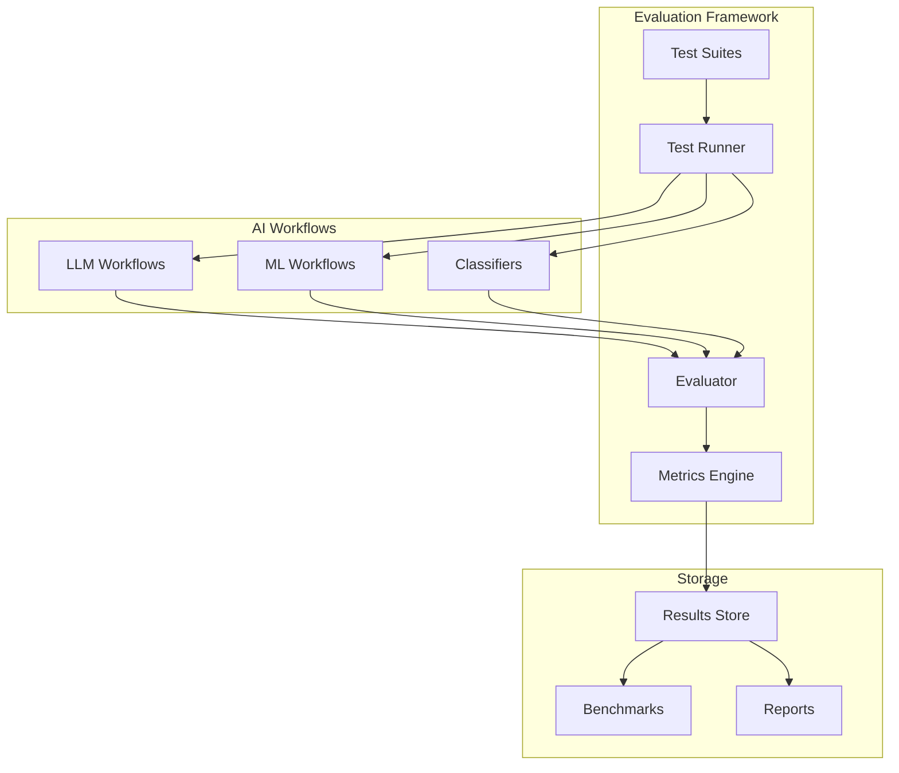

# Evaluation Module (Enterprise)

## Overview

The Evaluation module provides AI/ML model evaluation capabilities for n8n workflows. It enables testing, benchmarking, and quality assessment of AI-powered workflows, including LLM outputs, classification accuracy, and regression performance metrics.

**Module Path**: `packages/cli/src/evaluation/`
**License**: Enterprise Edition

## Core Components

### 1. Evaluation Service
- **Purpose**: Orchestrate evaluation workflows
- **Key Features**:
  - Test suite management
  - Evaluation job scheduling
  - Metric calculation and aggregation
  - Report generation

### 2. Test Runner Service
- **Purpose**: Execute evaluation test cases
- **Key Features**:
  - Parallel test execution
  - Input data management
  - Output collection
  - Performance monitoring

### 3. Metrics Calculator
- **Purpose**: Calculate evaluation metrics
- **Key Features**:
  - Accuracy, precision, recall, F1 scores
  - BLEU, ROUGE scores for text generation
  - Custom metric definitions
  - Statistical significance testing

## Architecture



## Evaluation Types

### LLM Evaluation
```typescript
interface LLMEvaluation {
  type: 'llm';
  metrics: {
    bleu: number;
    rouge: {
      rouge1: number;
      rouge2: number;
      rougeL: number;
    };
    perplexity: number;
    coherence: number;
    factuality?: number;
    toxicity?: number;
  };
  humanEval?: {
    relevance: number;
    quality: number;
    accuracy: number;
  };
}
```

### Classification Evaluation
```typescript
interface ClassificationEvaluation {
  type: 'classification';
  metrics: {
    accuracy: number;
    precision: number;
    recall: number;
    f1Score: number;
    confusionMatrix: number[][];
    rocAuc?: number;
    classMetrics: {
      [className: string]: {
        precision: number;
        recall: number;
        f1Score: number;
        support: number;
      };
    };
  };
}
```

### Regression Evaluation
```typescript
interface RegressionEvaluation {
  type: 'regression';
  metrics: {
    mse: number;  // Mean Squared Error
    rmse: number; // Root Mean Squared Error
    mae: number;  // Mean Absolute Error
    r2Score: number;
    mape?: number; // Mean Absolute Percentage Error
  };
}
```

## Test Suite Definition

```typescript
interface TestSuite {
  id: string;
  name: string;
  description: string;
  workflowId: string;
  type: 'llm' | 'classification' | 'regression';

  testCases: TestCase[];

  configuration: {
    parallelism: number;
    timeout: number;
    retryOnFailure: boolean;
    randomSeed?: number;
  };

  metrics: string[]; // Metrics to calculate

  baseline?: {
    metrics: Record<string, number>;
    timestamp: Date;
  };
}

interface TestCase {
  id: string;
  name: string;
  input: any;
  expectedOutput?: any;
  metadata?: Record<string, any>;
  weight?: number; // For weighted metrics
}
```

## Running Evaluations

### API Endpoints

```http
POST /api/v1/evaluation/run
{
  "suiteId": "suite_123",
  "configuration": {
    "parallelism": 5,
    "compareToBaseline": true
  }
}

Response:
{
  "evaluationId": "eval_456",
  "status": "running",
  "estimatedTime": 300
}
```

### Get Results
```http
GET /api/v1/evaluation/{evaluationId}/results

Response:
{
  "evaluationId": "eval_456",
  "status": "completed",
  "duration": 285,
  "results": {
    "metrics": { ... },
    "testCases": [ ... ],
    "comparison": { ... }
  }
}
```

## Metrics Calculation

### Text Generation Metrics
```typescript
class TextMetrics {
  // BLEU Score
  calculateBLEU(reference: string, hypothesis: string): number {
    // Implementation of BLEU score calculation
  }

  // ROUGE Scores
  calculateROUGE(reference: string, hypothesis: string): RougeScores {
    // Implementation of ROUGE-1, ROUGE-2, ROUGE-L
  }

  // Semantic Similarity
  calculateSimilarity(text1: string, text2: string): number {
    // Using embeddings for semantic similarity
  }
}
```

### Custom Metrics
```typescript
// Define custom metrics
interface CustomMetric {
  name: string;
  description: string;
  calculate: (output: any, expected: any) => number;
}

const customMetrics: CustomMetric[] = [
  {
    name: 'json_validity',
    description: 'Checks if output is valid JSON',
    calculate: (output) => {
      try {
        JSON.parse(output);
        return 1.0;
      } catch {
        return 0.0;
      }
    }
  }
];
```

## Benchmarking

### Benchmark Management
```typescript
interface Benchmark {
  id: string;
  name: string;
  suiteId: string;
  metrics: Record<string, number>;
  metadata: {
    modelVersion?: string;
    timestamp: Date;
    environment: string;
    notes?: string;
  };
}

// Compare against benchmark
const comparison = await evaluationService.compareWithBenchmark(
  currentResults,
  benchmarkId
);
```

## A/B Testing

```typescript
interface ABTest {
  id: string;
  name: string;
  variants: {
    control: string; // Workflow ID
    treatment: string; // Workflow ID
  };

  splitRatio: number; // 0.5 = 50/50 split

  metrics: string[];

  minimumSampleSize: number;

  results?: {
    control: EvaluationResults;
    treatment: EvaluationResults;
    winner?: 'control' | 'treatment' | 'no_difference';
    confidence: number;
  };
}
```

## Continuous Evaluation

### Scheduled Evaluations
```typescript
interface ScheduledEvaluation {
  id: string;
  suiteId: string;
  schedule: string; // Cron expression
  enabled: boolean;

  notifications: {
    onFailure: boolean;
    onRegression: boolean;
    recipients: string[];
  };

  thresholds: {
    [metric: string]: {
      minimum: number;
      action: 'alert' | 'block_deployment';
    };
  };
}
```

## Reporting

### Evaluation Reports
```typescript
interface EvaluationReport {
  summary: {
    passed: boolean;
    score: number;
    duration: number;
    testCasesPassed: number;
    testCasesTotal: number;
  };

  metrics: Record<string, number>;

  trends: {
    metric: string;
    current: number;
    previous: number;
    change: number;
    trend: 'improving' | 'declining' | 'stable';
  }[];

  recommendations: string[];

  visualizations: {
    confusionMatrix?: string; // Base64 encoded image
    rocCurve?: string;
    trendsChart?: string;
  };
}
```

## Configuration

### Environment Variables
```bash
# Evaluation Configuration
N8N_EVALUATION_ENABLED=true
N8N_EVALUATION_MAX_PARALLEL_TESTS=10
N8N_EVALUATION_DEFAULT_TIMEOUT=300

# Storage
N8N_EVALUATION_RESULTS_RETENTION_DAYS=90
N8N_EVALUATION_STORE_RAW_OUTPUTS=true

# Notifications
N8N_EVALUATION_NOTIFICATIONS_ENABLED=true
N8N_EVALUATION_SLACK_WEBHOOK=https://hooks.slack.com/...
```

## Best Practices

1. **Define clear test cases** with expected outputs
2. **Use appropriate metrics** for your use case
3. **Establish baselines** before making changes
4. **Run evaluations regularly** to catch regressions
5. **Version your test suites** alongside workflows
6. **Monitor trends** not just absolute values
7. **Document metric thresholds** and their rationale

## Integration with CI/CD

```yaml
# GitHub Actions example
name: Evaluate AI Workflows

on:
  pull_request:
    paths:
      - 'workflows/ai/**'

jobs:
  evaluate:
    runs-on: ubuntu-latest
    steps:
      - name: Run Evaluation Suite
        run: |
          npx n8n evaluation:run \
            --suite=ai-workflows \
            --compare-to-baseline

      - name: Check Results
        run: |
          npx n8n evaluation:check \
            --min-score=0.85 \
            --block-on-regression
```

## Future Enhancements

1. **Visual evaluation** for image generation workflows
2. **Real-time evaluation** during workflow execution
3. **Adversarial testing** for robustness
4. **Cost-performance** optimization metrics
5. **Multi-model comparison** frameworks