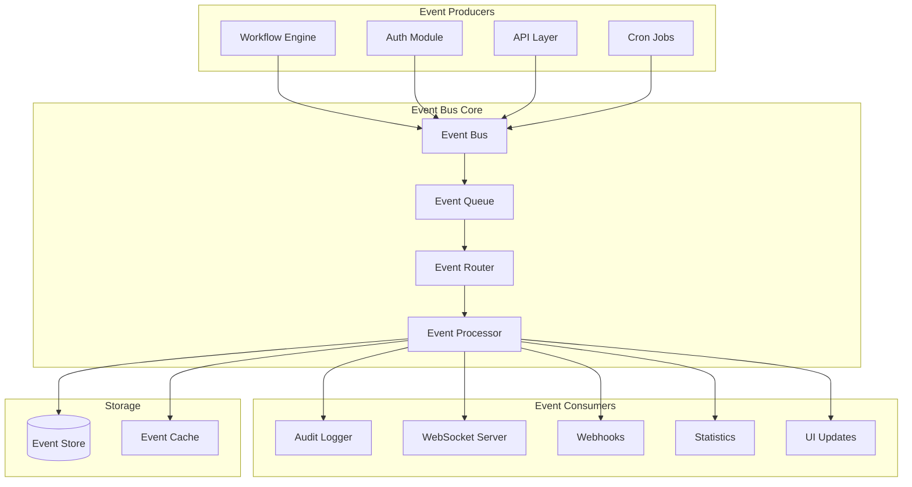

# Event Bus Module

## Overview

The Event Bus module provides a centralized event-driven architecture for n8n, enabling decoupled communication between different parts of the system. It facilitates real-time updates, audit logging, and system-wide notifications through a publish-subscribe pattern.

**Module Path**: `packages/cli/src/events/`

## Core Components

### 1. Event Service (`event.service.ts`)
- **Purpose**: Central event dispatcher and handler registry
- **Key Features**:
  - Event publishing and subscription management
  - Event filtering and routing
  - Async event processing with queuing
  - Event persistence for audit trails

### 2. Message Event Bus (`message-event-bus.ts`)
- **Purpose**: Core event bus implementation
- **Key Features**:
  - In-memory event dispatching
  - Event listener registration
  - Event history tracking
  - Dead letter queue for failed events

### 3. Event Relay (`event-relay.service.ts`)
- **Purpose**: Bridge between internal events and external systems
- **Key Features**:
  - Webhook dispatching for events
  - External system integration
  - Event transformation and mapping
  - Retry logic for external deliveries

### 4. Audit Event Relay (`audit-event-relay.service.ts`)
- **Purpose**: Specialized relay for audit events
- **Key Features**:
  - Security event tracking
  - Compliance logging
  - Event filtering for sensitive data
  - Retention policy enforcement

## Architecture



## Event Types

### System Events
```typescript
enum SystemEventType {
  // Application lifecycle
  APP_STARTED = 'app.started',
  APP_STOPPED = 'app.stopped',
  APP_CRASHED = 'app.crashed',

  // Configuration changes
  CONFIG_UPDATED = 'config.updated',
  FEATURE_FLAG_CHANGED = 'feature.flag.changed',

  // System health
  HEALTH_CHECK_PASSED = 'health.check.passed',
  HEALTH_CHECK_FAILED = 'health.check.failed'
}
```

### Workflow Events
```typescript
enum WorkflowEventType {
  // Lifecycle events
  WORKFLOW_CREATED = 'workflow.created',
  WORKFLOW_UPDATED = 'workflow.updated',
  WORKFLOW_DELETED = 'workflow.deleted',
  WORKFLOW_ACTIVATED = 'workflow.activated',
  WORKFLOW_DEACTIVATED = 'workflow.deactivated',

  // Execution events
  WORKFLOW_STARTED = 'workflow.started',
  WORKFLOW_SUCCESS = 'workflow.success',
  WORKFLOW_FAILED = 'workflow.failed',
  WORKFLOW_CRASHED = 'workflow.crashed'
}
```

### User Events
```typescript
enum UserEventType {
  // Authentication
  USER_LOGIN = 'user.login',
  USER_LOGOUT = 'user.logout',
  USER_LOGIN_FAILED = 'user.login.failed',

  // User management
  USER_CREATED = 'user.created',
  USER_UPDATED = 'user.updated',
  USER_DELETED = 'user.deleted',
  USER_INVITED = 'user.invited',
  USER_PASSWORD_RESET = 'user.password.reset'
}
```

### Security Events
```typescript
enum SecurityEventType {
  // Access control
  ACCESS_DENIED = 'security.access.denied',
  PERMISSION_VIOLATION = 'security.permission.violation',

  // Credentials
  CREDENTIAL_CREATED = 'security.credential.created',
  CREDENTIAL_ACCESSED = 'security.credential.accessed',
  CREDENTIAL_UPDATED = 'security.credential.updated',
  CREDENTIAL_DELETED = 'security.credential.deleted',

  // Threats
  SUSPICIOUS_ACTIVITY = 'security.suspicious.activity',
  RATE_LIMIT_EXCEEDED = 'security.rate.limit.exceeded'
}
```

## Event Structure

### Base Event Interface
```typescript
interface BaseEvent {
  id: string;                  // Unique event ID
  type: string;                 // Event type/name
  timestamp: Date;              // When event occurred
  source: string;               // Event source/module
  userId?: string;              // User who triggered event
  sessionId?: string;           // Associated session
  metadata: Record<string, any>; // Event-specific data
}
```

### Audit Event
```typescript
interface AuditEvent extends BaseEvent {
  action: string;               // Action performed
  resource: string;             // Resource affected
  resourceId: string;           // Resource identifier
  oldValue?: any;              // Previous state
  newValue?: any;              // New state
  ip?: string;                 // Client IP address
  userAgent?: string;          // Client user agent
}
```

## Usage Examples

### Publishing Events
```typescript
// Publish a simple event
eventBus.publish({
  type: 'workflow.created',
  userId: currentUser.id,
  metadata: {
    workflowId: workflow.id,
    workflowName: workflow.name
  }
});

// Publish with priority
eventBus.publish({
  type: 'security.access.denied',
  priority: EventPriority.HIGH,
  metadata: {
    resource: '/api/credentials',
    reason: 'Insufficient permissions'
  }
});
```

### Subscribing to Events
```typescript
// Subscribe to specific event type
eventBus.subscribe('workflow.failed', async (event) => {
  await notificationService.sendAlert({
    type: 'workflow_failure',
    workflowId: event.metadata.workflowId,
    error: event.metadata.error
  });
});

// Subscribe with filter
eventBus.subscribe('user.*', async (event) => {
  if (event.metadata.role === 'admin') {
    await auditLogger.logAdminAction(event);
  }
});

// Subscribe to multiple event types
eventBus.subscribeMany(
  ['workflow.started', 'workflow.success', 'workflow.failed'],
  async (event) => {
    await updateWorkflowStatistics(event);
  }
);
```

### Event Filtering
```typescript
// Create filtered subscription
const subscription = eventBus.subscribe({
  types: ['workflow.*'],
  filter: (event) => {
    return event.metadata.projectId === currentProject.id;
  },
  handler: async (event) => {
    await updateProjectDashboard(event);
  }
});

// Unsubscribe when done
subscription.unsubscribe();
```

## Configuration

### Environment Variables
```bash
# Event Bus Configuration
N8N_EVENT_BUS_ENABLED=true
N8N_EVENT_BUS_LOG_LEVEL=info
N8N_EVENT_BUS_MAX_QUEUE_SIZE=10000
N8N_EVENT_BUS_WORKER_THREADS=4

# Event Persistence
N8N_EVENT_BUS_PERSIST_EVENTS=true
N8N_EVENT_BUS_RETENTION_DAYS=90

# External Relay
N8N_EVENT_BUS_WEBHOOK_URL=https://external.system/events
N8N_EVENT_BUS_WEBHOOK_RETRY_COUNT=3
```

### Configuration Object
```typescript
{
  eventBus: {
    enabled: true,
    persistence: {
      enabled: true,
      retentionDays: 90,
      batchSize: 100
    },
    queue: {
      maxSize: 10000,
      workerThreads: 4,
      processingInterval: 100 // ms
    },
    relay: {
      enabled: false,
      webhookUrl: null,
      retryCount: 3,
      timeout: 5000 // ms
    }
  }
}
```

## Performance Considerations

### Event Batching
```typescript
// Batch multiple events for efficiency
eventBus.batchPublish([
  { type: 'metric.recorded', metadata: { ... } },
  { type: 'metric.recorded', metadata: { ... } },
  { type: 'metric.recorded', metadata: { ... } }
]);
```

### Async Processing
```typescript
// Non-blocking event publishing
await eventBus.publishAsync(event);

// Fire-and-forget for non-critical events
eventBus.publishNoWait(event);
```

### Queue Management
- Maximum queue size: 10,000 events
- Overflow strategy: Drop oldest events
- Processing rate: 1000 events/second
- Worker threads: 4 (configurable)

## Error Handling

### Dead Letter Queue
```typescript
// Events that fail processing go to DLQ
eventBus.on('event.failed', async (failedEvent) => {
  await deadLetterQueue.add({
    event: failedEvent.event,
    error: failedEvent.error,
    retryCount: failedEvent.retryCount,
    timestamp: new Date()
  });
});

// Process DLQ periodically
async function processDLQ() {
  const failed = await deadLetterQueue.getAll();
  for (const item of failed) {
    if (item.retryCount < 3) {
      await eventBus.retry(item.event);
    } else {
      await alertAdmin(item);
    }
  }
}
```

### Error Recovery
```typescript
// Automatic retry with exponential backoff
eventBus.subscribe('critical.event', async (event) => {
  try {
    await processEvent(event);
  } catch (error) {
    throw new RetryableError(error, {
      maxRetries: 3,
      backoff: 'exponential'
    });
  }
});
```

## Monitoring

### Metrics
```typescript
// Event bus metrics
{
  'event_bus.events_published': counter,
  'event_bus.events_processed': counter,
  'event_bus.events_failed': counter,
  'event_bus.queue_size': gauge,
  'event_bus.processing_time': histogram,
  'event_bus.subscriber_count': gauge
}
```

### Health Checks
```typescript
// Event bus health check
async function checkEventBusHealth() {
  return {
    healthy: eventBus.isHealthy(),
    queueSize: eventBus.getQueueSize(),
    processingRate: eventBus.getProcessingRate(),
    failureRate: eventBus.getFailureRate(),
    subscribers: eventBus.getSubscriberCount()
  };
}
```

## Testing

### Unit Tests
```typescript
describe('EventBus', () => {
  test('should publish and receive events', async () => {
    const handler = jest.fn();
    eventBus.subscribe('test.event', handler);

    await eventBus.publish({
      type: 'test.event',
      metadata: { foo: 'bar' }
    });

    expect(handler).toHaveBeenCalledWith(
      expect.objectContaining({
        type: 'test.event',
        metadata: { foo: 'bar' }
      })
    );
  });
});
```

### Integration Tests
```typescript
describe('Event Flow', () => {
  test('workflow events trigger statistics update', async () => {
    const workflow = await createWorkflow();

    await executeWorkflow(workflow.id);

    // Wait for async event processing
    await eventually(async () => {
      const stats = await getWorkflowStatistics(workflow.id);
      expect(stats.executionCount).toBe(1);
    });
  });
});
```

## WebSocket Integration

### Real-time Updates
```typescript
// Push events to connected clients
eventBus.subscribe('workflow.*', async (event) => {
  wsServer.broadcast({
    type: 'event',
    payload: event
  });
});

// Client-side subscription
ws.on('message', (data) => {
  const { type, payload } = JSON.parse(data);
  if (type === 'event') {
    handleRealtimeEvent(payload);
  }
});
```

## Security Considerations

### Event Sanitization
```typescript
// Remove sensitive data from events
function sanitizeEvent(event: BaseEvent): BaseEvent {
  const sanitized = { ...event };

  // Remove credentials
  delete sanitized.metadata.password;
  delete sanitized.metadata.apiKey;
  delete sanitized.metadata.token;

  // Mask sensitive fields
  if (sanitized.metadata.email) {
    sanitized.metadata.email = maskEmail(sanitized.metadata.email);
  }

  return sanitized;
}
```

### Access Control
```typescript
// Role-based event access
eventBus.subscribe('admin.*', async (event) => {
  if (!hasRole(event.userId, 'admin')) {
    throw new UnauthorizedError('Admin events require admin role');
  }
  await processAdminEvent(event);
});
```

## Best Practices

### Event Naming
- Use dot notation: `domain.action.status`
- Be consistent: `workflow.execution.started`
- Include context: `user.login.failed`

### Event Payload
- Keep payloads small (<1KB)
- Include only necessary data
- Reference IDs instead of full objects
- Use consistent field names

### Subscription Management
- Unsubscribe when component unmounts
- Use specific event types over wildcards
- Implement error handling in handlers
- Keep handlers lightweight

## Troubleshooting

### Common Issues

**Issue**: Events not being received
- Check subscription patterns match event types
- Verify event bus is enabled in config
- Check for errors in event handlers

**Issue**: High memory usage
- Reduce queue size limit
- Implement event batching
- Clean up old subscriptions

**Issue**: Events processing slowly
- Increase worker thread count
- Optimize event handlers
- Consider async processing

## Future Enhancements

### Planned Features
1. **Event Sourcing**: Complete system state from events
2. **Event Replay**: Replay events for debugging
3. **Event Streaming**: Kafka/RabbitMQ integration
4. **Event Schema Registry**: Versioned event schemas
5. **Distributed Tracing**: Event flow visualization

### Roadmap
- Q1 2025: Event streaming support
- Q2 2025: Schema registry implementation
- Q3 2025: Distributed tracing
- Q4 2025: Event sourcing capabilities