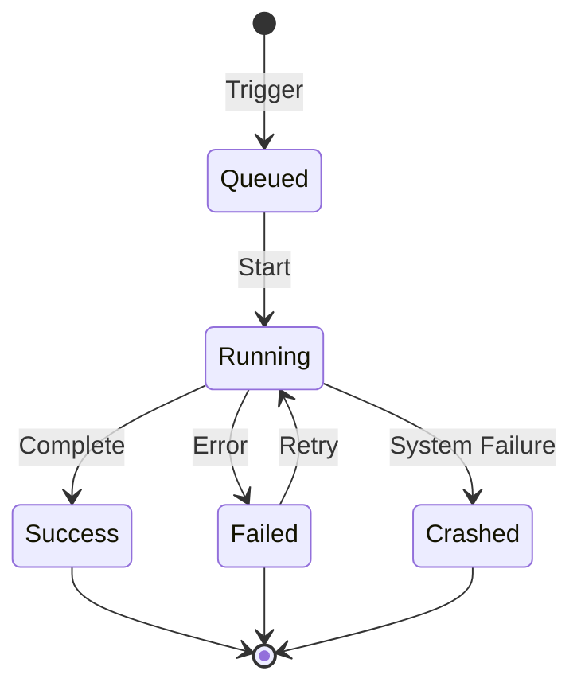

# Executions Feature Documentation

## Overview

The Executions feature manages the complete lifecycle of workflow runs in n8n, from initiation through completion or failure. It provides real-time execution tracking, state management, error handling, and execution history with comprehensive monitoring capabilities.

## Core Concepts

### Execution Lifecycle



### Execution Modes

1. **Regular Mode**: Synchronous execution in main process
2. **Queue Mode**: Asynchronous execution via worker nodes
3. **Webhook Mode**: Lightweight webhook-only processing

## Architecture

### Component Structure
```
executions/
├── execution.service.ts         # Core execution logic
├── execution.repository.ts      # Database operations
├── execution-recovery.service.ts # Crash recovery
├── active-executions.ts         # Runtime tracking
├── execution-metrics.service.ts # Performance metrics
└── execution.types.ts          # Type definitions
```

### Data Model

```typescript
interface IExecution {
  id: string;
  workflowId: string;
  mode: 'manual' | 'trigger' | 'webhook' | 'retry';
  status: 'queued' | 'running' | 'success' | 'failed' | 'crashed';
  startedAt: Date;
  stoppedAt?: Date;
  data: IRunExecutionData;
  waitTill?: Date;
  retryOf?: string;
  retrySuccessId?: string;
}
```

## Key Features

### 1. Execution Management
- Start, stop, and retry executions
- Queue management for async processing
- Concurrency control and throttling
- Execution prioritization

### 2. State Tracking
- Real-time execution status
- Progress monitoring
- Resource utilization tracking
- Performance metrics

### 3. Error Handling
- Automatic retry logic
- Error workflows
- Crash recovery
- Dead letter queue

### 4. Execution History
- Complete execution logs
- Input/output data storage
- Execution timeline
- Performance analytics

## API Reference

### REST Endpoints

| Method | Endpoint | Description |
|--------|----------|-------------|
| GET | `/executions` | List all executions |
| GET | `/executions/:id` | Get execution details |
| POST | `/executions/:id/stop` | Stop running execution |
| POST | `/executions/:id/retry` | Retry failed execution |
| DELETE | `/executions/:id` | Delete execution |
| GET | `/executions/active` | List active executions |

### WebSocket Events

```javascript
// Real-time execution updates
ws.on('execution.start', (data) => {});
ws.on('execution.progress', (data) => {});
ws.on('execution.finish', (data) => {});
ws.on('execution.error', (data) => {});
```

## Configuration

### Environment Variables

```bash
# Execution settings
EXECUTIONS_MODE=regular|queue
EXECUTIONS_TIMEOUT=3600
EXECUTIONS_TIMEOUT_MAX=7200
EXECUTIONS_DATA_SAVE_ON_ERROR=all|none
EXECUTIONS_DATA_SAVE_ON_SUCCESS=all|none
EXECUTIONS_DATA_SAVE_MANUAL_EXECUTIONS=true

# Queue settings (for queue mode)
QUEUE_BULL_REDIS_HOST=localhost
QUEUE_BULL_REDIS_PORT=6379
QUEUE_WORKER_CONCURRENCY=10
```

### Execution Options

```typescript
interface IExecutionOptions {
  saveDataOnError: 'all' | 'none' | 'lastNode';
  saveDataOnSuccess: 'all' | 'none' | 'lastNode';
  saveManualExecutions: boolean;
  executionTimeout: number;
  retryOnFail: boolean;
  maxRetries: number;
}
```

## Performance Optimization

### Queue Mode Setup

```yaml
# docker-compose.yml for scaling
services:
  n8n-main:
    command: start
    environment:
      - EXECUTIONS_MODE=queue

  n8n-worker:
    command: worker
    environment:
      - EXECUTIONS_MODE=queue
    deploy:
      replicas: 3
```

### Optimization Strategies

1. **Data Pruning**: Remove old execution data
2. **Selective Saving**: Save only error executions
3. **Binary Data**: External storage for large files
4. **Database Indexing**: Optimize query performance
5. **Connection Pooling**: Database connection management

## Monitoring

### Metrics

```typescript
// Key performance indicators
{
  'execution.started': counter,
  'execution.completed': counter,
  'execution.failed': counter,
  'execution.duration': histogram,
  'execution.queue.depth': gauge,
  'execution.active.count': gauge
}
```

### Health Checks

```javascript
// Health check endpoint
GET /healthz/executions
{
  "status": "healthy",
  "activeExecutions": 5,
  "queueDepth": 10,
  "workerCount": 3
}
```

## Error Recovery

### Retry Configuration

```json
{
  "retry": {
    "enable": true,
    "maxAttempts": 3,
    "waitBetweenTries": 5000,
    "backoffStrategy": "exponential"
  }
}
```

### Crash Recovery

```typescript
// Automatic recovery on startup
async function recoverCrashedExecutions() {
  const crashed = await findCrashedExecutions();
  for (const execution of crashed) {
    await retryExecution(execution.id);
  }
}
```

## Best Practices

### Execution Management
1. Use queue mode for production
2. Set appropriate timeouts
3. Implement retry strategies
4. Monitor queue depth
5. Regular data pruning

### Performance
1. Limit concurrent executions
2. Use external binary storage
3. Optimize database queries
4. Implement caching
5. Scale workers horizontally

### Reliability
1. Enable crash recovery
2. Configure error workflows
3. Set up monitoring alerts
4. Implement circuit breakers
5. Regular backups

## Troubleshooting

### Common Issues

#### Stuck Executions
```sql
-- Find stuck executions
SELECT id, workflow_id, started_at
FROM execution_entity
WHERE status = 'running'
  AND started_at < NOW() - INTERVAL '1 hour';
```

#### Queue Backlog
```bash
# Check queue depth
redis-cli LLEN bull:executions:wait
```

#### Memory Issues
```javascript
// Limit execution data size
process.env.EXECUTIONS_DATA_MAX_SIZE = '10MB';
```

## Integration

### With Workflows
- Executions are triggered by workflows
- Each workflow run creates an execution
- Execution context passed between nodes

### With Monitoring
- Prometheus metrics export
- Grafana dashboards
- Alert manager integration
- Custom webhooks for notifications

## Related Documentation

- [Workflows Documentation](../workflows/README.md)
- [Queue Mode Setup](https://docs.n8n.io/hosting/scaling/queue-mode/)
- [Execution API](https://docs.n8n.io/api/executions/)

---

**Last Updated**: 2025-11-10
**Version**: 1.0.0
**BMAD Compliance**: ✅ Complete