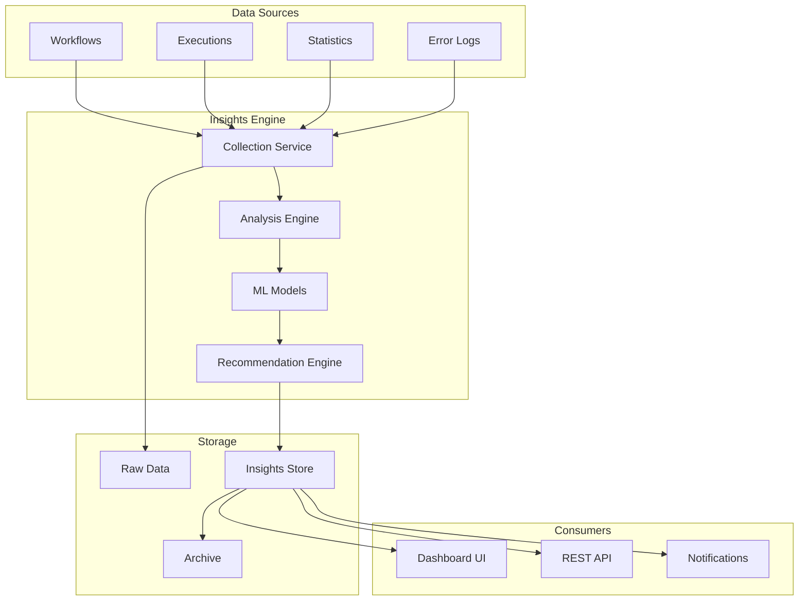

# Insights Module

## Overview

The Insights module provides intelligent analysis and recommendations for n8n workflows. It analyzes workflow patterns, identifies optimization opportunities, detects anomalies, and provides actionable insights to improve automation efficiency and reliability.

**Module Path**: `packages/cli/src/modules/insights/`

## Core Components

### 1. Insights Service (`insights.service.ts`)
- **Purpose**: Main service orchestrating insight generation
- **Key Features**:
  - Pattern recognition and analysis
  - Anomaly detection algorithms
  - Recommendation generation
  - Insight prioritization and scoring

### 2. Insights Collection Service (`insights-collection.service.ts`)
- **Purpose**: Collect data for insight generation
- **Key Features**:
  - Workflow execution data collection
  - Node usage pattern tracking
  - Error pattern analysis
  - Performance baseline establishment

### 3. Insights Compaction Service (`insights-compaction.service.ts`)
- **Purpose**: Compress and optimize stored insights
- **Key Features**:
  - Historical data compression
  - Duplicate insight removal
  - Data aggregation for trends
  - Storage optimization

### 4. Insights Pruning Service (`insights-pruning.service.ts`)
- **Purpose**: Clean up old and irrelevant insights
- **Key Features**:
  - Age-based pruning
  - Relevance scoring
  - Automated cleanup scheduling
  - Archive management

## Architecture



## Insight Types

### Performance Insights
```typescript
interface PerformanceInsight {
  type: 'performance';
  severity: 'low' | 'medium' | 'high';
  workflowId: string;
  title: string;
  description: string;
  impact: {
    currentDuration: number;
    potentialSaving: number;
    affectedExecutions: number;
  };
  recommendations: string[];
}

// Example insights:
// - "Workflow X takes 3x longer than similar workflows"
// - "Node Y is the bottleneck (80% of execution time)"
// - "Parallel execution could save 50% time"
```

### Reliability Insights
```typescript
interface ReliabilityInsight {
  type: 'reliability';
  severity: 'low' | 'medium' | 'high';
  workflowId: string;
  errorPattern: string;
  frequency: number;
  lastOccurrence: Date;
  recommendations: string[];
}

// Example insights:
// - "Workflow fails 20% of the time at Node Z"
// - "Timeout errors increased by 150% this week"
// - "Add error handling to prevent cascading failures"
```

### Cost Insights
```typescript
interface CostInsight {
  type: 'cost';
  resourceType: 'api_calls' | 'storage' | 'compute';
  currentCost: number;
  projectedCost: number;
  savingOpportunity: number;
  recommendations: string[];
}

// Example insights:
// - "API calls could be batched to reduce costs by 40%"
// - "Unused workflow executions consuming 2GB storage"
// - "Schedule workflows during off-peak for lower rates"
```

### Security Insights
```typescript
interface SecurityInsight {
  type: 'security';
  severity: 'critical' | 'high' | 'medium' | 'low';
  issue: string;
  affectedResources: string[];
  recommendations: string[];
}

// Example insights:
// - "Credentials exposed in workflow variables"
// - "Workflow accessible without authentication"
// - "Sensitive data logged in plain text"
```

## Machine Learning Models

### Anomaly Detection
```typescript
class AnomalyDetector {
  // Isolation Forest for execution time anomalies
  detectExecutionAnomalies(executions: Execution[]): Anomaly[] {
    const durations = executions.map(e => e.duration);
    const model = new IsolationForest();
    model.fit(durations);
    return model.predict(durations)
      .map((score, idx) => ({
        executionId: executions[idx].id,
        anomalyScore: score,
        type: 'duration'
      }))
      .filter(a => a.anomalyScore > THRESHOLD);
  }

  // Pattern matching for error anomalies
  detectErrorPatterns(errors: Error[]): Pattern[] {
    const patterns = new PatternMatcher();
    return patterns.findRecurring(errors, {
      minSupport: 0.1,
      minConfidence: 0.8
    });
  }
}
```

### Predictive Analytics
```typescript
class PredictiveAnalytics {
  // Predict workflow failure probability
  predictFailure(workflow: Workflow): number {
    const features = extractFeatures(workflow);
    const model = loadModel('workflow_failure_predictor');
    return model.predict(features)[0];
  }

  // Forecast resource usage
  forecastUsage(historicalData: TimeSeries): Forecast {
    const model = new ARIMA();
    model.fit(historicalData);
    return model.forecast(periods=30);
  }
}
```

## API Endpoints

### Get Insights
```http
GET /api/v1/insights
  ?type=performance,reliability
  &severity=high
  &workflowId=workflow_123

Response:
{
  "insights": [
    {
      "id": "insight_001",
      "type": "performance",
      "severity": "high",
      "title": "Workflow bottleneck detected",
      "description": "Node 'HTTP Request' takes 80% of execution time",
      "recommendations": [
        "Enable caching for HTTP requests",
        "Batch multiple requests when possible"
      ],
      "createdAt": "2025-11-10T10:00:00Z"
    }
  ],
  "summary": {
    "total": 15,
    "bySeverity": {
      "high": 3,
      "medium": 7,
      "low": 5
    }
  }
}
```

### Dismiss Insight
```http
POST /api/v1/insights/{insightId}/dismiss
{
  "reason": "not_applicable",
  "comment": "This workflow requires real-time data"
}
```

## Recommendation Engine

### Optimization Recommendations
```typescript
class OptimizationRecommender {
  generateRecommendations(workflow: Workflow): Recommendation[] {
    const recommendations = [];

    // Check for parallelization opportunities
    if (hasSequentialIndependentNodes(workflow)) {
      recommendations.push({
        type: 'parallelization',
        impact: 'high',
        description: 'Run independent nodes in parallel',
        implementation: generateParallelConfig(workflow)
      });
    }

    // Check for caching opportunities
    if (hasRepetitiveApiCalls(workflow)) {
      recommendations.push({
        type: 'caching',
        impact: 'medium',
        description: 'Cache API responses',
        implementation: generateCacheConfig(workflow)
      });
    }

    return recommendations;
  }
}
```

## Notification System

### Alert Configuration
```typescript
interface InsightAlert {
  enabled: boolean;
  channels: ('email' | 'slack' | 'webhook')[];
  severityThreshold: 'low' | 'medium' | 'high' | 'critical';
  types: InsightType[];
  frequency: 'immediate' | 'daily' | 'weekly';
}
```

## Configuration

### Environment Variables
```bash
# Insights Configuration
N8N_INSIGHTS_ENABLED=true
N8N_INSIGHTS_ML_ENABLED=true
N8N_INSIGHTS_COLLECTION_INTERVAL=3600
N8N_INSIGHTS_RETENTION_DAYS=90

# Machine Learning
N8N_INSIGHTS_ANOMALY_THRESHOLD=0.8
N8N_INSIGHTS_MIN_DATA_POINTS=100

# Notifications
N8N_INSIGHTS_NOTIFICATIONS_ENABLED=true
N8N_INSIGHTS_NOTIFICATION_CHANNELS=email,slack
```

## Best Practices

1. **Regular review** - Check insights dashboard weekly
2. **Act on high-severity insights** promptly
3. **Validate recommendations** before implementing
4. **Track improvement metrics** after changes
5. **Provide feedback** to improve ML models
6. **Archive resolved insights** for future reference