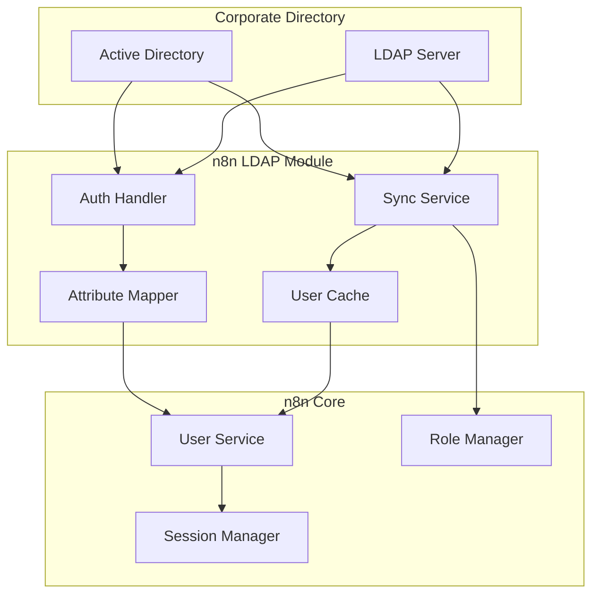

# LDAP Integration Module (Enterprise)

## Overview

The LDAP module provides enterprise-grade authentication and user synchronization through LDAP/Active Directory integration. It enables centralized user management, single sign-on capabilities, and automatic user provisioning from corporate directories.

**Module Path**: `packages/cli/src/ldap/`
**License**: Enterprise Edition

## Core Components

### 1. LDAP Service
- **Purpose**: Main service for LDAP operations
- **Key Features**:
  - LDAP server connection management
  - User authentication against LDAP
  - Group membership validation
  - User attribute mapping

### 2. LDAP Sync Service
- **Purpose**: Synchronize users and groups from LDAP
- **Key Features**:
  - Scheduled user synchronization
  - Group-to-role mapping
  - Incremental sync support
  - Conflict resolution

### 3. LDAP Configuration Service
- **Purpose**: Manage LDAP connection settings
- **Key Features**:
  - Connection pool management
  - SSL/TLS configuration
  - Search filter configuration
  - Attribute mapping setup

## Architecture



## Configuration

### LDAP Connection Settings
```typescript
interface LDAPConfig {
  connectionUrl: string;
  bindDN: string;
  bindCredentials: string;
  baseDN: string;
  userSearchBase: string;
  groupSearchBase: string;

  // Authentication
  authenticationMethod: 'simple' | 'SASL';

  // SSL/TLS
  connectionSecurity: 'none' | 'tls' | 'startTLS';
  tlsOptions: {
    rejectUnauthorized: boolean;
    ca?: string;
    cert?: string;
    key?: string;
  };

  // Search filters
  userFilter: string;
  groupFilter: string;
  loginIdAttribute: string;

  // Attribute mapping
  attributeMapping: {
    email: string;
    firstName: string;
    lastName: string;
    displayName: string;
  };
}
```

### Example Configuration
```javascript
{
  ldap: {
    connectionUrl: 'ldaps://ldap.company.com:636',
    bindDN: 'CN=n8n,OU=ServiceAccounts,DC=company,DC=com',
    bindCredentials: 'serviceAccountPassword',
    baseDN: 'DC=company,DC=com',
    userSearchBase: 'OU=Users,DC=company,DC=com',
    groupSearchBase: 'OU=Groups,DC=company,DC=com',

    userFilter: '(&(objectClass=person)(sAMAccountName={{username}}))',
    groupFilter: '(&(objectClass=group)(member={{dn}}))',
    loginIdAttribute: 'sAMAccountName',

    attributeMapping: {
      email: 'mail',
      firstName: 'givenName',
      lastName: 'sn',
      displayName: 'displayName'
    },

    synchronization: {
      enabled: true,
      interval: 3600, // seconds
      usersFilter: '(&(objectClass=person)(memberOf=CN=n8n-users,OU=Groups,DC=company,DC=com))',
      roleMapping: {
        'CN=n8n-admins,OU=Groups,DC=company,DC=com': 'admin',
        'CN=n8n-editors,OU=Groups,DC=company,DC=com': 'editor',
        'CN=n8n-members,OU=Groups,DC=company,DC=com': 'member'
      }
    }
  }
}
```

## Authentication Flow

```typescript
// 1. User enters credentials
const credentials = {
  username: 'john.doe',
  password: 'userPassword'
};

// 2. Search for user in LDAP
const userDN = await ldapService.findUserDN(credentials.username);
// Returns: 'CN=John Doe,OU=Users,DC=company,DC=com'

// 3. Authenticate user with LDAP
const authenticated = await ldapService.authenticate(userDN, credentials.password);

// 4. Fetch user attributes
const ldapUser = await ldapService.getUserAttributes(userDN);

// 5. Create/update local user
const localUser = await userService.syncFromLDAP(ldapUser);

// 6. Create session
const session = await sessionManager.create(localUser);
```

## User Synchronization

### Sync Process
```typescript
async function syncLDAPUsers() {
  // 1. Fetch all users from LDAP
  const ldapUsers = await ldapService.searchUsers({
    filter: config.synchronization.usersFilter,
    attributes: ['sAMAccountName', 'mail', 'givenName', 'sn', 'memberOf']
  });

  // 2. Process each user
  for (const ldapUser of ldapUsers) {
    // Check if user exists locally
    const existingUser = await userService.findByEmail(ldapUser.mail);

    if (existingUser) {
      // Update existing user
      await userService.update(existingUser.id, {
        firstName: ldapUser.givenName,
        lastName: ldapUser.sn,
        ldapDN: ldapUser.dn
      });
    } else {
      // Create new user
      await userService.create({
        email: ldapUser.mail,
        firstName: ldapUser.givenName,
        lastName: ldapUser.sn,
        ldapDN: ldapUser.dn,
        authMethod: 'ldap'
      });
    }

    // Update role based on group membership
    const role = determineRole(ldapUser.memberOf);
    await roleService.assignRole(user.id, role);
  }

  // 3. Disable users not in LDAP
  await disableOrphanedUsers();
}
```

## Group-to-Role Mapping

```typescript
interface RoleMapping {
  ldapGroup: string;
  n8nRole: 'admin' | 'editor' | 'member';
  priority: number; // Higher priority wins in case of multiple groups
}

const roleMappings: RoleMapping[] = [
  {
    ldapGroup: 'CN=n8n-admins,OU=Groups,DC=company,DC=com',
    n8nRole: 'admin',
    priority: 100
  },
  {
    ldapGroup: 'CN=n8n-editors,OU=Groups,DC=company,DC=com',
    n8nRole: 'editor',
    priority: 50
  },
  {
    ldapGroup: 'CN=n8n-members,OU=Groups,DC=company,DC=com',
    n8nRole: 'member',
    priority: 10
  }
];
```

## Security Considerations

### Connection Security
- Always use LDAPS (LDAP over SSL) or StartTLS
- Validate server certificates
- Use dedicated service account with minimal permissions
- Store bind credentials securely (encrypted)

### Authentication Security
- Never store LDAP passwords locally
- Implement account lockout policies
- Log all authentication attempts
- Support MFA through LDAP when available

## Troubleshooting

### Common Issues

**Connection Failed**
- Verify LDAP server URL and port
- Check firewall rules
- Validate SSL certificates
- Test with ldapsearch command

**Authentication Failed**
- Verify bind DN and credentials
- Check user search filter
- Validate base DN configuration
- Review LDAP server logs

**Users Not Syncing**
- Check synchronization filter
- Verify group memberships
- Review attribute mappings
- Check sync job logs

## CLI Commands

```bash
# Test LDAP connection
n8n ldap:test-connection

# Sync users manually
n8n ldap:sync

# Reset LDAP configuration
n8n ldap:reset

# List LDAP users
n8n ldap:list-users --filter="(department=Engineering)"
```

## Monitoring

### Metrics
```typescript
{
  'ldap.authentications.success': counter,
  'ldap.authentications.failed': counter,
  'ldap.sync.users_created': counter,
  'ldap.sync.users_updated': counter,
  'ldap.sync.duration': histogram,
  'ldap.connection.errors': counter
}
```

## Best Practices

1. **Use secure connections** - Always LDAPS or StartTLS
2. **Implement caching** - Cache LDAP queries to reduce load
3. **Regular synchronization** - Keep user data up-to-date
4. **Monitor sync performance** - Track sync duration and failures
5. **Test in staging** - Validate configuration before production
6. **Document mappings** - Maintain clear documentation of group/role mappings
7. **Plan for failures** - Have fallback authentication method