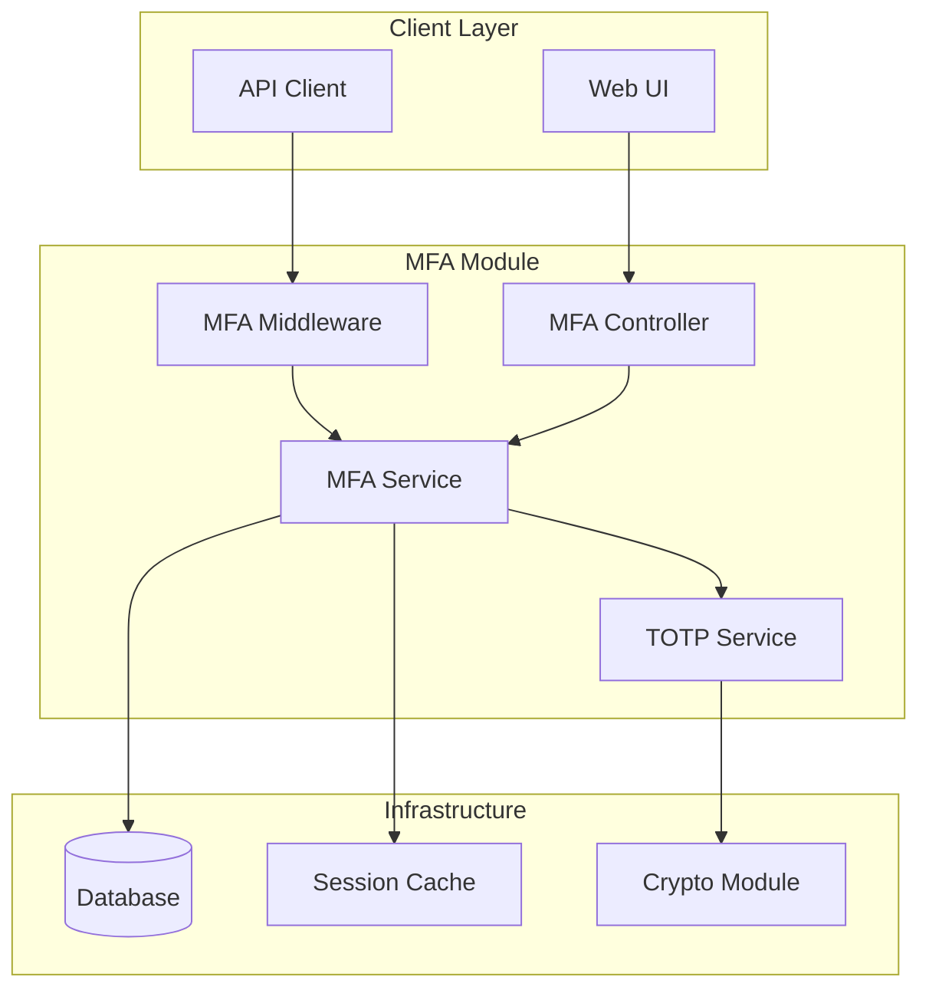

# MFA (Multi-Factor Authentication) Module

## Overview

The MFA module provides multi-factor authentication capabilities for n8n, enhancing security through TOTP (Time-based One-Time Password) support. This enterprise security feature adds an additional layer of protection beyond username/password authentication.

**Module Path**: `packages/cli/src/mfa/`

## Core Components

### 1. MFA Service (`mfa.service.ts`)
- **Purpose**: Main orchestrator for MFA operations
- **Key Features**:
  - TOTP secret generation and validation
  - User MFA enrollment/unenrollment
  - Recovery code generation and management
  - MFA status tracking per user

### 2. TOTP Service (`totp.service.ts`)
- **Purpose**: TOTP-specific authentication logic
- **Key Features**:
  - Secret key generation using speakeasy
  - QR code generation for authenticator apps
  - Token validation with time window tolerance
  - Backup code generation (10 single-use codes)

### 3. MFA Controller (`mfa.controller.ts`)
- **Purpose**: REST API endpoints for MFA operations
- **Endpoints**:
  - `GET /mfa/qr` - Generate QR code for enrollment
  - `POST /mfa/enable` - Enable MFA with valid token
  - `POST /mfa/disable` - Disable MFA (requires password)
  - `POST /mfa/verify` - Verify MFA token during login
  - `GET /mfa/recovery-codes` - Get recovery codes

### 4. MFA Middleware (`mfa.middleware.ts`)
- **Purpose**: Enforce MFA verification for protected routes
- **Logic**:
  - Check if user has MFA enabled
  - Validate session MFA status
  - Redirect to MFA verification if needed
  - Skip for API tokens and OAuth flows

## Architecture



## Database Schema

### User MFA Settings
```typescript
interface UserMfaSettings {
  userId: string;
  mfaEnabled: boolean;
  mfaSecret?: string;  // Encrypted TOTP secret
  mfaRecoveryCodes?: string[];  // Encrypted backup codes
  mfaEnrolledAt?: Date;
  mfaLastUsedAt?: Date;
}
```

### MFA Session State
```typescript
interface MfaSessionState {
  sessionId: string;
  userId: string;
  mfaVerified: boolean;
  mfaVerifiedAt?: Date;
  mfaMethod: 'totp' | 'recovery';
}
```

## Security Features

### 1. TOTP Implementation
- **Algorithm**: HMAC-SHA1 (industry standard)
- **Time Window**: 30 seconds
- **Token Length**: 6 digits
- **Tolerance**: ±1 time window (handles clock drift)

### 2. Recovery Codes
- **Generation**: 10 random 8-character codes
- **Storage**: Encrypted in database
- **Usage**: Single-use only
- **Purpose**: Account recovery if device lost

### 3. Security Best Practices
- Secrets encrypted at rest
- Rate limiting on verification attempts
- Session invalidation on MFA disable
- Audit logging for all MFA events
- No MFA secrets in logs or error messages

## Integration Points

### 1. Authentication Flow
```typescript
// Login with MFA
1. User enters username/password
2. System validates credentials
3. If MFA enabled, prompt for TOTP
4. Validate TOTP token
5. Mark session as MFA-verified
6. Allow access to protected resources
```

### 2. Enrollment Flow
```typescript
// MFA Enrollment
1. User initiates MFA setup
2. Generate TOTP secret
3. Display QR code
4. User scans with authenticator app
5. User provides test token
6. Validate token
7. Generate recovery codes
8. Enable MFA for user
```

### 3. Protected Routes
```typescript
// Routes requiring MFA
- /workflows (editor access)
- /credentials (sensitive data)
- /settings (admin functions)
- /users (user management)
```

## Configuration

### Environment Variables
```bash
# MFA Configuration
N8N_MFA_ENABLED=true
N8N_MFA_ENFORCEMENT_MODE=optional  # or 'required'
N8N_MFA_TOKEN_WINDOW=1  # Time windows tolerance
N8N_MFA_RATE_LIMIT=5  # Max attempts per minute
```

### Feature Flags
```typescript
{
  "mfa": {
    "enabled": true,
    "enforcement": "optional",
    "methods": ["totp"],  // Future: ["totp", "sms", "email"]
    "recoveryCodesCount": 10
  }
}
```

## API Reference

### Enable MFA
```http
POST /api/v1/mfa/enable
Authorization: Bearer {token}
Content-Type: application/json

{
  "token": "123456",
  "secret": "BASE32_ENCODED_SECRET"
}

Response:
{
  "success": true,
  "recoveryCodes": ["code1", "code2", ...],
  "message": "MFA enabled successfully"
}
```

### Verify MFA Token
```http
POST /api/v1/mfa/verify
Content-Type: application/json

{
  "token": "123456",
  "sessionId": "session_xyz"
}

Response:
{
  "success": true,
  "mfaVerified": true
}
```

## Error Handling

### Common MFA Errors
```typescript
class MfaTokenInvalidError extends ApplicationError {
  constructor() {
    super('Invalid MFA token', { code: 'MFA_TOKEN_INVALID' });
  }
}

class MfaNotEnabledError extends ApplicationError {
  constructor() {
    super('MFA not enabled for user', { code: 'MFA_NOT_ENABLED' });
  }
}

class MfaRateLimitError extends ApplicationError {
  constructor() {
    super('Too many MFA attempts', { code: 'MFA_RATE_LIMITED' });
  }
}
```

## Testing

### Unit Tests
```typescript
describe('MFA Service', () => {
  test('should generate valid TOTP secret', async () => {
    const secret = await mfaService.generateSecret();
    expect(secret).toMatch(/^[A-Z2-7]{32}$/);
  });

  test('should validate correct token', async () => {
    const token = totp.generate(secret);
    const valid = await mfaService.verifyToken(secret, token);
    expect(valid).toBe(true);
  });
});
```

### Integration Tests
```typescript
describe('MFA Flow', () => {
  test('should enforce MFA on protected routes', async () => {
    // Enable MFA for user
    await enableMfa(user);

    // Access protected route without MFA
    const response = await request(app)
      .get('/api/v1/workflows')
      .set('Authorization', `Bearer ${token}`);

    expect(response.status).toBe(403);
    expect(response.body.code).toBe('MFA_REQUIRED');
  });
});
```

## Monitoring

### Key Metrics
- MFA adoption rate (% users with MFA enabled)
- MFA verification success/failure rates
- Recovery code usage frequency
- Average time to complete MFA flow
- Failed MFA attempts per user

### Audit Events
```typescript
{
  event: "mfa.enabled",
  userId: "user123",
  timestamp: "2025-11-10T12:00:00Z",
  metadata: {
    method: "totp",
    ip: "192.168.1.1"
  }
}
```

## Migration Guide

### Enabling MFA for Existing Installation
1. Set `N8N_MFA_ENABLED=true` in environment
2. Run database migration: `pnpm migration:run`
3. Configure MFA enforcement mode
4. Notify users about MFA availability
5. Monitor adoption through metrics

### Migrating from External MFA Provider
1. Export user MFA status from external provider
2. Map users to n8n user accounts
3. Generate new TOTP secrets for users
4. Provide enrollment instructions
5. Set grace period for migration

## Security Considerations

### Threat Model
- **Threat**: Account takeover via stolen credentials
  - **Mitigation**: MFA adds second factor requirement
- **Threat**: Phishing attacks
  - **Mitigation**: TOTP codes are time-limited and single-use
- **Threat**: Device theft/loss
  - **Mitigation**: Recovery codes for account access
- **Threat**: Brute force attacks
  - **Mitigation**: Rate limiting on verification attempts

### Compliance
- **SOC 2**: MFA satisfies multi-factor authentication requirements
- **GDPR**: MFA secrets are encrypted and user-deletable
- **HIPAA**: Supports healthcare data protection requirements
- **ISO 27001**: Aligns with access control standards

## Future Enhancements

### Planned Features
1. **SMS MFA**: Text message verification
2. **Email MFA**: Email-based verification codes
3. **Hardware Keys**: FIDO2/WebAuthn support
4. **Biometric**: Fingerprint/FaceID on mobile
5. **Risk-Based MFA**: Adaptive authentication based on context

### Roadmap
- Q1 2025: SMS and Email MFA support
- Q2 2025: Hardware key integration
- Q3 2025: Risk-based authentication
- Q4 2025: Biometric support

## Support

### Common Issues

**Issue**: User locked out after losing device
- **Solution**: Use recovery codes or admin override

**Issue**: TOTP codes not working
- **Solution**: Check device time sync, use NTP

**Issue**: QR code not scanning
- **Solution**: Provide manual secret entry option

### Resources
- [TOTP RFC 6238](https://tools.ietf.org/html/rfc6238)
- [Google Authenticator](https://github.com/google/google-authenticator)
- [Authy Integration](https://www.twilio.com/docs/authy)
- [n8n Security Docs](https://docs.n8n.io/security)