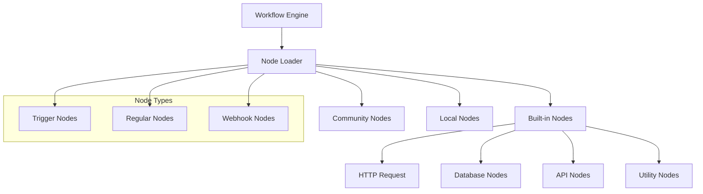
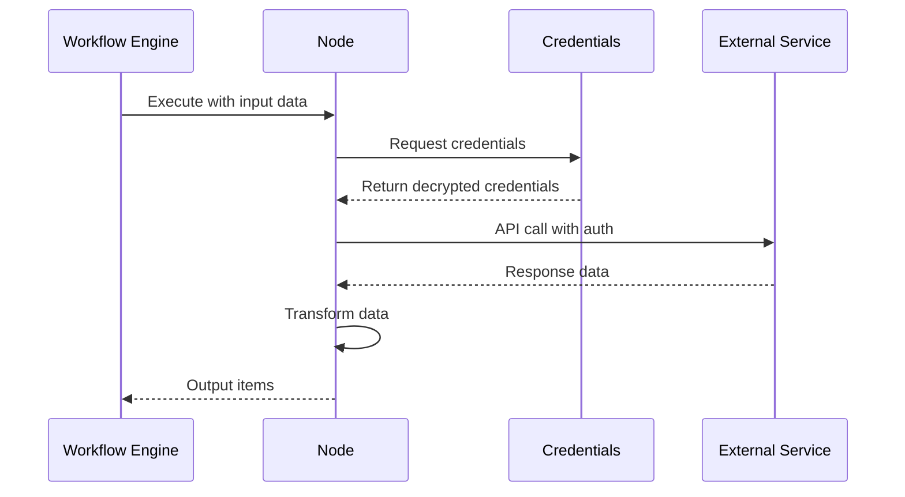

# Nodes Base Feature

## Overview

The Nodes Base feature provides the core library of built-in integration nodes for n8n. These nodes enable connections to hundreds of services, APIs, and databases, forming the foundation of workflow automation capabilities. Each node encapsulates the logic for interacting with external services while providing a consistent interface within n8n.

## Quick Start

### Using Built-in Nodes

1. **Open Workflow Editor**: Create or open a workflow
2. **Add Node**: Click the "+" button or press Tab
3. **Search Node**: Type the service name (e.g., "Slack", "Google Sheets")
4. **Configure Node**: Set up credentials and parameters
5. **Execute**: Run the workflow to test

### Creating Custom Nodes

```bash
# Install node development tools
npm install -g n8n-node-dev

# Create new node
n8n-node-dev new

# Follow prompts:
# ? Node name: MyService
# ? Description: Integrate with MyService API
# ? Node type: Regular node

# Develop node
cd n8n-nodes-myservice
npm install
npm run build
```

## Architecture

### Node System Architecture



### Node Execution Flow



## Node Categories

### Core Nodes
- **Start**: Manual trigger, schedule trigger
- **Webhook**: HTTP webhook receiver
- **HTTP Request**: Generic HTTP/REST client
- **Function**: JavaScript code execution
- **Set**: Data manipulation
- **If**: Conditional branching
- **Switch**: Multi-path routing
- **Merge**: Combine data streams
- **Split In Batches**: Process in chunks

### Database Nodes
- **PostgreSQL**: Query and manipulate PostgreSQL
- **MySQL**: MySQL/MariaDB operations
- **MongoDB**: NoSQL database operations
- **Redis**: Key-value store operations
- **Elasticsearch**: Search and analytics
- **SQLite**: Embedded database

### Communication Nodes
- **Email**: Send/receive emails (SMTP/IMAP)
- **Slack**: Messages, channels, users
- **Discord**: Server and channel management
- **Telegram**: Bot messages and groups
- **Microsoft Teams**: Team collaboration
- **Twilio**: SMS and voice calls

### Productivity Nodes
- **Google Sheets**: Spreadsheet operations
- **Google Drive**: File management
- **Microsoft 365**: Office suite integration
- **Notion**: Database and pages
- **Airtable**: Database operations
- **Todoist**: Task management

### Developer Tools
- **GitHub**: Repository operations
- **GitLab**: Project management
- **Jira**: Issue tracking
- **Jenkins**: CI/CD automation
- **Docker**: Container management
- **Kubernetes**: Container orchestration

### AI/ML Nodes
- **OpenAI**: GPT models and embeddings
- **Anthropic**: Claude AI integration
- **Hugging Face**: Model inference
- **Pinecone**: Vector database
- **LangChain**: Chain operations

## Node Development

### Node Structure

```typescript
// Basic node structure
import {
  IExecuteFunctions,
  INodeExecutionData,
  INodeType,
  INodeTypeDescription,
} from 'n8n-workflow';

export class MyNode implements INodeType {
  description: INodeTypeDescription = {
    displayName: 'My Node',
    name: 'myNode',
    group: ['transform'],
    version: 1,
    description: 'Node description',
    defaults: {
      name: 'My Node',
    },
    inputs: ['main'],
    outputs: ['main'],
    properties: [
      // Node parameters
    ],
  };

  async execute(this: IExecuteFunctions): Promise<INodeExecutionData[][]> {
    const items = this.getInputData();
    const returnData: INodeExecutionData[] = [];

    for (let i = 0; i < items.length; i++) {
      // Process each item
      returnData.push({
        json: {
          // Output data
        },
      });
    }

    return [returnData];
  }
}
```

### Trigger Node Structure

```typescript
import {
  ITriggerFunctions,
  INodeType,
  ITriggerResponse,
} from 'n8n-workflow';

export class MyTrigger implements INodeType {
  description: INodeTypeDescription = {
    displayName: 'My Trigger',
    name: 'myTrigger',
    group: ['trigger'],
    version: 1,
    description: 'Trigger description',
    defaults: {
      name: 'My Trigger',
    },
    inputs: [],
    outputs: ['main'],
    webhooks: [
      {
        name: 'default',
        httpMethod: 'POST',
        responseMode: 'onReceived',
        path: 'webhook',
      },
    ],
    properties: [],
  };

  async webhook(this: IWebhookFunctions): Promise<IWebhookResponseData> {
    const bodyData = this.getBodyData();
    return {
      workflowData: [
        [
          {
            json: bodyData,
          },
        ],
      ],
    };
  }
}
```

## Key Files

### Node Implementation
- `/packages/nodes-base/nodes/` - All built-in nodes
- `/packages/nodes-base/credentials/` - Credential types
- `/packages/nodes-base/nodes/[Service]/[Service].node.ts` - Node logic
- `/packages/nodes-base/nodes/[Service]/[Service].node.json` - Node metadata

### Node Loading
- `/packages/cli/src/LoadNodesAndCredentials.ts` - Node loader
- `/packages/core/src/NodeExecuteFunctions.ts` - Execution helpers
- `/packages/workflow/src/NodeHelpers.ts` - Node utilities

### Testing
- `/packages/nodes-base/test/` - Node tests
- `/packages/nodes-base/test/nodes/` - Node-specific tests

## API Reference

### Node Interface

```typescript
interface INodeType {
  description: INodeTypeDescription;
  execute?(this: IExecuteFunctions): Promise<INodeExecutionData[][]>;
  trigger?(this: ITriggerFunctions): Promise<ITriggerResponse | undefined>;
  webhook?(this: IWebhookFunctions): Promise<IWebhookResponseData>;
  poll?(this: IPollFunctions): Promise<INodeExecutionData[][] | null>;
}

interface INodeTypeDescription {
  displayName: string;
  name: string;
  icon?: string;
  group: string[];
  version: number | number[];
  subtitle?: string;
  description: string;
  defaults: INodeTypeDefaults;
  inputs: string[];
  outputs: string[];
  credentials?: INodeCredentialDescription[];
  properties: INodeProperties[];
  webhooks?: IWebhookDescription[];
  hooks?: INodeHooks;
}

interface INodeProperties {
  displayName: string;
  name: string;
  type: NodePropertyTypes;
  default?: any;
  required?: boolean;
  displayOptions?: IDisplayOptions;
  options?: INodePropertyOptions[];
  placeholder?: string;
  description?: string;
  typeOptions?: INodePropertyTypeOptions;
}
```

### Helper Functions

```typescript
// Get input data
const items = this.getInputData();
const item = items[itemIndex];

// Get node parameters
const resource = this.getNodeParameter('resource', 0) as string;
const operation = this.getNodeParameter('operation', 0) as string;

// Get credentials
const credentials = await this.getCredentials('apiKey');

// Make HTTP requests
const response = await this.helpers.request({
  method: 'GET',
  url: 'https://api.example.com/data',
  headers: {
    'Authorization': `Bearer ${credentials.apiKey}`,
  },
});

// Handle binary data
const binaryData = await this.helpers.getBinaryDataBuffer(itemIndex, 'data');

// Return data
return [this.helpers.returnJsonArray(responseData)];
```

## Node Testing

### Unit Testing

```typescript
import { MyNode } from '../nodes/MyNode/MyNode.node';
import { IExecuteFunctions } from 'n8n-workflow';
import { mockClear, mockDeep } from 'jest-mock-extended';

describe('MyNode', () => {
  let node: MyNode;
  let executeFunctions: IExecuteFunctions;

  beforeEach(() => {
    node = new MyNode();
    executeFunctions = mockDeep<IExecuteFunctions>();
    mockClear(executeFunctions);
  });

  it('should process data correctly', async () => {
    // Mock input data
    executeFunctions.getInputData.mockReturnValue([
      { json: { test: 'data' } }
    ]);

    // Execute node
    const result = await node.execute.call(executeFunctions);

    // Assert results
    expect(result).toHaveLength(1);
    expect(result[0]).toHaveLength(1);
    expect(result[0][0].json).toEqual({ processed: 'data' });
  });
});
```

### Workflow Testing

```json
{
  "name": "Test MyNode Workflow",
  "nodes": [
    {
      "name": "Start",
      "type": "n8n-nodes-base.manualTrigger",
      "position": [250, 300],
      "parameters": {}
    },
    {
      "name": "MyNode",
      "type": "n8n-nodes-base.myNode",
      "position": [450, 300],
      "parameters": {
        "resource": "user",
        "operation": "get"
      }
    }
  ],
  "connections": {
    "Start": {
      "main": [[{"node": "MyNode", "type": "main", "index": 0}]]
    }
  }
}
```

## Creating Custom Nodes

### Development Workflow

1. **Setup Development Environment**:
```bash
# Clone n8n
git clone https://github.com/n8n-io/n8n.git
cd n8n

# Install dependencies
pnpm install

# Build
pnpm build
```

2. **Create Node Structure**:
```bash
# Create node directory
mkdir packages/nodes-base/nodes/MyService

# Create node files
touch MyService.node.ts
touch MyService.node.json
touch GenericFunctions.ts
```

3. **Implement Node Logic**:
```typescript
// MyService.node.ts
export class MyService implements INodeType {
  // Implementation
}
```

4. **Register Node**:
```json
// package.json
{
  "n8n": {
    "nodes": [
      "dist/nodes/MyService/MyService.node.js"
    ]
  }
}
```

5. **Test Node**:
```bash
# Build node
pnpm build

# Start n8n
pnpm dev

# Test in editor
```

## Best Practices

### Node Design
- Clear, descriptive naming
- Comprehensive parameter descriptions
- Sensible defaults
- Progressive disclosure of options
- Consistent with existing nodes

### Error Handling
```typescript
try {
  const response = await apiCall();
  return response;
} catch (error) {
  throw new NodeOperationError(
    this.getNode(),
    `Failed to fetch data: ${error.message}`,
    { itemIndex }
  );
}
```

### Performance
- Batch operations when possible
- Implement pagination
- Use streaming for large data
- Cache reusable data
- Respect rate limits

### Security
- Never log credentials
- Sanitize user inputs
- Use HTTPS for API calls
- Implement request signing
- Follow OAuth best practices

## Community Nodes

### Installing Community Nodes

```bash
# Install from npm
n8n-community-nodes install n8n-nodes-package-name

# Install from GitHub
n8n-community-nodes install https://github.com/user/repo

# List installed nodes
n8n-community-nodes list
```

### Publishing Nodes

1. **Prepare Package**:
```json
{
  "name": "n8n-nodes-myservice",
  "version": "1.0.0",
  "description": "MyService nodes for n8n",
  "keywords": ["n8n", "nodes", "myservice"],
  "n8n": {
    "nodes": ["dist/nodes/MyService/MyService.node.js"],
    "credentials": ["dist/credentials/MyServiceApi.credentials.js"]
  }
}
```

2. **Publish to npm**:
```bash
npm publish
```

## Troubleshooting

### Node Not Loading
```bash
# Check node is registered
cat packages/nodes-base/package.json | grep -A 10 '"nodes"'

# Verify build output
ls packages/nodes-base/dist/nodes/

# Check for errors
tail -f packages/cli/logs/n8n.log | grep -i "node\|error"
```

### Credential Issues
- Verify credential type matches
- Check credential schema
- Ensure encryption key set
- Test with HTTP Request node first

### Execution Errors
- Add console.log for debugging
- Check input/output data structure
- Verify API responses
- Review error messages

## Future Enhancements

### Planned Features
- Node versioning improvements
- Better type safety
- Visual node builder
- AI-assisted node creation
- Node marketplace

### Experimental Features
- WebAssembly nodes
- Sandboxed execution
- Dynamic node loading
- Plugin architecture
- Node composition

## Related Documentation

- [Node Development Guide](https://docs.n8n.io/integrations/creating-nodes/)
- [Credentials](../credentials/README.md)
- [Workflow Engine](../workflows/README.md)
- [Community Packages](../community-packages/README.md)

## Support

### Resources
- Node examples: [github.com/n8n-io/n8n/tree/master/packages/nodes-base](https://github.com/n8n-io/n8n/tree/master/packages/nodes-base)
- Community forum: [community.n8n.io](https://community.n8n.io)
- Node requests: [community.n8n.io/c/feature-requests](https://community.n8n.io/c/feature-requests)