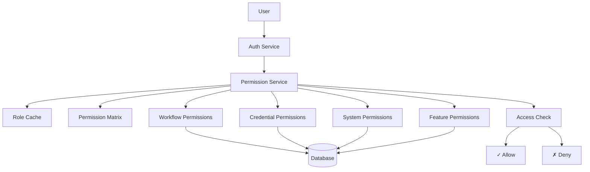
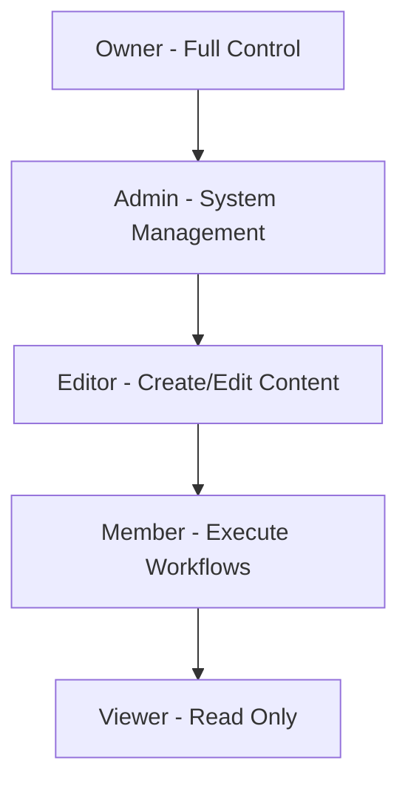

# Permissions Feature (Enterprise)

## Overview

The Permissions feature provides enterprise-grade Role-Based Access Control (RBAC) for n8n. It enables fine-grained control over user access to workflows, credentials, and system features, ensuring security and compliance in multi-user enterprise environments.

## Quick Start

### Basic Setup

1. **Enable Enterprise Permissions**:
```bash
# Enable RBAC
export N8N_ENTERPRISE_FEATURES_ENABLED=true
export N8N_RBAC_ENABLED=true
export N8N_LICENSE_KEY=your-enterprise-license

# Configure default permissions
export N8N_DEFAULT_USER_ROLE=member
export N8N_RBAC_STRICT_MODE=true
```

2. **Configure Database** (PostgreSQL recommended):
```bash
export DB_TYPE=postgresdb
export DB_POSTGRESDB_HOST=localhost
export DB_POSTGRESDB_DATABASE=n8n_enterprise
```

3. **Start n8n**:
```bash
pnpm build
pnpm start
```

### Creating Roles

1. **Navigate to Settings** → **Roles & Permissions**
2. **Create New Role**: Click "Add Role"
3. **Define Permissions**: Select allowed actions
4. **Assign to Users**: Add users to role

## Architecture

### Permission System Architecture



### Permission Hierarchy



## Configuration

### Environment Variables

| Variable | Description | Default | Required |
|----------|-------------|---------|----------|
| `N8N_RBAC_ENABLED` | Enable RBAC system | `false` | Yes |
| `N8N_DEFAULT_USER_ROLE` | Default role for new users | `member` | No |
| `N8N_RBAC_STRICT_MODE` | Deny by default | `false` | No |
| `N8N_RBAC_CACHE_TTL` | Permission cache TTL (ms) | `60000` | No |
| `N8N_RBAC_AUDIT_ENABLED` | Audit permission checks | `true` | No |
| `N8N_RBAC_INHERITANCE` | Enable role inheritance | `true` | No |

### Permission Schema

```typescript
interface Permission {
  id: string;
  name: string;
  resource: ResourceType;
  actions: Action[];
  scope?: Scope;
  conditions?: Condition[];
}

interface Role {
  id: string;
  name: string;
  description?: string;
  permissions: Permission[];
  isSystem: boolean;
  isCustom: boolean;
  priority: number;
  inherits?: string[];
}

interface ResourceType {
  type: 'workflow' | 'credential' | 'user' | 'system' | 'project' | 'tag';
  id?: string;
  attributes?: Record<string, any>;
}

interface Action {
  type: 'create' | 'read' | 'update' | 'delete' | 'execute' | 'share' | 'admin';
}

interface Scope {
  type: 'own' | 'project' | 'organization' | 'global';
  value?: string;
}
```

## API Reference

### Permission Management API

#### Get User Permissions
```http
GET /api/permissions/users/:userId
Authorization: Bearer <token>
```

Response:
```json
{
  "userId": "user-123",
  "roles": ["editor", "project-admin"],
  "permissions": [
    {
      "resource": "workflow",
      "actions": ["create", "read", "update", "execute"],
      "scope": "project"
    }
  ],
  "effectivePermissions": {...}
}
```

#### Create Custom Role
```http
POST /api/permissions/roles
Content-Type: application/json
Authorization: Bearer <admin-token>

{
  "name": "Workflow Developer",
  "description": "Can develop and test workflows",
  "permissions": [
    {
      "resource": "workflow",
      "actions": ["create", "read", "update", "execute"],
      "scope": "own"
    },
    {
      "resource": "credential",
      "actions": ["read", "use"],
      "scope": "project"
    }
  ]
}
```

#### Check Permission
```http
POST /api/permissions/check
Content-Type: application/json
Authorization: Bearer <token>

{
  "resource": "workflow",
  "resourceId": "workflow-123",
  "action": "execute"
}
```

### TypeScript Interfaces

```typescript
interface IPermissionService {
  checkPermission(userId: string, resource: string, action: string): Promise<boolean>;
  getUserPermissions(userId: string): Promise<Permission[]>;
  getRolePermissions(roleId: string): Promise<Permission[]>;
  assignRole(userId: string, roleId: string): Promise<void>;
  revokeRole(userId: string, roleId: string): Promise<void>;
  createCustomRole(role: RoleCreate): Promise<Role>;
}

interface PermissionCheck {
  userId: string;
  resource: ResourceType;
  action: Action;
  context?: {
    projectId?: string;
    organizationId?: string;
    metadata?: Record<string, any>;
  };
}

interface PermissionResult {
  allowed: boolean;
  reason?: string;
  appliedRules?: string[];
  suggestions?: string[];
}

interface RoleAssignment {
  userId: string;
  roleId: string;
  scope?: {
    type: 'global' | 'project' | 'resource';
    id?: string;
  };
  expiresAt?: Date;
  assignedBy: string;
  assignedAt: Date;
}
```

## Built-in Roles

### System Roles

#### Owner
- Full system control
- User management
- License management
- All permissions
- Cannot be modified

#### Admin
- System configuration
- User management
- Role management
- Workflow administration
- Credential management

#### Editor
- Create workflows
- Edit workflows
- Create credentials
- Execute workflows
- Share resources

#### Member
- Execute assigned workflows
- View shared workflows
- Use shared credentials
- Limited creation rights

#### Viewer
- Read-only access
- View workflows
- View executions
- No modification rights

### Custom Roles

```typescript
// Example custom role definitions
const customRoles = [
  {
    name: 'Department Lead',
    permissions: [
      'workflow:*:department',
      'credential:read,use:department',
      'user:read:department',
      'project:manage:department'
    ]
  },
  {
    name: 'Workflow Tester',
    permissions: [
      'workflow:read,execute:all',
      'execution:read:all',
      'credential:use:test'
    ]
  },
  {
    name: 'Credential Manager',
    permissions: [
      'credential:*:all',
      'workflow:read:all'
    ]
  }
];
```

## Permission Types

### Resource Permissions

#### Workflow Permissions
- `workflow:create` - Create new workflows
- `workflow:read` - View workflow details
- `workflow:update` - Edit workflows
- `workflow:delete` - Delete workflows
- `workflow:execute` - Run workflows
- `workflow:share` - Share with others

#### Credential Permissions
- `credential:create` - Create credentials
- `credential:read` - View credential details
- `credential:update` - Edit credentials
- `credential:delete` - Delete credentials
- `credential:use` - Use in workflows
- `credential:share` - Share with others

#### System Permissions
- `system:admin` - System administration
- `system:audit` - View audit logs
- `system:settings` - Manage settings
- `system:license` - License management
- `system:backup` - Backup/restore

### Scope Modifiers

```javascript
// Permission with scope
{
  permission: 'workflow:execute',
  scope: {
    type: 'own',      // Only own workflows
    // OR
    type: 'project',  // Within project
    value: 'project-123'
    // OR
    type: 'global'    // All workflows
  }
}
```

## Key Files

### Backend Implementation
- `/packages/cli/src/permissions/permission.service.ee.ts` - Main service
- `/packages/cli/src/permissions/rbac.service.ee.ts` - RBAC engine
- `/packages/cli/src/permissions/role.repository.ee.ts` - Role storage
- `/packages/cli/src/permissions/permission.guard.ee.ts` - Guards

### Middleware
- `/packages/cli/src/middlewares/rbac.middleware.ee.ts` - RBAC middleware
- `/packages/cli/src/decorators/rbac.decorator.ee.ts` - Permission decorators

### Frontend
- `/packages/editor-ui/src/stores/rbac.store.ts` - RBAC state
- `/packages/editor-ui/src/components/PermissionGate.vue` - UI gates
- `/packages/editor-ui/src/views/RoleManagement.vue` - Role management

## Advanced Features

### Dynamic Permissions

```typescript
// Attribute-based access control (ABAC)
const dynamicPermission = {
  resource: 'workflow',
  action: 'execute',
  conditions: [
    {
      attribute: 'workflow.tags',
      operator: 'contains',
      value: 'production'
    },
    {
      attribute: 'time.hour',
      operator: 'between',
      value: [9, 17]
    }
  ]
};
```

### Permission Inheritance

```typescript
// Role inheritance chain
const roleHierarchy = {
  'super-admin': {
    inherits: ['admin'],
    additionalPerms: ['system:dangerous']
  },
  'admin': {
    inherits: ['editor'],
    additionalPerms: ['system:admin', 'user:manage']
  },
  'editor': {
    inherits: ['member'],
    additionalPerms: ['workflow:create', 'credential:create']
  }
};
```

### Conditional Permissions

```typescript
// Time-based permissions
{
  permission: 'workflow:execute',
  conditions: {
    schedule: {
      days: ['MON', 'TUE', 'WED', 'THU', 'FRI'],
      hours: { from: 9, to: 17 }
    }
  }
}

// Resource-based conditions
{
  permission: 'credential:use',
  conditions: {
    resource: {
      type: 'production',
      environment: ['staging', 'development']
    }
  }
}
```

## Security Best Practices

### Principle of Least Privilege
- Grant minimum required permissions
- Regular permission audits
- Time-limited elevated access
- Remove unused permissions

### Separation of Duties
```javascript
// Separate creation from approval
const separationRules = {
  'workflow-creator': ['workflow:create', 'workflow:update'],
  'workflow-approver': ['workflow:approve', 'workflow:execute'],
  // Users cannot have both roles
};
```

### Audit Trail
```typescript
// Log all permission checks
logger.audit('Permission check', {
  userId,
  resource,
  action,
  result: allowed,
  context,
  timestamp: new Date()
});
```

## Integration

### SSO Integration
```typescript
// Map SSO groups to roles
const groupMappings = {
  'ad-group-developers': 'editor',
  'ad-group-managers': 'admin',
  'ad-group-viewers': 'viewer'
};
```

### Project Integration
```typescript
// Project-scoped permissions
const projectPermissions = {
  projectId: 'project-123',
  roles: {
    'project-owner': ['*:*:project'],
    'project-member': ['workflow:*:project', 'credential:use:project']
  }
};
```

## Monitoring

### Metrics
- Permission checks per second
- Cache hit rate
- Failed permission attempts
- Role usage statistics
- Custom role proliferation

### Alerts
- Excessive permission denials
- Privilege escalation attempts
- Unused roles
- Over-privileged users

## Troubleshooting

### Permission Denied Issues

```bash
# Check user's effective permissions
curl http://localhost:5678/api/permissions/users/user-123

# Test specific permission
curl -X POST http://localhost:5678/api/permissions/check \
  -H "Authorization: Bearer $TOKEN" \
  -d '{"resource":"workflow","action":"execute","resourceId":"123"}'

# View permission audit log
tail -f packages/cli/logs/rbac-audit.log
```

### Cache Issues
```bash
# Clear permission cache
redis-cli DEL "rbac:cache:*"

# Disable cache temporarily
export N8N_RBAC_CACHE_TTL=0
```

## Migration Guide

### From Basic to RBAC

1. **Audit Current Access**:
```sql
SELECT u.email, w.name as workflow, uw.role
FROM users u
JOIN user_workflow uw ON u.id = uw.user_id
JOIN workflow w ON uw.workflow_id = w.id;
```

2. **Map to Roles**:
```javascript
const migration = {
  'owner': 'admin',
  'editor': 'editor',
  'viewer': 'viewer'
};
```

3. **Apply Roles**:
```bash
pnpm typeorm migration:run
```

## Future Enhancements

### Planned Features
- Policy-based access control
- Just-in-time access
- Approval workflows
- Permission templates
- Cross-tenant permissions

### Experimental
- AI-powered permission suggestions
- Anomaly detection
- Zero-trust architecture
- Blockchain audit trail

## Related Documentation

- [User Management](../user-management/README.md)
- [SSO Configuration](../sso/README.md)
- [Project Management](../project/README.md)
- [Audit Logging](../audit/README.md)

## Support

### Enterprise Support
- Email: enterprise-support@n8n.io
- Security reviews available
- Custom role consultation
- Migration assistance
- Compliance guidance