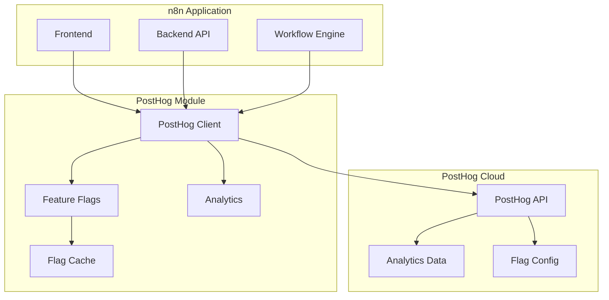

# PostHog Integration Module

## Overview

The PostHog module provides product analytics and feature flag management for n8n. It enables data-driven decisions through user behavior tracking, A/B testing, and controlled feature rollouts.

**Module Path**: `packages/cli/src/posthog/`

## Core Components

### PostHog Client Service
- Event tracking and analytics
- Feature flag evaluation
- User identification
- Session recording integration

### Feature Flag Manager
- Flag caching and updates
- User segmentation
- Rollout percentage control
- Override management

### Analytics Collector
- Usage metrics collection
- Custom event tracking
- User property management
- Batch event sending

## Architecture



## Event Tracking

### Standard Events
```typescript
// User actions
posthog.capture('workflow_created', {
  workflow_id: workflow.id,
  node_count: workflow.nodes.length,
  trigger_type: workflow.triggerType
});

// Feature usage
posthog.capture('feature_used', {
  feature: 'ai_assistant',
  context: 'workflow_builder',
  success: true
});

// Performance metrics
posthog.capture('execution_completed', {
  duration_ms: execution.duration,
  node_count: execution.nodeCount,
  status: execution.status
});
```

### User Properties
```typescript
posthog.identify(userId, {
  email: user.email,
  role: user.role,
  created_at: user.createdAt,
  organization: user.organization,
  plan: 'enterprise'
});
```

## Feature Flags

### Flag Evaluation
```typescript
// Check if feature is enabled
const aiEnabled = await posthog.isFeatureEnabled('ai-assistant', userId);

// Get flag variant
const variant = await posthog.getFeatureFlag('new-ui-design', userId);
if (variant === 'variant-a') {
  // Show design A
} else if (variant === 'variant-b') {
  // Show design B
}

// Percentage rollout
const inRollout = await posthog.isFeatureEnabled('new-feature', userId, {
  rolloutPercentage: 25 // 25% of users
});
```

### Flag Configuration
```typescript
interface FeatureFlag {
  key: string;
  name: string;
  active: boolean;
  rolloutPercentage?: number;
  filters: {
    properties?: Record<string, any>;
    groups?: string[];
  };
  payloads?: Record<string, any>;
}
```

## Configuration

### Environment Variables
```bash
# PostHog Configuration
POSTHOG_ENABLED=true
POSTHOG_API_KEY=phc_xxxxxxxxxxxxx
POSTHOG_HOST=https://app.posthog.com

# Feature Flags
POSTHOG_FEATURE_FLAGS_ENABLED=true
POSTHOG_FLAG_CACHE_TTL=300

# Analytics
POSTHOG_DISABLE_TRACKING=false
POSTHOG_BATCH_SIZE=100
POSTHOG_FLUSH_INTERVAL=30000
```

## Privacy & Compliance

### Data Minimization
```typescript
// Sanitize sensitive data
posthog.capture('workflow_executed', {
  workflow_id: hash(workflow.id),
  // Don't send: credentials, PII, secrets
});
```

### Opt-out Support
```typescript
// User opt-out
if (user.telemetryOptOut) {
  posthog.optOut();
}

// GDPR compliance
posthog.deleteUser(userId);
```

## A/B Testing

### Experiment Setup
```typescript
// Run A/B test
const experiment = await posthog.getExperiment('onboarding-flow');

switch (experiment.variant) {
  case 'control':
    showOriginalOnboarding();
    break;
  case 'treatment':
    showNewOnboarding();
    break;
}

// Track conversion
posthog.capture('experiment_conversion', {
  experiment: 'onboarding-flow',
  variant: experiment.variant,
  success: true
});
```

## Best Practices

1. **Track meaningful events** not every action
2. **Sanitize sensitive data** before sending
3. **Use consistent naming** for events and properties
4. **Cache feature flags** to reduce API calls
5. **Batch events** for performance
6. **Respect user privacy** and opt-out preferences