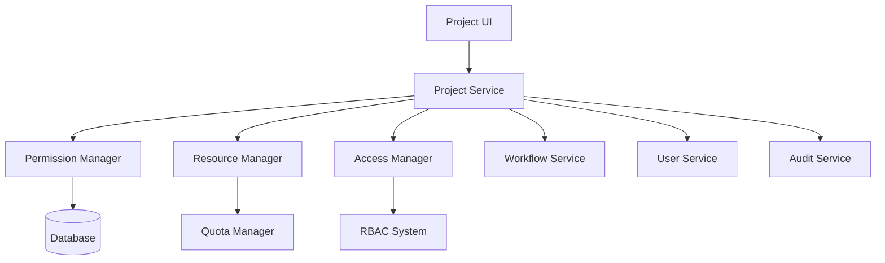
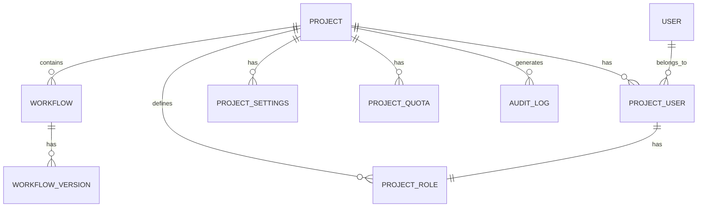

# Project Management Feature (Enterprise)

## Overview

The Project Management feature provides enterprise-grade organization and governance capabilities for n8n workflows. It enables teams to organize workflows into projects, manage access control, enforce governance policies, and maintain separation of concerns across different teams and departments.

## Quick Start

### Basic Setup

1. **Enable Enterprise Features**:
```bash
# Enable project management
export N8N_ENTERPRISE_FEATURES_ENABLED=true
export N8N_PROJECT_MANAGEMENT_ENABLED=true
export N8N_LICENSE_KEY=your-enterprise-license
```

2. **Configure Database**:
```bash
# Requires PostgreSQL or MySQL for enterprise features
export DB_TYPE=postgresdb
export DB_POSTGRESDB_HOST=localhost
export DB_POSTGRESDB_PORT=5432
export DB_POSTGRESDB_DATABASE=n8n_enterprise
export DB_POSTGRESDB_USER=n8n
export DB_POSTGRESDB_PASSWORD=password
```

3. **Start n8n**:
```bash
pnpm build
pnpm start
```

### Creating Projects

1. **Navigate to Projects**: Click "Projects" in main navigation
2. **Create Project**: Click "New Project" button
3. **Configure Settings**:
   - Name and description
   - Team members
   - Permissions
   - Resource quotas
4. **Add Workflows**: Move or create workflows in project

## Architecture

### System Components



### Data Model



## Configuration

### Environment Variables

| Variable | Description | Default | Required |
|----------|-------------|---------|----------|
| `N8N_PROJECT_MANAGEMENT_ENABLED` | Enable projects | `false` | Yes |
| `N8N_PROJECT_MAX_PER_ORG` | Max projects per org | `100` | No |
| `N8N_PROJECT_MAX_USERS` | Max users per project | `50` | No |
| `N8N_PROJECT_MAX_WORKFLOWS` | Max workflows per project | `500` | No |
| `N8N_PROJECT_ISOLATION_ENABLED` | Project isolation | `true` | No |
| `N8N_PROJECT_CROSS_ACCESS` | Allow cross-project access | `false` | No |
| `N8N_PROJECT_DEFAULT_ROLE` | Default member role | `member` | No |

### Project Settings Schema

```typescript
interface ProjectSettings {
  general: {
    name: string;
    description?: string;
    icon?: string;
    color?: string;
  };
  access: {
    visibility: 'private' | 'internal' | 'public';
    joinPolicy: 'invite' | 'request' | 'open';
    externalSharing: boolean;
  };
  governance: {
    approvalRequired: boolean;
    changeControl: boolean;
    auditLogging: 'none' | 'basic' | 'detailed';
  };
  resources: {
    workflowQuota?: number;
    executionQuota?: number;
    storageQuota?: number;
    apiQuota?: number;
  };
  integration: {
    gitEnabled?: boolean;
    slackChannel?: string;
    webhookUrl?: string;
  };
}
```

## API Reference

### Project Management API

#### Create Project
```http
POST /api/projects
Content-Type: application/json
Authorization: Bearer <token>

{
  "name": "Marketing Automation",
  "description": "Marketing team workflows",
  "settings": {
    "access": {
      "visibility": "internal"
    }
  }
}
```

#### List Projects
```http
GET /api/projects?page=1&limit=10&filter=active
Authorization: Bearer <token>
```

#### Update Project
```http
PATCH /api/projects/:projectId
Content-Type: application/json
Authorization: Bearer <token>

{
  "name": "Updated Name",
  "settings": {...}
}
```

#### Add Project Member
```http
POST /api/projects/:projectId/members
Content-Type: application/json
Authorization: Bearer <token>

{
  "userId": "user-123",
  "role": "editor"
}
```

### TypeScript Interfaces

```typescript
interface IProjectService {
  create(project: ProjectCreate): Promise<Project>;
  update(id: string, updates: ProjectUpdate): Promise<Project>;
  delete(id: string): Promise<void>;
  getById(id: string): Promise<Project>;
  list(filters: ProjectFilters): Promise<Project[]>;
  addMember(projectId: string, userId: string, role: string): Promise<void>;
  removeMember(projectId: string, userId: string): Promise<void>;
  moveWorkflow(workflowId: string, projectId: string): Promise<void>;
}

interface Project {
  id: string;
  name: string;
  description?: string;
  ownerId: string;
  organizationId: string;
  settings: ProjectSettings;
  stats: ProjectStats;
  createdAt: Date;
  updatedAt: Date;
}

interface ProjectRole {
  id: string;
  name: string;
  permissions: ProjectPermission[];
  isCustom: boolean;
}

interface ProjectPermission {
  resource: 'workflow' | 'credential' | 'member' | 'settings';
  actions: ('create' | 'read' | 'update' | 'delete' | 'execute')[];
}

interface ProjectStats {
  workflowCount: number;
  memberCount: number;
  executionCount: number;
  storageUsed: number;
  lastActivity: Date;
}
```

## Features

### Project Hierarchy
- Root organization level
- Department projects
- Team sub-projects
- Personal projects
- Shared projects

### Access Control
- Role-based permissions
- Project-level roles (Owner, Admin, Editor, Viewer)
- Resource-level permissions
- Inheritance from parent projects
- Custom role creation

### Resource Management
- Workflow quotas
- Execution limits
- Storage quotas
- API rate limits
- CPU/memory limits

### Governance
- Approval workflows
- Change control
- Audit logging
- Compliance policies
- Retention policies

### Collaboration
- Shared workflows
- Team credentials
- Project templates
- Knowledge sharing
- Cross-team visibility

## Key Files

### Backend Implementation
- `/packages/cli/src/projects/project.service.ee.ts` - Main service
- `/packages/cli/src/projects/project.controller.ee.ts` - API endpoints
- `/packages/cli/src/projects/project.repository.ee.ts` - Data access
- `/packages/cli/src/projects/project-role.service.ee.ts` - Role management
- `/packages/cli/src/projects/project-quota.service.ee.ts` - Quota enforcement

### Frontend Components
- `/packages/editor-ui/src/views/ProjectsView.vue` - Projects list
- `/packages/editor-ui/src/components/ProjectSettings/` - Settings UI
- `/packages/editor-ui/src/stores/projects.store.ts` - State management

### Database Migrations
- `/packages/cli/src/databases/migrations/postgres/*Project*.ts`
- `/packages/cli/src/databases/migrations/mysql/*Project*.ts`

## Development

### Setting Up Development Environment

```bash
# Use docker for PostgreSQL
docker run -d \
  --name n8n-postgres \
  -e POSTGRES_PASSWORD=password \
  -e POSTGRES_DB=n8n_dev \
  -p 5432:5432 \
  postgres:14

# Configure environment
export DB_TYPE=postgresdb
export DB_POSTGRESDB_HOST=localhost
export N8N_PROJECT_MANAGEMENT_ENABLED=true

# Run migrations
pnpm typeorm migration:run

# Start development
pnpm dev
```

### Testing Projects

```bash
# Unit tests
pnpm test packages/cli/test/unit/projects

# Integration tests
pnpm test packages/cli/test/integration/projects

# E2E tests
pnpm --filter=n8n-playwright test:projects
```

### Creating Test Projects

```typescript
// Test data factory
const testProject = await projectFactory.create({
  name: 'Test Project',
  workflows: 5,
  members: 3,
  settings: {
    access: { visibility: 'private' }
  }
});
```

## Enterprise Integration

### LDAP/AD Integration
- Sync projects with AD groups
- Map AD groups to project roles
- Automatic user provisioning
- Group-based access control

### SSO Integration
- SAML-based project access
- OAuth group mapping
- JIT project provisioning
- Role synchronization

### Git Integration
- Project as Git repository
- Workflow version control
- Branch-based development
- Pull request workflows

### Audit & Compliance
- SOC 2 compliance logging
- GDPR data isolation
- HIPAA access controls
- ISO 27001 audit trails

## Security

### Data Isolation
- Project-level encryption keys
- Isolated credential storage
- Separate execution contexts
- Network segmentation support

### Access Control
- Zero-trust architecture
- Principle of least privilege
- Just-in-time access
- Regular access reviews

### Compliance
- Data residency controls
- Retention policies
- Right to be forgotten
- Export capabilities

## Monitoring

### Metrics
- Projects created/deleted
- Active projects
- Workflow distribution
- Resource utilization
- Access patterns

### Dashboards
- Project overview
- Resource usage
- User activity
- Performance metrics
- Security events

### Alerts
- Quota exceeded
- Unauthorized access
- Resource exhaustion
- Compliance violations

## Troubleshooting

### Common Issues

#### Project Creation Fails
```bash
# Check license
curl http://localhost:5678/api/license

# Verify database permissions
psql -U n8n -d n8n_dev -c "SELECT * FROM project LIMIT 1;"

# Check error logs
tail -f packages/cli/logs/n8n.log | grep project
```

#### Permission Denied
- Verify user role in project
- Check project visibility settings
- Ensure license is valid
- Review RBAC configuration

#### Quota Exceeded
- Check project quotas
- Review resource usage
- Adjust limits if needed
- Clean up unused resources

## Best Practices

### Project Organization
- One project per team/department
- Clear naming conventions
- Documented project purposes
- Regular access reviews
- Archived project cleanup

### Resource Management
- Set appropriate quotas
- Monitor usage trends
- Plan for growth
- Regular optimization
- Cost allocation tracking

### Security
- Minimum necessary access
- Regular permission audits
- Separate prod/dev projects
- Encrypted sensitive data
- Documented access policies

## Migration Guide

### From Open Source to Enterprise

1. **Backup existing data**
2. **Install enterprise license**
3. **Enable project management**
4. **Create default project**
5. **Migrate workflows to projects**
6. **Assign user permissions**
7. **Configure project settings**
8. **Test access controls**

### Project Structure Migration

```sql
-- Example migration script
BEGIN;
  -- Create default project
  INSERT INTO project (name, owner_id)
  VALUES ('Default', 'admin-user-id');

  -- Move workflows to project
  UPDATE workflow
  SET project_id = (SELECT id FROM project WHERE name = 'Default')
  WHERE project_id IS NULL;

  -- Assign users to project
  INSERT INTO project_user (project_id, user_id, role_id)
  SELECT p.id, u.id, r.id
  FROM project p, "user" u, project_role r
  WHERE p.name = 'Default' AND r.name = 'member';
COMMIT;
```

## Future Enhancements

### Planned Features
- Project templates
- Project cloning
- Bulk workflow operations
- Advanced quota management
- Project analytics dashboard

### Roadmap Items
- Multi-tenancy support
- Project marketplace
- Cross-organization projects
- Project backup/restore
- AI-powered project insights

## Related Documentation

- [Permissions System](../permissions/README.md)
- [SSO Configuration](../sso/README.md)
- [LDAP Integration](../ldap/README.md)
- [Enterprise Features](../enterprise/README.md)

## Support

### Enterprise Support
- Email: enterprise-support@n8n.io
- Phone: +1-555-N8N-HELP
- Slack: enterprise-customers.slack.com
- Priority issue tracking

### Resources
- Enterprise documentation
- Video tutorials
- Best practices guide
- Architecture reviews
- Migration assistance