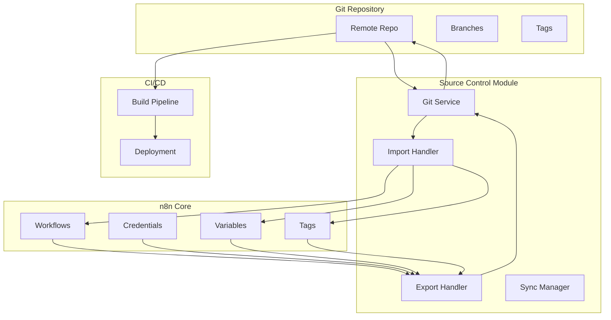

# Source Control Module

## Overview

The Source Control module enables version control integration for n8n workflows, allowing teams to track changes, collaborate through Git, and maintain workflow history. It provides GitOps capabilities for workflow deployment and environment synchronization.

**Module Path**: `packages/cli/src/environments/source-control/`

## Core Components

### 1. Source Control Service
- **Purpose**: Main service for Git operations
- **Key Features**:
  - Git repository initialization and management
  - Workflow import/export to Git
  - Commit, push, pull operations
  - Branch management

### 2. Version Control Manager
- **Purpose**: Handle workflow versioning
- **Key Features**:
  - Version tracking and tagging
  - Diff generation for workflows
  - Merge conflict resolution
  - Rollback capabilities

### 3. Environment Sync Service
- **Purpose**: Synchronize workflows between environments
- **Key Features**:
  - Pull workflows from Git repository
  - Push local changes to remote
  - Environment-specific configurations
  - Deployment automation

## Architecture



## Repository Structure

```
n8n-workflows/
├── .git/
├── workflows/
│   ├── workflow-1/
│   │   ├── workflow.json
│   │   ├── metadata.json
│   │   └── README.md
│   └── workflow-2/
│       ├── workflow.json
│       ├── metadata.json
│       └── README.md
├── credentials/
│   ├── credential-1.json (encrypted)
│   └── credential-2.json (encrypted)
├── variables/
│   ├── development.json
│   ├── staging.json
│   └── production.json
├── tags/
│   └── tags.json
└── n8n.config.json
```

## Git Operations

### Initialize Repository
```typescript
// Initialize Git repository for workflows
await sourceControlService.init({
  repositoryUrl: 'git@github.com:company/n8n-workflows.git',
  branch: 'main',
  authorName: 'n8n Bot',
  authorEmail: 'n8n@company.com'
});
```

### Export Workflows
```typescript
// Export all workflows to Git
await sourceControlService.exportAll({
  includeCredentials: false, // Credentials handled separately
  includeVariables: true,
  includeTags: true,
  message: 'Export all workflows'
});

// Export specific workflow
await sourceControlService.exportWorkflow(workflowId, {
  message: 'Update email automation workflow'
});
```

### Import Workflows
```typescript
// Import all workflows from Git
const imported = await sourceControlService.importAll({
  force: false, // Don't overwrite local changes
  activateWorkflows: true
});

// Import specific workflow
await sourceControlService.importWorkflow('workflows/email-automation', {
  overwrite: true
});
```

## Version Management

### Workflow Versioning
```typescript
interface WorkflowVersion {
  id: string;
  workflowId: string;
  version: string;
  commitHash: string;
  author: string;
  timestamp: Date;
  message: string;
  changes: WorkflowChange[];
}

interface WorkflowChange {
  type: 'node_added' | 'node_removed' | 'node_modified' | 'connection_changed';
  nodeId?: string;
  details: any;
}
```

### Diff Generation
```typescript
// Compare workflow versions
const diff = await versionManager.diff(workflowId, {
  from: 'v1.0.0',
  to: 'v2.0.0'
});

// Result
{
  nodesAdded: ['node_123'],
  nodesRemoved: ['node_456'],
  nodesModified: ['node_789'],
  connectionsChanged: [
    { from: 'node_111', to: 'node_222', action: 'added' }
  ]
}
```

## Environment Management

### Environment Configuration
```typescript
interface EnvironmentConfig {
  name: 'development' | 'staging' | 'production';
  branch: string;
  autoSync: boolean;
  syncInterval: number; // minutes
  variables: Record<string, any>;
  deploymentUrl?: string;
}

// Example configuration
{
  environments: [
    {
      name: 'development',
      branch: 'develop',
      autoSync: true,
      syncInterval: 5,
      variables: {
        API_URL: 'https://dev-api.example.com'
      }
    },
    {
      name: 'production',
      branch: 'main',
      autoSync: false,
      variables: {
        API_URL: 'https://api.example.com'
      }
    }
  ]
}
```

### Environment Sync
```typescript
// Sync from Git to environment
await environmentSync.pullFromGit({
  environment: 'production',
  strategy: 'merge', // or 'replace'
  dryRun: true // Preview changes
});

// Push environment to Git
await environmentSync.pushToGit({
  environment: 'development',
  message: 'Update development workflows'
});
```

## Conflict Resolution

### Merge Conflicts
```typescript
// Handle merge conflicts
const conflicts = await sourceControlService.getConflicts();

for (const conflict of conflicts) {
  // Resolve conflict
  await sourceControlService.resolveConflict(conflict.workflowId, {
    resolution: 'theirs', // 'ours', 'theirs', or 'manual'
    manualResolution: resolvedWorkflow // if resolution === 'manual'
  });
}

// Continue merge after resolution
await sourceControlService.continueMerge();
```

## CI/CD Integration

### GitHub Actions Example
```yaml
name: Deploy n8n Workflows

on:
  push:
    branches: [main]

jobs:
  deploy:
    runs-on: ubuntu-latest
    steps:
      - uses: actions/checkout@v2

      - name: Deploy to n8n
        run: |
          npx n8n source-control:pull \
            --force \
            --activate \
            --environment=production
        env:
          N8N_API_KEY: ${{ secrets.N8N_API_KEY }}
          N8N_HOST: ${{ secrets.N8N_HOST }}
```

## API Endpoints

### Pull from Repository
```http
POST /api/v1/source-control/pull
{
  "force": false,
  "activate": true
}

Response:
{
  "imported": 15,
  "updated": 5,
  "skipped": 2,
  "errors": []
}
```

### Push to Repository
```http
POST /api/v1/source-control/push
{
  "message": "Update workflows",
  "includeCredentials": false
}

Response:
{
  "exported": 20,
  "commitHash": "abc123def",
  "branch": "main"
}
```

## Security

### Credential Handling
```typescript
// Credentials are encrypted before storing in Git
interface EncryptedCredential {
  id: string;
  name: string;
  type: string;
  data: string; // Encrypted with repository key
  iv: string;   // Initialization vector
}

// Encryption key management
const encryptionKey = process.env.N8N_SOURCE_CONTROL_ENCRYPTION_KEY;
```

### Access Control
- Repository access via SSH keys or tokens
- Branch protection rules
- Required reviews for production branches
- Audit logging for all Git operations

## Configuration

### Environment Variables
```bash
# Source Control Configuration
N8N_SOURCE_CONTROL_ENABLED=true
N8N_SOURCE_CONTROL_REPO_URL=git@github.com:company/n8n-workflows.git
N8N_SOURCE_CONTROL_BRANCH=main
N8N_SOURCE_CONTROL_AUTO_SYNC=true
N8N_SOURCE_CONTROL_SYNC_INTERVAL=300

# Git Configuration
N8N_SOURCE_CONTROL_GIT_USER_NAME="n8n Bot"
N8N_SOURCE_CONTROL_GIT_USER_EMAIL="n8n@company.com"

# Encryption
N8N_SOURCE_CONTROL_ENCRYPTION_KEY=your-encryption-key
```

## Best Practices

1. **Use branches** for different environments
2. **Never commit** unencrypted credentials
3. **Review changes** before deploying to production
4. **Tag releases** for version tracking
5. **Automate deployments** through CI/CD
6. **Regular backups** independent of Git
7. **Document workflows** with README files

## Troubleshooting

### Common Issues

**Authentication Failed**
- Verify SSH keys or access tokens
- Check repository permissions
- Validate Git configuration

**Merge Conflicts**
- Use UI to resolve conflicts
- Consider using separate branches
- Implement review process

**Sync Failures**
- Check network connectivity
- Verify repository accessibility
- Review error logs

## Future Enhancements

1. **Visual diff viewer** for workflow changes
2. **Approval workflows** for production deployments
3. **Rollback automation** with one-click restore
4. **Multi-repository support** for large organizations
5. **GitLab/Bitbucket** integration