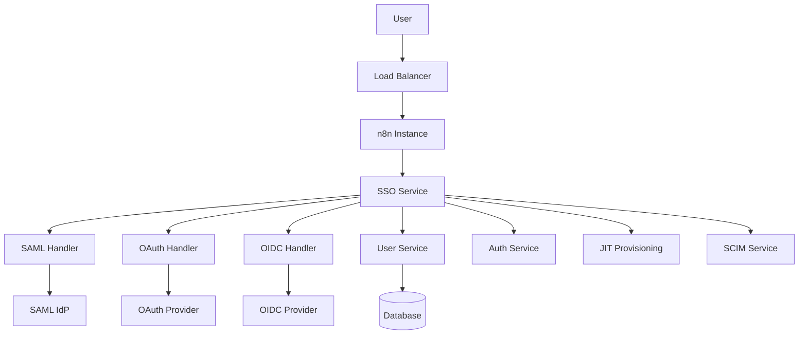
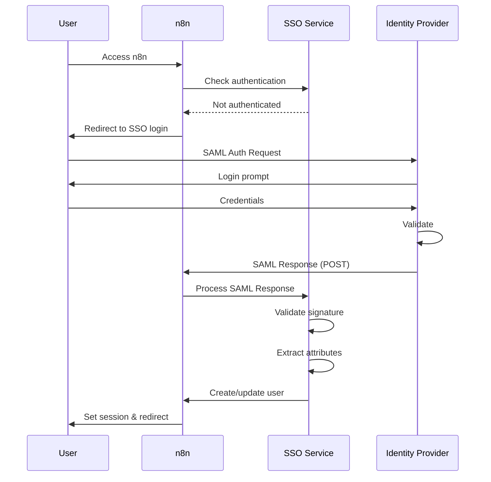

# Single Sign-On (SSO) Feature (Enterprise)

## Overview

The SSO feature provides enterprise-grade authentication through SAML 2.0 and OAuth 2.0/OIDC protocols. It enables organizations to integrate n8n with their existing identity providers (IdP) for centralized user authentication, automated provisioning, and enhanced security compliance.

## Quick Start

### Basic SAML Setup

1. **Enable SSO**:
```bash
# Enable enterprise SSO
export N8N_ENTERPRISE_FEATURES_ENABLED=true
export N8N_SSO_ENABLED=true
export N8N_LICENSE_KEY=your-enterprise-license
```

2. **Configure SAML Provider**:
```bash
# SAML configuration
export N8N_SSO_SAML_ENABLED=true
export N8N_SSO_SAML_METADATA_URL=https://idp.company.com/metadata
export N8N_SSO_SAML_ENTITY_ID=n8n.company.com
export N8N_SSO_SAML_CALLBACK_URL=https://n8n.company.com/sso/saml/callback
```

3. **Start n8n**:
```bash
pnpm build
pnpm start
```

### OAuth 2.0/OIDC Setup

```bash
# OAuth configuration
export N8N_SSO_OAUTH_ENABLED=true
export N8N_SSO_OAUTH_CLIENT_ID=your-client-id
export N8N_SSO_OAUTH_CLIENT_SECRET=your-client-secret
export N8N_SSO_OAUTH_AUTHORIZATION_URL=https://idp.company.com/oauth/authorize
export N8N_SSO_OAUTH_TOKEN_URL=https://idp.company.com/oauth/token
export N8N_SSO_OAUTH_USER_INFO_URL=https://idp.company.com/userinfo
export N8N_SSO_OAUTH_CALLBACK_URL=https://n8n.company.com/sso/oauth/callback
```

## Architecture

### System Components



### Authentication Flow (SAML)



## Configuration

### Environment Variables

| Variable | Description | Default | Required |
|----------|-------------|---------|----------|
| `N8N_SSO_ENABLED` | Enable SSO | `false` | Yes |
| `N8N_SSO_SAML_ENABLED` | Enable SAML | `false` | For SAML |
| `N8N_SSO_SAML_METADATA_URL` | IdP metadata URL | - | For SAML |
| `N8N_SSO_SAML_ENTITY_ID` | Service provider entity ID | - | For SAML |
| `N8N_SSO_SAML_CALLBACK_URL` | SAML callback URL | - | For SAML |
| `N8N_SSO_OAUTH_ENABLED` | Enable OAuth | `false` | For OAuth |
| `N8N_SSO_OAUTH_CLIENT_ID` | OAuth client ID | - | For OAuth |
| `N8N_SSO_OAUTH_CLIENT_SECRET` | OAuth client secret | - | For OAuth |
| `N8N_SSO_JIT_ENABLED` | Just-in-time provisioning | `true` | No |
| `N8N_SSO_DEFAULT_ROLE` | Default user role | `member` | No |

### SAML Configuration

```typescript
interface SAMLConfig {
  enabled: boolean;
  metadata: {
    url?: string;
    xml?: string;
  };
  serviceProvider: {
    entityId: string;
    assertionConsumerService: {
      url: string;
      binding: 'HTTP-POST' | 'HTTP-Redirect';
    };
  };
  identityProvider: {
    entityId: string;
    singleSignOnService: {
      url: string;
      binding: 'HTTP-POST' | 'HTTP-Redirect';
    };
    x509cert: string;
  };
  attributes: {
    email: string;
    firstName?: string;
    lastName?: string;
    id?: string;
    groups?: string;
  };
  security: {
    authnRequestsSigned: boolean;
    wantAssertionsSigned: boolean;
    signatureAlgorithm: string;
  };
}
```

## API Reference

### SSO Management API

#### Get SSO Configuration
```http
GET /api/sso/config
Authorization: Bearer <admin-token>
```

#### Update SSO Configuration
```http
PUT /api/sso/config
Content-Type: application/json
Authorization: Bearer <admin-token>

{
  "saml": {
    "enabled": true,
    "metadata": {
      "url": "https://idp.company.com/metadata"
    }
  }
}
```

#### Test SSO Connection
```http
POST /api/sso/test
Content-Type: application/json
Authorization: Bearer <admin-token>

{
  "provider": "saml",
  "config": {...}
}
```

#### SSO Login Endpoints
```http
# Initiate SAML login
GET /sso/saml/login

# SAML callback (IdP posts here)
POST /sso/saml/callback

# OAuth login
GET /sso/oauth/login

# OAuth callback
GET /sso/oauth/callback?code=xxx&state=yyy

# Logout
POST /sso/logout
```

### TypeScript Interfaces

```typescript
interface ISSOService {
  configure(config: SSOConfig): Promise<void>;
  initiateLogin(provider: string): Promise<LoginRequest>;
  handleCallback(provider: string, data: any): Promise<SSOUser>;
  logout(userId: string): Promise<void>;
  testConnection(config: SSOConfig): Promise<TestResult>;
}

interface SSOUser {
  id: string;
  email: string;
  firstName?: string;
  lastName?: string;
  attributes: Record<string, any>;
  groups?: string[];
  provider: string;
  providerId: string;
}

interface JITProvisioningConfig {
  enabled: boolean;
  defaultRole: string;
  defaultProjects?: string[];
  attributeMapping: {
    email: string;
    firstName?: string;
    lastName?: string;
    role?: string;
    projects?: string;
  };
  groupMapping?: {
    [group: string]: {
      role: string;
      projects: string[];
    };
  };
}
```

## Supported Identity Providers

### SAML Providers
- **Okta**: Full support with metadata URL
- **Azure AD**: SAML 2.0 enterprise applications
- **OneLogin**: Standard SAML integration
- **Ping Identity**: PingFederate support
- **Google Workspace**: SAML apps
- **AWS SSO**: Identity Center integration
- **ADFS**: Active Directory Federation Services

### OAuth/OIDC Providers
- **Auth0**: OAuth 2.0 and OIDC
- **Keycloak**: Full OIDC support
- **Google**: OAuth 2.0
- **Microsoft**: Azure AD OAuth
- **GitHub**: OAuth apps
- **GitLab**: OAuth applications

## Key Files

### Backend Implementation
- `/packages/cli/src/sso/sso.service.ee.ts` - Main SSO service
- `/packages/cli/src/sso/saml/saml.service.ee.ts` - SAML handler
- `/packages/cli/src/sso/oauth/oauth.service.ee.ts` - OAuth handler
- `/packages/cli/src/sso/sso.controller.ee.ts` - API endpoints
- `/packages/cli/src/sso/jit-provisioning.service.ee.ts` - JIT provisioning

### Configuration
- `/packages/cli/src/sso/providers/` - Provider-specific configs
- `/packages/cli/src/sso/metadata/` - SAML metadata handling

### Frontend
- `/packages/editor-ui/src/views/SSOLogin.vue` - SSO login page
- `/packages/editor-ui/src/stores/sso.store.ts` - SSO state

## Features

### Just-In-Time (JIT) Provisioning
- Automatic user creation on first login
- Attribute-based role assignment
- Group-based project assignment
- Profile synchronization
- Deprovisioning on logout

### SCIM Support
- User provisioning API
- Group synchronization
- Attribute updates
- Bulk operations
- Azure AD SCIM support

### Multi-Domain Support
- Multiple IdP configurations
- Domain-based routing
- Fallback authentication
- Mixed authentication modes

### Session Management
- Single logout (SLO)
- Session timeout sync
- Remember me options
- Device tracking
- Concurrent session limits

## Provider-Specific Setup

### Okta Configuration

1. **In Okta Admin**:
   - Create SAML 2.0 application
   - Set Single sign-on URL: `https://n8n.company.com/sso/saml/callback`
   - Set Audience URI: `n8n.company.com`
   - Set Name ID format: `EmailAddress`

2. **Attribute Mapping**:
```
user.email → email
user.firstName → firstName
user.lastName → lastName
user.department → department
```

3. **In n8n**:
```bash
export N8N_SSO_SAML_METADATA_URL=https://company.okta.com/app/xxx/sso/saml/metadata
```

### Azure AD Configuration

1. **In Azure Portal**:
   - Create Enterprise Application
   - Choose SAML
   - Set Reply URL: `https://n8n.company.com/sso/saml/callback`
   - Set Identifier: `n8n.company.com`

2. **Claims Configuration**:
```
user.mail → email
user.givenname → firstName
user.surname → lastName
user.groups → groups
```

3. **In n8n**:
```bash
export N8N_SSO_SAML_METADATA_URL=https://login.microsoftonline.com/xxx/federationmetadata/2007-06/federationmetadata.xml
```

## Security Considerations

### SAML Security
- Always use HTTPS
- Validate signatures
- Check assertion expiry
- Verify audience
- Prevent replay attacks
- Use encrypted assertions

### OAuth Security
- Use PKCE for public clients
- Validate state parameter
- Short-lived tokens
- Secure token storage
- Regular token rotation

### Best Practices
- Enable MFA at IdP
- Regular certificate rotation
- Audit SSO events
- Monitor failed attempts
- Implement rate limiting

## Monitoring

### Metrics
- SSO login attempts
- Success/failure rates
- Provider response times
- JIT provisioning events
- Token refresh rates

### Logging
```typescript
logger.info('SSO authentication', {
  provider: 'saml',
  userId: user.id,
  email: user.email,
  success: true,
  metadata: {
    sessionIndex,
    nameId,
    attributes
  }
});
```

### Audit Events
- Login attempts
- User provisioning
- Role changes
- Session creation
- Logout events

## Troubleshooting

### SAML Issues

#### Signature Validation Failed
```bash
# Check certificate
openssl x509 -in cert.pem -text -noout

# Validate metadata
curl https://idp.company.com/metadata | xmllint --format -

# Check logs
tail -f packages/cli/logs/sso.log | grep signature
```

#### User Not Created
- Check JIT provisioning enabled
- Verify attribute mapping
- Check required fields present
- Review user creation logs

### OAuth Issues

#### Invalid Client
- Verify client ID and secret
- Check redirect URI matches
- Ensure client is active
- Review OAuth scopes

#### Token Expired
- Check token lifetime
- Implement refresh logic
- Verify clock synchronization

## Migration Guide

### From Basic Auth to SSO

1. **Phase 1: Preparation**
   - Audit existing users
   - Map users to IdP
   - Plan group mappings
   - Test in staging

2. **Phase 2: Configuration**
   - Configure SSO settings
   - Set up JIT provisioning
   - Configure role mappings
   - Test with pilot users

3. **Phase 3: Migration**
   - Enable SSO for groups
   - Maintain password fallback
   - Monitor adoption
   - Disable basic auth

### User Mapping Script

```javascript
// Map existing users to SSO
const users = await userRepository.find();
for (const user of users) {
  await ssoService.mapUser({
    localId: user.id,
    email: user.email,
    provider: 'saml',
    providerId: user.email
  });
}
```

## Testing

### Unit Tests
```bash
pnpm test packages/cli/test/unit/sso
```

### Integration Tests
```bash
# Start test IdP
docker run -d -p 8080:8080 kristophjunge/test-saml-idp

# Run tests
pnpm test packages/cli/test/integration/sso
```

### E2E Tests
```bash
pnpm --filter=n8n-playwright test:sso
```

## Future Enhancements

### Planned Features
- WebAuthn support
- Passwordless authentication
- Risk-based authentication
- Adaptive MFA
- Biometric support

### Roadmap Items
- LDAP bridge
- Kerberos support
- Certificate-based auth
- Smart card integration
- Zero-trust architecture

## Related Documentation

- [User Management](../user-management/README.md)
- [Permissions](../permissions/README.md)
- [LDAP Integration](../ldap/README.md)
- [Security](../security/README.md)

## Support

### Enterprise Support
- Email: enterprise-support@n8n.io
- Dedicated Slack channel
- Phone support available
- Implementation assistance
- Security reviews