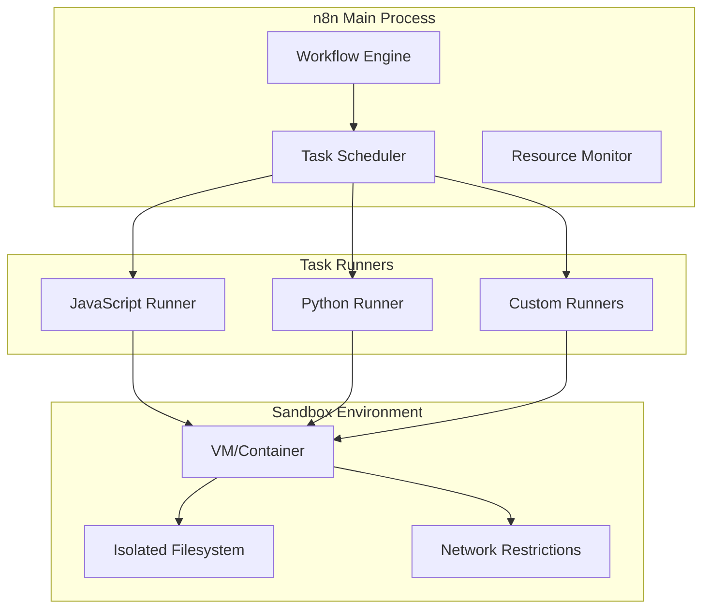

# Task Runners Module

## Overview

The Task Runners module provides isolated code execution environments for n8n workflows. It enables secure execution of user-provided code in JavaScript and Python through sandboxed runners, protecting the main n8n process from potentially harmful code.

**Module Path**: `packages/cli/src/task-runners/`

## Core Components

### Task Runner Service
- Runner process management
- Task distribution and scheduling
- Resource allocation
- Health monitoring

### JavaScript Runner
- Node.js-based execution
- VM2 sandboxing
- Memory and CPU limits
- NPM package support

### Python Runner
- Python interpreter integration
- Virtual environment isolation
- pip package management
- Resource constraints

## Architecture



## Runner Configuration

### JavaScript Runner
```typescript
interface JSRunnerConfig {
  maxMemoryMB: number;
  timeoutMs: number;
  allowedModules: string[];
  nodeVersion: string;
  env: Record<string, string>;
}

// Example configuration
{
  javascript: {
    maxMemoryMB: 256,
    timeoutMs: 30000,
    allowedModules: ['lodash', 'moment', 'axios'],
    nodeVersion: '20.x',
    env: {
      NODE_ENV: 'production'
    }
  }
}
```

### Python Runner
```typescript
interface PythonRunnerConfig {
  maxMemoryMB: number;
  timeoutMs: number;
  allowedPackages: string[];
  pythonVersion: string;
  virtualEnvPath: string;
}

// Example configuration
{
  python: {
    maxMemoryMB: 512,
    timeoutMs: 60000,
    allowedPackages: ['pandas', 'numpy', 'requests'],
    pythonVersion: '3.11',
    virtualEnvPath: '/var/n8n/python-envs'
  }
}
```

## Task Execution

### Submitting Tasks
```typescript
// JavaScript task
const result = await taskRunner.execute({
  type: 'javascript',
  code: `
    const sum = items.reduce((acc, item) => acc + item.value, 0);
    return { total: sum, count: items.length };
  `,
  inputs: { items: workflowData },
  timeout: 5000
});

// Python task
const result = await taskRunner.execute({
  type: 'python',
  code: `
    import pandas as pd
    df = pd.DataFrame(items)
    return df.describe().to_dict()
  `,
  inputs: { items: workflowData },
  timeout: 10000
});
```

## Security Features

### Sandboxing
- Process isolation
- Resource limits (CPU, memory, disk)
- Network restrictions
- Filesystem isolation
- No system call access

### Code Validation
```typescript
// Pre-execution validation
function validateCode(code: string, language: string): ValidationResult {
  // Check for dangerous patterns
  const dangerous = [
    /require\(['"]child_process['"]\)/,
    /import\s+os/,
    /eval\(/,
    /exec\(/
  ];

  for (const pattern of dangerous) {
    if (pattern.test(code)) {
      return { valid: false, error: 'Dangerous code pattern detected' };
    }
  }

  return { valid: true };
}
```

## Resource Management

### Resource Limits
```typescript
interface ResourceLimits {
  cpu: {
    cores: number;
    shares: number;
  };
  memory: {
    maxMB: number;
    swapMB: number;
  };
  disk: {
    maxMB: number;
    tempDirMB: number;
  };
  network: {
    enabled: boolean;
    allowedHosts?: string[];
  };
}
```

### Monitoring
```typescript
// Resource usage tracking
{
  'task_runner.executions_total': counter,
  'task_runner.execution_duration_ms': histogram,
  'task_runner.memory_usage_mb': gauge,
  'task_runner.cpu_usage_percent': gauge,
  'task_runner.failures_total': counter,
  'task_runner.timeouts_total': counter
}
```

## Package Management

### JavaScript Packages
```bash
# Allow specific npm packages
N8N_TASK_RUNNER_JS_ALLOWED_PACKAGES=lodash,moment,axios

# Package installation
npm install --prefix /var/n8n/js-runner lodash moment axios
```

### Python Packages
```bash
# Allow specific pip packages
N8N_TASK_RUNNER_PYTHON_ALLOWED_PACKAGES=pandas,numpy,scikit-learn

# Package installation
pip install --target /var/n8n/python-runner pandas numpy scikit-learn
```

## Error Handling

### Common Errors
```typescript
class TaskExecutionError extends Error {
  constructor(
    message: string,
    public code: string,
    public details?: any
  ) {
    super(message);
  }
}

// Error types
TIMEOUT_ERROR: 'Task execution timed out'
MEMORY_ERROR: 'Task exceeded memory limit'
SYNTAX_ERROR: 'Code syntax error'
RUNTIME_ERROR: 'Runtime execution error'
PERMISSION_ERROR: 'Permission denied for requested operation'
```

## Configuration

### Environment Variables
```bash
# Task Runner Configuration
N8N_TASK_RUNNERS_ENABLED=true
N8N_TASK_RUNNERS_MAX_CONCURRENCY=10

# JavaScript Runner
N8N_JS_RUNNER_ENABLED=true
N8N_JS_RUNNER_MAX_MEMORY_MB=256
N8N_JS_RUNNER_TIMEOUT_MS=30000

# Python Runner
N8N_PYTHON_RUNNER_ENABLED=true
N8N_PYTHON_RUNNER_MAX_MEMORY_MB=512
N8N_PYTHON_RUNNER_TIMEOUT_MS=60000

# Security
N8N_TASK_RUNNER_ALLOW_NETWORK=false
N8N_TASK_RUNNER_ALLOW_FILESYSTEM=false
```

## Best Practices

1. **Validate all code** before execution
2. **Set appropriate timeouts** to prevent hanging
3. **Monitor resource usage** to prevent abuse
4. **Use minimal package sets** for security
5. **Log all executions** for audit trails
6. **Implement rate limiting** per user/workflow
7. **Regular security updates** for runner environments