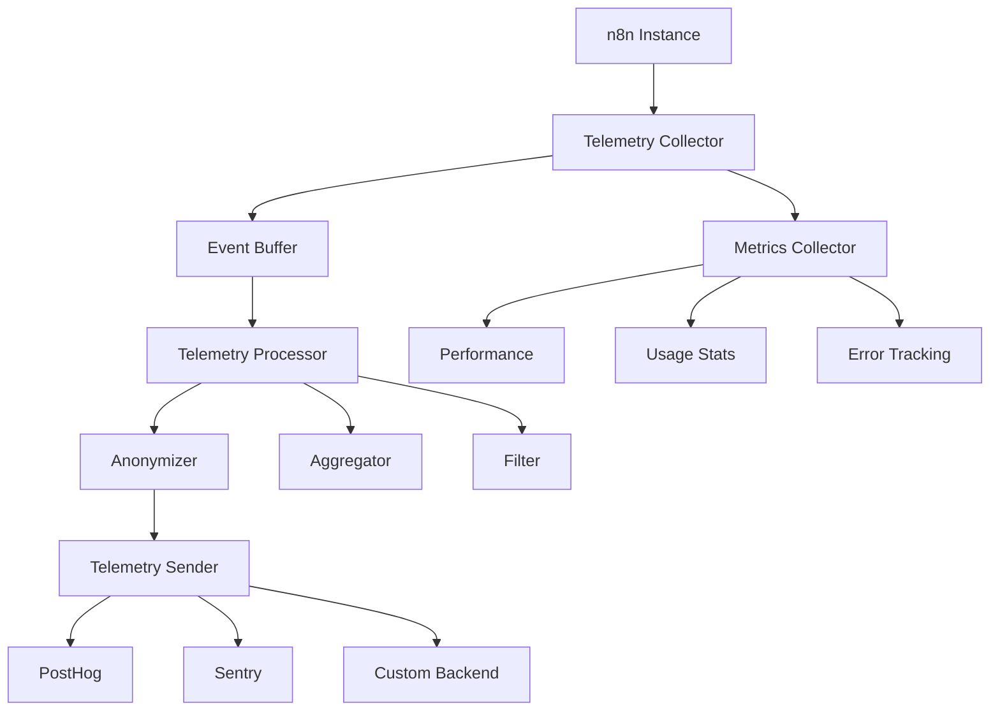
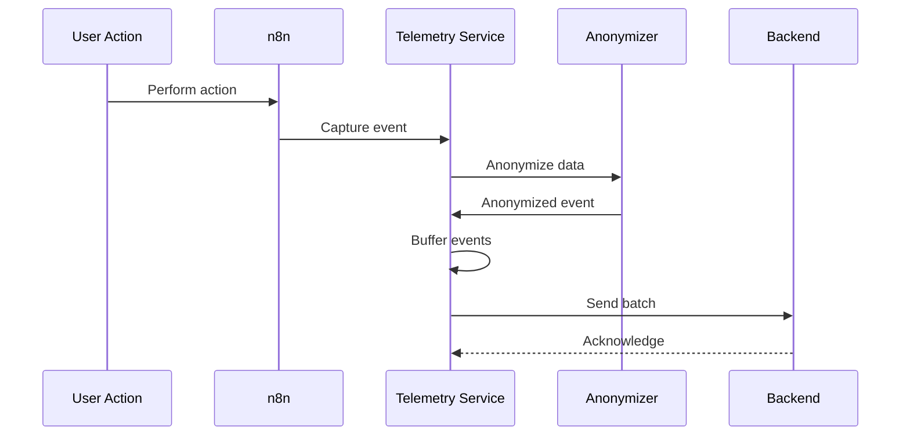

# Telemetry Feature

## Overview

The Telemetry feature collects anonymous usage data to help improve n8n. It tracks feature adoption, performance metrics, error patterns, and usage statistics while respecting user privacy. The data helps the development team understand how n8n is used and identify areas for improvement.

## Quick Start

### Configuration

1. **Enable/Disable Telemetry**:
```bash
# Enable telemetry (default)
export N8N_DIAGNOSTICS_ENABLED=true

# Disable telemetry
export N8N_DIAGNOSTICS_ENABLED=false

# Enable enhanced telemetry
export N8N_DIAGNOSTICS_ENHANCED=true
export N8N_DIAGNOSTICS_INCLUDE_ERRORS=true
```

2. **Configure PostHog** (for feature flags):
```bash
export N8N_DIAGNOSTICS_POSTHOG_API_KEY=your-posthog-key
export N8N_DIAGNOSTICS_POSTHOG_API_HOST=https://app.posthog.com
```

3. **Start n8n**:
```bash
pnpm start
```

## Architecture

### Telemetry System Architecture



### Data Flow



## Configuration

### Environment Variables

| Variable | Description | Default | Required |
|----------|-------------|---------|----------|
| `N8N_DIAGNOSTICS_ENABLED` | Enable telemetry | `true` | No |
| `N8N_DIAGNOSTICS_ENHANCED` | Enhanced telemetry | `false` | No |
| `N8N_DIAGNOSTICS_INCLUDE_ERRORS` | Include error details | `false` | No |
| `N8N_DIAGNOSTICS_POSTHOG_API_KEY` | PostHog API key | - | No |
| `N8N_DIAGNOSTICS_POSTHOG_API_HOST` | PostHog host | `https://app.posthog.com` | No |
| `N8N_DIAGNOSTICS_BUFFER_SIZE` | Event buffer size | `100` | No |
| `N8N_DIAGNOSTICS_BUFFER_TIMEOUT` | Buffer flush timeout (ms) | `30000` | No |
| `N8N_TELEMETRY_ENDPOINT` | Custom telemetry endpoint | - | No |

### Telemetry Configuration

```typescript
interface TelemetryConfig {
  enabled: boolean;
  enhanced: boolean;
  anonymize: boolean;
  includeErrors: boolean;
  sampling: {
    rate: number;        // 0-1, percentage of events to send
    rules: SamplingRule[];
  };
  buffer: {
    maxSize: number;     // Max events before flush
    flushInterval: number; // Ms between flushes
  };
  filters: {
    excludeEvents?: string[];
    includeEvents?: string[];
    excludeUsers?: string[];
  };
  destinations: {
    posthog?: PostHogConfig;
    sentry?: SentryConfig;
    custom?: CustomDestConfig;
  };
}
```

## Events Tracked

### System Events

```typescript
// Instance lifecycle
'n8n.instance.started'
'n8n.instance.stopped'
'n8n.instance.updated'
'n8n.instance.crashed'

// Configuration
'n8n.settings.updated'
'n8n.feature.enabled'
'n8n.feature.disabled'
```

### Workflow Events

```typescript
// Workflow lifecycle
'n8n.workflow.created'
'n8n.workflow.updated'
'n8n.workflow.deleted'
'n8n.workflow.activated'
'n8n.workflow.deactivated'

// Workflow execution
'n8n.workflow.executed'
'n8n.workflow.failed'
'n8n.workflow.success'
'n8n.workflow.timeout'
```

### Node Events

```typescript
// Node usage
'n8n.node.added'
'n8n.node.removed'
'n8n.node.executed'
'n8n.node.error'

// Node discovery
'n8n.node.searched'
'n8n.node.installed'
'n8n.node.uninstalled'
```

### User Events

```typescript
// User actions
'n8n.user.login'
'n8n.user.logout'
'n8n.user.signup'
'n8n.user.invite'

// User workflow
'n8n.user.workflow.opened'
'n8n.user.workflow.saved'
'n8n.user.workflow.shared'
```

## Data Collected

### Anonymous Instance Data

```json
{
  "instanceId": "uuid-v4",
  "version": "1.0.0",
  "nodeVersion": "18.12.0",
  "os": {
    "platform": "linux",
    "release": "5.15.0",
    "arch": "x64"
  },
  "executionMode": "queue",
  "database": "postgres",
  "isDocker": true,
  "deploymentType": "self-hosted"
}
```

### Workflow Metrics

```json
{
  "workflowId": "hashed-id",
  "nodeCount": 5,
  "nodeTypes": ["httpRequest", "set", "if"],
  "executionTime": 1234,
  "executionStatus": "success",
  "triggerType": "webhook",
  "isScheduled": false
}
```

### Performance Metrics

```json
{
  "cpu": {
    "usage": 45.2,
    "cores": 4
  },
  "memory": {
    "used": 512000000,
    "total": 2048000000,
    "percentage": 25
  },
  "executions": {
    "active": 5,
    "queued": 10,
    "completed": 1000
  }
}
```

## API Reference

### Telemetry Service

```typescript
interface ITelemetryService {
  track(event: string, properties?: Record<string, any>): void;
  identify(userId: string, traits?: Record<string, any>): void;
  page(name: string, properties?: Record<string, any>): void;
  alias(userId: string, previousId: string): void;
  group(groupId: string, traits?: Record<string, any>): void;
  flush(): Promise<void>;
}

interface TelemetryEvent {
  event: string;
  userId?: string;
  anonymousId: string;
  properties: Record<string, any>;
  context: TelemetryContext;
  timestamp: Date;
}

interface TelemetryContext {
  app: {
    name: string;
    version: string;
  };
  device: {
    id: string;
    type: string;
  };
  os: {
    name: string;
    version: string;
  };
  locale: string;
  timezone: string;
}
```

### Custom Event Tracking

```typescript
// Track custom event
telemetryService.track('custom.feature.used', {
  featureName: 'ai-assistant',
  duration: 5000,
  success: true
});

// Track with user context
telemetryService.track('workflow.shared', {
  workflowId: hashId(workflow.id),
  shareType: 'link',
  permissions: ['view', 'execute']
}, userId);

// Batch tracking
const events = [
  { event: 'node.executed', properties: {...} },
  { event: 'node.executed', properties: {...} }
];
telemetryService.trackBatch(events);
```

## Key Files

### Core Implementation
- `/packages/cli/src/telemetry/telemetry.service.ts` - Main telemetry service
- `/packages/cli/src/telemetry/telemetry-event-relay.ts` - Event relay
- `/packages/cli/src/telemetry/posthog-client.ts` - PostHog integration
- `/packages/cli/src/telemetry/anonymization.ts` - Data anonymization

### Event Tracking
- `/packages/cli/src/events/workflow-events.ts` - Workflow tracking
- `/packages/cli/src/events/user-events.ts` - User tracking
- `/packages/cli/src/events/node-events.ts` - Node usage tracking

### Configuration
- `/packages/@n8n/config/src/configs/diagnostics.config.ts` - Config schema
- `/packages/cli/src/config/schema.ts` - Environment variables

## Privacy & Compliance

### Data Anonymization

```typescript
// Anonymization rules
const anonymizationRules = {
  // Hash sensitive IDs
  userId: (id: string) => sha256(id + salt),
  workflowId: (id: string) => sha256(id + salt),
  email: (email: string) => sha256(email + salt),

  // Remove PII
  name: () => null,
  address: () => null,
  phone: () => null,

  // Generalize data
  ipAddress: (ip: string) => ip.substring(0, ip.lastIndexOf('.')),
  timestamp: (ts: Date) => roundToHour(ts)
};
```

### GDPR Compliance

```typescript
// User data export
GET /api/telemetry/export/:userId

// User data deletion
DELETE /api/telemetry/user/:userId

// Opt-out
POST /api/telemetry/opt-out
{
  "userId": "user-123",
  "reason": "privacy"
}
```

### Data Retention

```yaml
retention_policies:
  events: 90_days
  metrics: 365_days
  errors: 30_days
  performance: 180_days
```

## Custom Telemetry Backend

### Implementation

```typescript
// Custom telemetry backend
class CustomTelemetryBackend implements ITelemetryBackend {
  async send(events: TelemetryEvent[]): Promise<void> {
    const processed = events.map(this.processEvent);
    await fetch(this.endpoint, {
      method: 'POST',
      body: JSON.stringify(processed),
      headers: {
        'Content-Type': 'application/json',
        'X-API-Key': this.apiKey
      }
    });
  }

  private processEvent(event: TelemetryEvent): ProcessedEvent {
    return {
      ...event,
      // Custom processing
    };
  }
}
```

### Configuration

```bash
# Use custom backend
export N8N_TELEMETRY_ENDPOINT=https://telemetry.company.com/v1/events
export N8N_TELEMETRY_API_KEY=your-api-key
export N8N_TELEMETRY_BACKEND=custom
```

## Feature Flags (PostHog)

### Configuration

```typescript
// Feature flag configuration
const featureFlags = {
  'new-ui': {
    enabled: true,
    rolloutPercentage: 50,
    groups: ['beta-users']
  },
  'ai-assistant': {
    enabled: true,
    variants: {
      'gpt-3.5': 30,
      'gpt-4': 70
    }
  }
};
```

### Usage

```typescript
// Check feature flag
if (await featureFlags.isEnabled('new-ui', userId)) {
  // Show new UI
}

// Get variant
const variant = await featureFlags.getVariant('ai-assistant', userId);
switch (variant) {
  case 'gpt-4':
    // Use GPT-4
    break;
  case 'gpt-3.5':
    // Use GPT-3.5
    break;
}
```

## Performance Impact

### Resource Usage
- CPU: < 0.1% overhead
- Memory: ~10MB for buffer
- Network: ~1KB/min average
- Disk: Minimal (temporary buffer)

### Optimization

```typescript
// Sampling configuration
{
  sampling: {
    rate: 0.1,  // Sample 10% of events
    rules: [
      { event: 'workflow.executed', rate: 0.01 },  // 1% for high-volume
      { event: 'error.*', rate: 1.0 }              // 100% for errors
    ]
  }
}
```

## Monitoring

### Metrics Dashboard

```typescript
// Telemetry health metrics
{
  eventsBuffered: 45,
  eventsDropped: 0,
  eventsSent: 10000,
  lastFlush: '2024-01-01T12:00:00Z',
  errors: 0,
  backendStatus: 'healthy'
}
```

### Alerts

- Buffer overflow
- Backend unreachable
- High error rate
- Sampling rate changes

## Troubleshooting

### Telemetry Not Sending

```bash
# Check if enabled
echo $N8N_DIAGNOSTICS_ENABLED

# Check PostHog connection
curl -X POST https://app.posthog.com/batch \
  -H "Content-Type: application/json" \
  -d '{"api_key":"your-key","batch":[]}'

# Check logs
tail -f packages/cli/logs/telemetry.log

# Debug mode
export N8N_DIAGNOSTICS_DEBUG=true
```

### High Memory Usage

```bash
# Reduce buffer size
export N8N_DIAGNOSTICS_BUFFER_SIZE=50

# Increase flush frequency
export N8N_DIAGNOSTICS_BUFFER_TIMEOUT=10000

# Enable sampling
export N8N_DIAGNOSTICS_SAMPLING_RATE=0.1
```

## Best Practices

### Event Naming
- Use dot notation: `category.action.result`
- Be consistent: `workflow.executed.success`
- Avoid PII in event names
- Use lowercase with dots

### Property Guidelines
- Keep properties flat when possible
- Use consistent property names
- Avoid large payloads (< 1KB)
- Include relevant context

### Performance
- Batch events when possible
- Use sampling for high-volume events
- Implement client-side buffering
- Handle failures gracefully

## Development

### Adding New Events

```typescript
// 1. Define event
export const CUSTOM_EVENT = 'feature.custom.used';

// 2. Create tracking function
export function trackCustomFeature(properties: CustomProperties) {
  telemetryService.track(CUSTOM_EVENT, {
    ...properties,
    timestamp: new Date()
  });
}

// 3. Add to appropriate location
onCustomFeatureUse(() => {
  trackCustomFeature({
    duration: timer.elapsed(),
    success: true
  });
});
```

### Testing Telemetry

```typescript
// Mock telemetry in tests
jest.mock('../telemetry.service', () => ({
  track: jest.fn(),
  identify: jest.fn(),
  flush: jest.fn()
}));

// Verify events tracked
expect(telemetryService.track).toHaveBeenCalledWith(
  'workflow.executed',
  expect.objectContaining({
    workflowId: expect.any(String),
    success: true
  })
);
```

## Future Enhancements

### Planned Features
- Real-time analytics dashboard
- Custom event definitions
- Advanced anonymization
- Machine learning insights
- Predictive analytics

### Experimental
- Edge analytics
- Distributed tracing
- Session replay
- Error replay
- Performance profiling

## Related Documentation

- [Privacy Policy](https://n8n.io/privacy)
- [PostHog Integration](../posthog/README.md)
- [Monitoring](../monitoring/README.md)
- [Performance](../performance/README.md)

## Support

### Resources
- Documentation: [docs.n8n.io/telemetry](https://docs.n8n.io/telemetry)
- Privacy questions: privacy@n8n.io
- Opt-out instructions: [docs.n8n.io/opt-out](https://docs.n8n.io/opt-out)