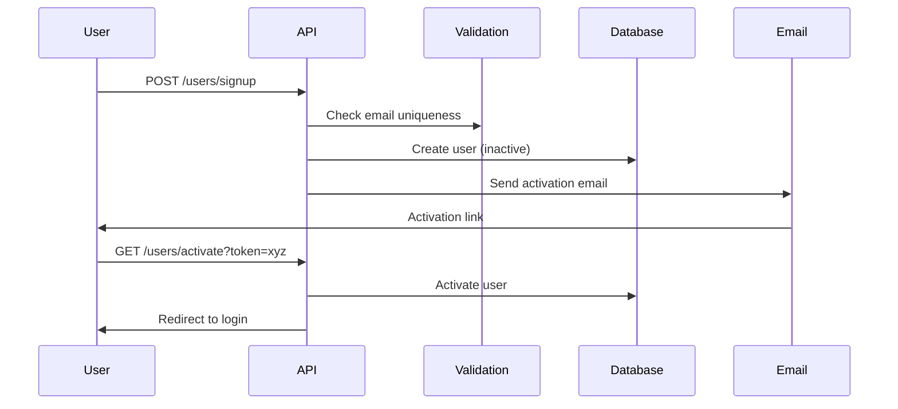
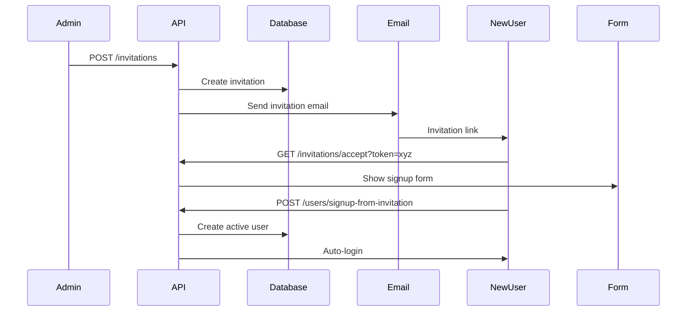

# User Management Feature Documentation

## Overview

The User Management feature provides comprehensive user administration capabilities for n8n, including user creation, role assignment, permissions management, team organization, and user lifecycle management. It supports both community and enterprise user management scenarios.

## Core Concepts

### User Types
1. **Owner**: Instance administrator with full permissions
2. **Admin**: Administrative privileges, user management
3. **Member**: Standard user with workflow access
4. **Guest**: Limited access, read-only permissions

### Organization Structure
- **Users**: Individual user accounts
- **Roles**: Permission sets assigned to users
- **Projects**: Team workspaces for collaboration
- **Invitations**: User onboarding mechanism

## Architecture

### Component Structure
```
user-management/
├── users.controller.ts         # User API endpoints
├── user.service.ts             # User business logic
├── role.service.ts             # Role management
├── invitation.controller.ts    # Invitation handling
├── me.controller.ts            # Current user operations
├── user.repository.ts          # Database operations
└── email/                      # Email notifications
    ├── user-management-mailer.ts
    └── templates/
```

### Data Model

```mermaid
erDiagram
    User {
        string id PK
        string email UK
        string firstName
        string lastName
        string password
        boolean isOwner
        string role
        boolean mfaEnabled
        timestamp createdAt
        timestamp lastLoginAt
    }

    Role {
        string id PK
        string name UK
        string scope
        json permissions
    }

    UserSettings {
        string userId FK
        json settings
        timestamp updatedAt
    }

    ProjectUser {
        string userId FK
        string projectId FK
        string role
    }

    User ||--|| UserSettings : has
    User }o--|| Role : assigned
    User }o--o{ ProjectUser : belongs to
```

## Key Features

### 1. User Lifecycle Management
- User registration and onboarding
- Account activation via email
- Password management and reset
- Account suspension and deletion
- User profile management

### 2. Role-Based Access Control
- Predefined roles (Owner, Admin, Member, Guest)
- Custom role creation (Enterprise)
- Granular permissions
- Role inheritance

### 3. Invitation System
- Email invitations
- Invitation links with expiry
- Bulk invitations
- Onboarding workflows

### 4. User Settings
- Personal preferences
- Notification settings
- UI customization
- API key management

## API Reference

### User Management Endpoints

| Method | Endpoint | Description |
|--------|----------|-------------|
| GET | `/users` | List all users |
| POST | `/users` | Create new user |
| GET | `/users/:id` | Get user details |
| PATCH | `/users/:id` | Update user |
| DELETE | `/users/:id` | Delete user |
| POST | `/users/:id/reinvite` | Resend invitation |
| PATCH | `/users/:id/role` | Change user role |

### Current User Endpoints

```
GET    /me                  # Current user info
PATCH  /me                  # Update profile
PATCH  /me/password         # Change password
PATCH  /me/settings         # Update settings
GET    /me/api-keys         # List API keys
POST   /me/api-keys         # Create API key
DELETE /me/api-keys/:id     # Delete API key
```

### Invitation Endpoints

```
GET    /invitations         # List invitations
POST   /invitations         # Create invitation
POST   /invitations/accept  # Accept invitation
DELETE /invitations/:id     # Cancel invitation
```

## Configuration

### Environment Variables

```bash
# User management settings
N8N_USER_MANAGEMENT_DISABLED=false
N8N_USER_MANAGEMENT_ALLOW_SIGNUP=true
N8N_USER_MANAGEMENT_SMTP_SETUP=true

# Email configuration
N8N_EMAIL_MODE=smtp
N8N_SMTP_HOST=smtp.example.com
N8N_SMTP_PORT=587
N8N_SMTP_USER=notifications@example.com
N8N_SMTP_PASS=password
N8N_SMTP_SECURE=true
N8N_SMTP_FROM="n8n <notifications@example.com>"

# User limits
N8N_USER_MANAGEMENT_MAX_USERS=100
N8N_USER_MANAGEMENT_MAX_SESSIONS_PER_USER=5

# Password policy
N8N_USER_MANAGEMENT_PASSWORD_MIN_LENGTH=8
N8N_USER_MANAGEMENT_PASSWORD_REQUIRE_UPPERCASE=true
N8N_USER_MANAGEMENT_PASSWORD_REQUIRE_NUMBER=true
```

## Role Management

### Default Roles

```typescript
enum UserRole {
  OWNER = 'owner',        // Full system access
  ADMIN = 'admin',        // User management, settings
  MEMBER = 'member',      // Create/edit own workflows
  GUEST = 'guest'         // Read-only access
}
```

### Permission Matrix

| Permission | Owner | Admin | Member | Guest |
|------------|-------|-------|--------|-------|
| Manage Users | ✅ | ✅ | ❌ | ❌ |
| Manage Instance | ✅ | ❌ | ❌ | ❌ |
| Create Workflows | ✅ | ✅ | ✅ | ❌ |
| Edit All Workflows | ✅ | ✅ | ❌ | ❌ |
| Execute Workflows | ✅ | ✅ | ✅ | ❌ |
| View All Workflows | ✅ | ✅ | ✅ | ✅ |
| Manage Credentials | ✅ | ✅ | ✅ | ❌ |
| Access API | ✅ | ✅ | ✅ | ❌ |

### Custom Roles (Enterprise)

```typescript
interface CustomRole {
  id: string;
  name: string;
  description: string;
  permissions: {
    workflows: ['create', 'read', 'update', 'delete', 'execute'];
    credentials: ['create', 'read', 'update', 'delete'];
    users: ['invite', 'read', 'update', 'delete'];
    settings: ['read', 'update'];
  };
}
```

## User Onboarding

### Registration Flow



### Invitation Flow



## Email Templates

### Invitation Email

```html
Subject: You've been invited to join n8n

Hello {{firstName}},

{{inviterName}} has invited you to join their n8n instance.

Click here to accept: {{invitationUrl}}

This invitation expires in {{expiryDays}} days.
```

### Password Reset Email

```html
Subject: Reset your n8n password

Hello {{firstName}},

Click here to reset your password: {{resetUrl}}

This link expires in 24 hours.

If you didn't request this, please ignore this email.
```

## Security Considerations

### Password Security

```typescript
// Password hashing
import bcrypt from 'bcrypt';

const hashPassword = async (password: string): Promise<string> => {
  const saltRounds = 10;
  return bcrypt.hash(password, saltRounds);
};

// Password validation
const validatePassword = (password: string): boolean => {
  const minLength = 8;
  const hasUppercase = /[A-Z]/.test(password);
  const hasNumber = /\d/.test(password);
  const hasSpecial = /[!@#$%^&*]/.test(password);

  return password.length >= minLength &&
         hasUppercase &&
         hasNumber &&
         hasSpecial;
};
```

### Session Management

```typescript
// Session configuration
{
  maxSessions: 5,          // Per user
  sessionTimeout: '24h',   // Idle timeout
  absoluteTimeout: '7d',   // Maximum duration
  renewalThreshold: '1h'   // Renew before expiry
}
```

## Best Practices

### User Management
1. **Strong passwords**: Enforce password complexity
2. **Email verification**: Always verify email addresses
3. **Role minimization**: Grant minimal required permissions
4. **Regular audits**: Review user access periodically
5. **Deactivation**: Disable rather than delete users

### Security
1. **MFA enforcement**: Require for admin accounts
2. **Session limits**: Prevent session proliferation
3. **Password rotation**: Regular password changes
4. **Audit logging**: Track all user actions
5. **IP restrictions**: Limit access by IP range

## Troubleshooting

### Common Issues

#### User Can't Login
```sql
-- Check user status
SELECT id, email, is_active, last_login_at
FROM user
WHERE email = 'user@example.com';

-- Reset password manually
UPDATE user
SET password = '$2b$10$...' -- Hashed password
WHERE email = 'user@example.com';
```

#### Email Not Sending
```bash
# Test SMTP configuration
echo $N8N_SMTP_HOST
echo $N8N_SMTP_PORT

# Test email sending
curl -X POST http://localhost:5678/rest/users/test-email \
  -H "Content-Type: application/json" \
  -d '{"email": "test@example.com"}'
```

#### Permission Denied
```javascript
// Check user permissions
const user = await userService.findOne(userId);
const permissions = await roleService.getPermissions(user.role);
console.log('User permissions:', permissions);
```

## Migration

### Bulk User Import

```typescript
// CSV import example
import { parse } from 'csv-parse';

async function importUsers(csvPath: string) {
  const users = await parseCsv(csvPath);

  for (const userData of users) {
    await userService.create({
      email: userData.email,
      firstName: userData.firstName,
      lastName: userData.lastName,
      role: userData.role || 'member',
      password: generateTempPassword()
    });

    await invitationService.sendWelcomeEmail(userData.email);
  }
}
```

---

**Last Updated**: 2025-11-10
**Version**: 1.0.0
**BMAD Compliance**: ✅ Complete