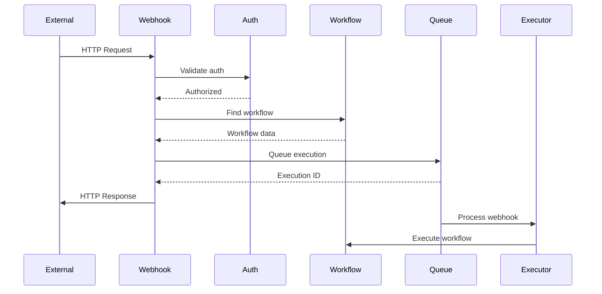

# Webhooks Feature Documentation

## Overview

The Webhooks feature enables n8n workflows to be triggered by external HTTP requests. It provides a robust webhook receiver system with support for various HTTP methods, authentication mechanisms, response handling, and real-time webhook processing.

## Core Concepts

### Webhook Types
1. **Production Webhooks**: Always-on endpoints for live workflows
2. **Test Webhooks**: Temporary endpoints for development
3. **Form Webhooks**: Special handling for form submissions
4. **Wait Webhooks**: Pause workflow execution until webhook received

### URL Structure
```
Production: https://your-instance/webhook/[webhook-id]
Test: https://your-instance/webhook-test/[webhook-id]
Wait: https://your-instance/webhook-waiting/[execution-id]
```

## Architecture

### Component Structure
```
webhooks/
├── webhook.controller.ts       # HTTP endpoint handling
├── webhook.service.ts          # Business logic
├── webhook-helpers.ts          # Utility functions
├── test-webhooks.ts           # Test webhook management
├── waiting-webhooks.ts        # Wait webhook handling
└── webhook.types.ts           # Type definitions
```

### Request Flow



## Key Features

### 1. Webhook Management
- Automatic URL generation
- Multiple webhooks per workflow
- Dynamic path parameters
- Query parameter handling

### 2. Authentication Methods
- No authentication (public)
- Basic authentication
- Header authentication
- Query authentication
- Custom validation in workflow

### 3. Request Handling
- All HTTP methods (GET, POST, PUT, DELETE, etc.)
- File upload support
- Binary data handling
- Large payload support
- Request body parsing (JSON, form, raw)

### 4. Response Management
- Immediate response (async execution)
- Wait for completion (sync execution)
- Custom response codes
- Response headers
- Binary response data

## API Reference

### Webhook Endpoints

| Method | Endpoint | Description |
|--------|----------|-------------|
| * | `/webhook/:id` | Production webhook |
| * | `/webhook-test/:id` | Test webhook |
| * | `/webhook/:id/*` | Webhook with path |
| GET | `/webhook-waiting/:id` | Waiting webhook |
| OPTIONS | `/webhook/:id` | CORS preflight |

### Webhook Node Configuration

```typescript
interface IWebhookNode {
  webhookId: string;
  path: string;
  method: string;
  authentication: 'none' | 'basicAuth' | 'headerAuth';
  responseMode: 'onReceived' | 'lastNode' | 'responseNode';
  responseCode: number;
  responseHeaders: Record<string, string>;
  responseBinaryPropertyName?: string;
}
```

## Configuration

### Environment Variables

```bash
# Webhook URL configuration
N8N_WEBHOOK_URL=https://your-instance.com
N8N_WEBHOOK_TEST_URL=https://test.your-instance.com

# Webhook settings
N8N_WEBHOOK_TIMEOUT=120
N8N_PAYLOAD_SIZE_MAX=16MB
N8N_DISABLE_PRODUCTION_WEBHOOKS=false

# Tunnel for local development
N8N_TUNNEL_WEBHOOK=true
```

### Security Configuration

```typescript
// Basic authentication
{
  authentication: 'basicAuth',
  credentials: {
    user: 'webhook_user',
    password: 'secure_password'
  }
}

// Header authentication
{
  authentication: 'headerAuth',
  headerName: 'X-Webhook-Secret',
  headerValue: 'secret_token'
}
```

## Response Modes

### 1. On Received
```javascript
// Immediate response
{
  responseMode: 'onReceived',
  responseData: {
    status: 'received'
  }
}
```

### 2. Last Node
```javascript
// Response from last node
{
  responseMode: 'lastNode',
  // Waits for workflow completion
  // Returns last node output
}
```

### 3. Response Node
```javascript
// Custom response node
{
  responseMode: 'responseNode',
  // Uses dedicated response node
  // Allows complex response logic
}
```

## File Upload Handling

### Form Data Processing
```typescript
// Handle multipart form data
const formData = {
  fields: req.body,
  files: req.files.map(file => ({
    fieldname: file.fieldname,
    originalname: file.originalname,
    mimetype: file.mimetype,
    buffer: file.buffer,
    size: file.size
  }))
};
```

### Binary Data
```typescript
// Process binary uploads
{
  binaryPropertyName: 'uploadedFile',
  binaryData: {
    data: Buffer,
    mimeType: 'image/png',
    fileName: 'upload.png'
  }
}
```

## Testing Webhooks

### Test Mode

```bash
# Enable test webhooks
curl -X GET https://your-instance/webhook-test/test-id

# Test webhook expires after
# - 120 seconds of inactivity
# - Workflow saved
# - Test stopped manually
```

### Development Tunnel

```bash
# Local development with tunnel
N8N_TUNNEL_WEBHOOK=true pnpm dev

# Provides public URL for testing
# Example: https://abc123.hooks.n8n.cloud
```

## Best Practices

### Security
1. **Authentication**: Always use authentication for production webhooks
2. **HTTPS**: Use HTTPS in production
3. **Rate limiting**: Implement rate limits
4. **Validation**: Validate incoming data
5. **Secrets**: Use environment variables for secrets

### Performance
1. **Async processing**: Use 'onReceived' for long workflows
2. **Payload limits**: Set appropriate size limits
3. **Timeout handling**: Configure reasonable timeouts
4. **Error responses**: Return proper error codes
5. **Caching**: Cache webhook configuration

### Reliability
1. **Idempotency**: Make webhooks idempotent
2. **Retry logic**: Handle webhook retries
3. **Logging**: Log all webhook activity
4. **Monitoring**: Alert on webhook failures
5. **Backup**: Alternative trigger methods

## Troubleshooting

### Common Issues

#### Webhook Not Triggering
```bash
# Check webhook URL
curl -X POST https://your-instance/webhook/webhook-id \
  -H "Content-Type: application/json" \
  -d '{"test": "data"}'

# Check workflow is active
# Check authentication if configured
```

#### Response Timeout
```javascript
// Increase timeout
process.env.N8N_WEBHOOK_TIMEOUT = '300';

// Or use async response
responseMode: 'onReceived'
```

#### Large Payloads
```bash
# Increase payload limit
N8N_PAYLOAD_SIZE_MAX=32MB

# Or use binary data handling
# Stream large files instead
```

## Integration Examples

### GitHub Webhook
```json
{
  "path": "github",
  "method": "POST",
  "authentication": "headerAuth",
  "headerName": "X-Hub-Signature-256",
  "responseMode": "onReceived"
}
```

### Stripe Webhook
```json
{
  "path": "stripe",
  "method": "POST",
  "authentication": "headerAuth",
  "headerName": "Stripe-Signature",
  "responseMode": "onReceived"
}
```

### Form Submission
```json
{
  "path": "contact-form",
  "method": "POST",
  "authentication": "none",
  "responseMode": "lastNode",
  "responseHeaders": {
    "Access-Control-Allow-Origin": "*"
  }
}
```

---

**Last Updated**: 2025-11-10
**Version**: 1.0.0
**BMAD Compliance**: ✅ Complete