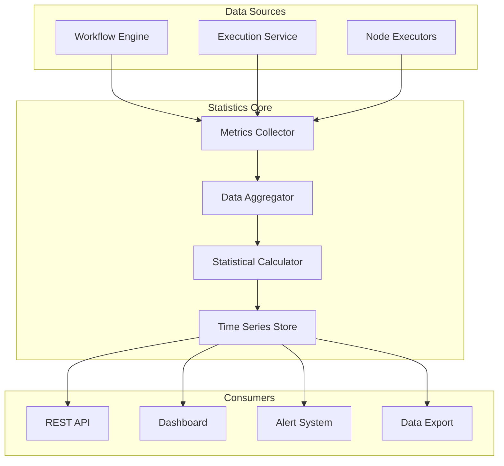

# Workflow Statistics Module

## Overview

The Workflow Statistics module collects, aggregates, and provides analytics for workflow executions in n8n. It tracks performance metrics, success rates, error patterns, and usage trends to give insights into workflow health and optimization opportunities.

**Module Path**: `packages/cli/src/workflow-statistics/`

## Core Components

### 1. Statistics Service
- **Purpose**: Main service for statistics collection and aggregation
- **Key Features**:
  - Real-time metrics collection
  - Time-series data aggregation
  - Statistical calculations (mean, median, percentiles)
  - Trend analysis and anomaly detection

### 2. Metrics Collector
- **Purpose**: Gather execution metrics from workflow engine
- **Key Features**:
  - Execution duration tracking
  - Node performance profiling
  - Resource usage monitoring
  - Error rate calculation

### 3. Data Aggregator
- **Purpose**: Process and aggregate raw metrics
- **Key Features**:
  - Hourly/daily/weekly aggregation
  - Rolling window calculations
  - Percentile computations
  - Data compression for storage

## Architecture



## Metrics Tracked

### Execution Metrics
```typescript
interface ExecutionMetrics {
  workflowId: string;
  executionId: string;
  startTime: Date;
  endTime: Date;
  duration: number;
  status: 'success' | 'error' | 'crashed';
  mode: 'manual' | 'trigger' | 'webhook';
  nodeCount: number;
  itemsProcessed: number;
  memoryUsage: number;
  cpuUsage: number;
}
```

### Aggregated Statistics
```typescript
interface WorkflowStatistics {
  workflowId: string;
  period: 'hour' | 'day' | 'week' | 'month';
  timestamp: Date;

  executions: {
    total: number;
    successful: number;
    failed: number;
    crashed: number;
    successRate: number;
  };

  performance: {
    avgDuration: number;
    medianDuration: number;
    p95Duration: number;
    p99Duration: number;
    minDuration: number;
    maxDuration: number;
  };

  throughput: {
    itemsProcessed: number;
    avgItemsPerExecution: number;
    processingRate: number; // items/second
  };

  resources: {
    avgMemoryMB: number;
    peakMemoryMB: number;
    avgCpuPercent: number;
  };
}
```

## API Endpoints

### Get Workflow Statistics
```http
GET /api/v1/statistics/workflows/{workflowId}
  ?period=day
  &from=2025-01-01
  &to=2025-01-31
  &granularity=hour

Response:
{
  "workflowId": "workflow_123",
  "statistics": [
    {
      "timestamp": "2025-01-01T00:00:00Z",
      "executions": { ... },
      "performance": { ... },
      "throughput": { ... }
    }
  ]
}
```

### Get Global Statistics
```http
GET /api/v1/statistics/global
  ?period=week

Response:
{
  "totalWorkflows": 150,
  "totalExecutions": 50000,
  "successRate": 94.5,
  "topWorkflows": [...],
  "errorPatterns": [...]
}
```

## Real-time Monitoring

### WebSocket Stream
```typescript
// Subscribe to real-time statistics
ws.send(JSON.stringify({
  type: 'subscribe',
  channel: 'statistics',
  workflowIds: ['workflow_123', 'workflow_456']
}));

// Receive updates
ws.on('message', (data) => {
  const update = JSON.parse(data);
  if (update.type === 'statistics') {
    updateDashboard(update.metrics);
  }
});
```

## Data Retention

### Retention Policies
```typescript
const retentionPolicies = {
  raw: 7,        // 7 days for raw metrics
  hourly: 30,    // 30 days for hourly aggregates
  daily: 365,    // 1 year for daily aggregates
  monthly: -1    // Forever for monthly aggregates
};
```

## Performance Optimization

### Data Sampling
```typescript
// Sample high-frequency workflows
const samplingRates = {
  default: 1.0,        // 100% sampling
  highFrequency: 0.1,  // 10% for >100 exec/hour
  veryHigh: 0.01      // 1% for >1000 exec/hour
};
```

### Batch Processing
```typescript
// Batch insert metrics for efficiency
async function batchInsertMetrics(metrics: ExecutionMetrics[]) {
  const batches = chunk(metrics, 1000);

  for (const batch of batches) {
    await statisticsStore.insertBatch(batch);
  }
}
```

## Alerting

### Alert Conditions
```typescript
interface AlertRule {
  id: string;
  workflowId: string;
  condition: {
    metric: 'errorRate' | 'duration' | 'throughput';
    operator: '>' | '<' | '==' | '!=';
    threshold: number;
    window: number; // minutes
  };
  actions: {
    email?: string[];
    webhook?: string;
    slack?: string;
  };
}
```

## Visualization

### Dashboard Components
- Execution timeline charts
- Success rate gauges
- Duration histograms
- Error heatmaps
- Resource usage graphs
- Top workflows tables

## Configuration

### Environment Variables
```bash
N8N_STATISTICS_ENABLED=true
N8N_STATISTICS_SAMPLING_RATE=1.0
N8N_STATISTICS_RETENTION_DAYS_RAW=7
N8N_STATISTICS_RETENTION_DAYS_AGGREGATED=365
N8N_STATISTICS_BATCH_SIZE=1000
```

## Best Practices

1. **Use appropriate sampling** for high-frequency workflows
2. **Set retention policies** based on storage capacity
3. **Monitor aggregation performance** and adjust batch sizes
4. **Create meaningful alerts** based on SLOs
5. **Export critical metrics** to external monitoring systems