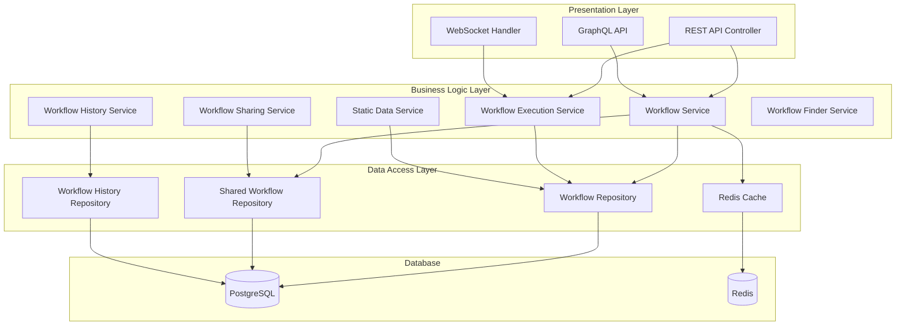
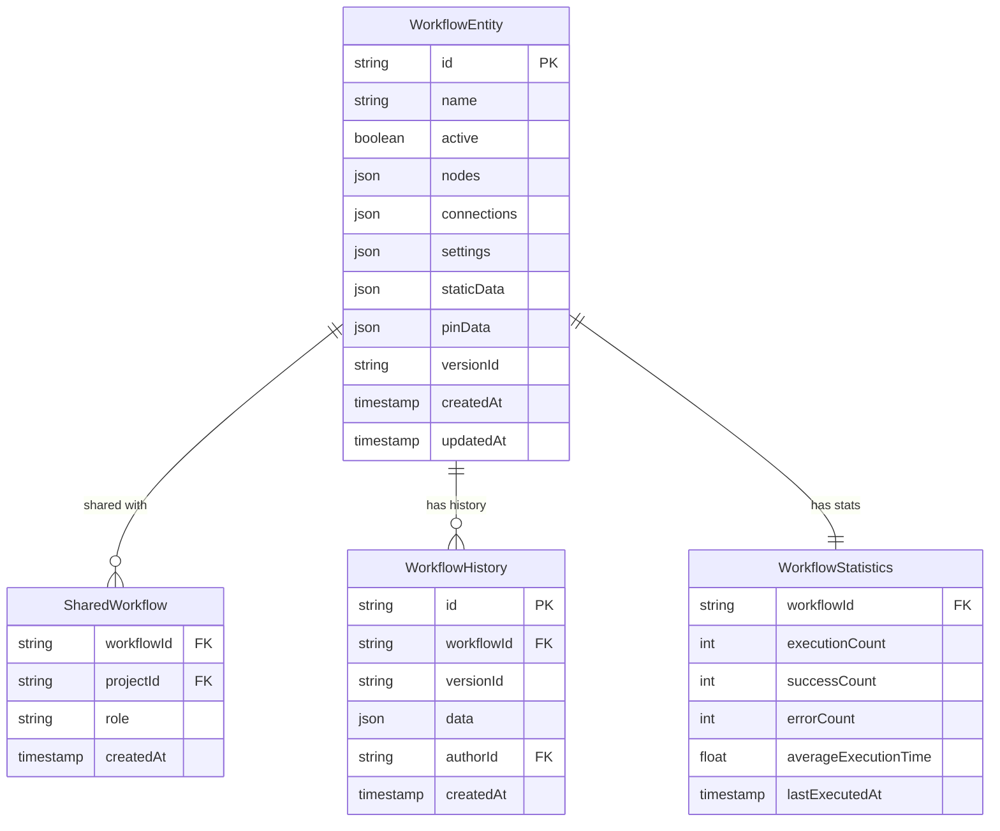
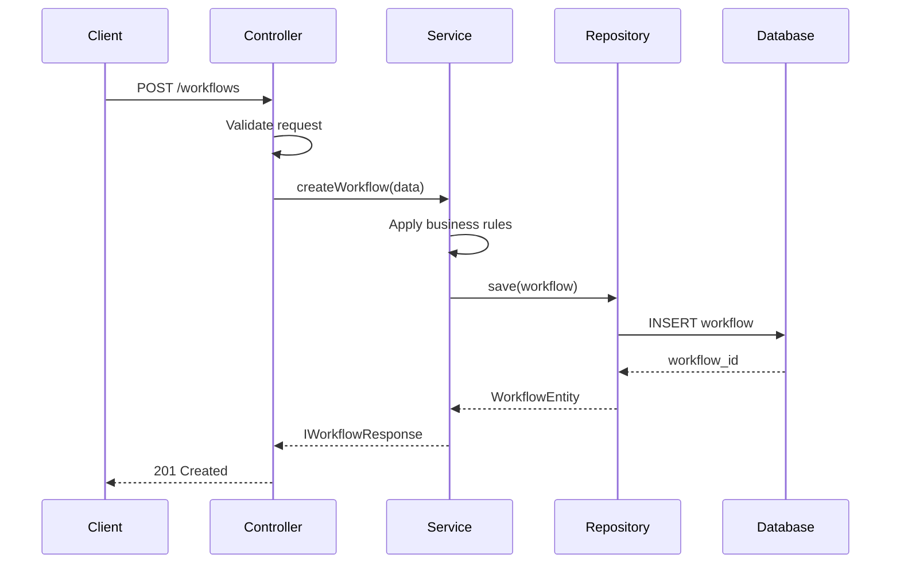
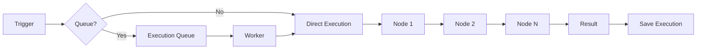
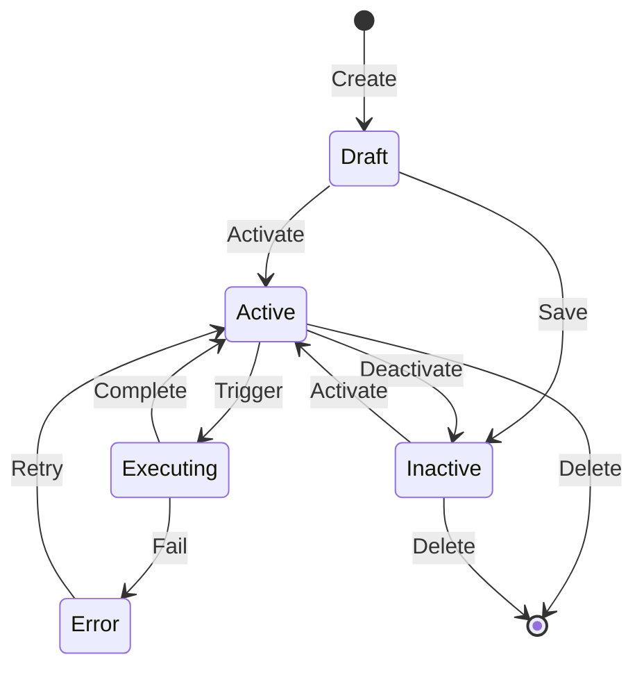
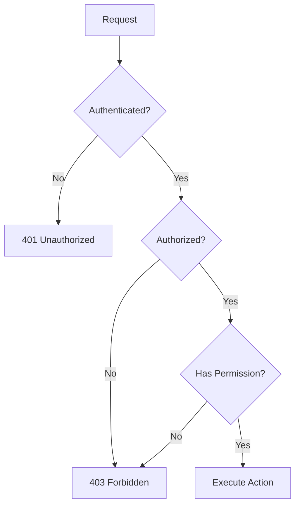
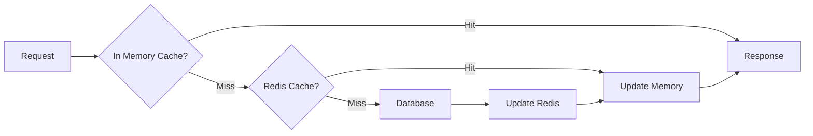
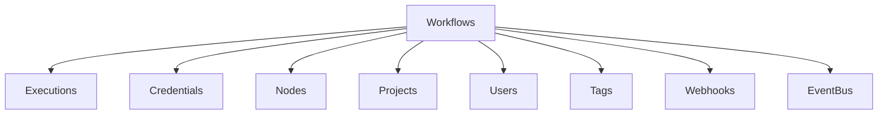

# Workflows Feature Architecture

## Overview

The Workflows feature implements a comprehensive workflow management system using a layered architecture pattern with clear separation of concerns. It follows Domain-Driven Design principles with distinct boundaries between presentation, business logic, and data persistence layers.

## System Architecture



## Component Architecture

### 1. Controller Layer (`workflows.controller.ts`)

**Responsibilities:**
- HTTP request handling and validation
- Request/response transformation
- Authentication and authorization checks
- Rate limiting and throttling

**Key Methods:**
```typescript
class WorkflowsController {
    create(req: WorkflowRequest.Create): Promise<IWorkflowResponse>
    update(req: WorkflowRequest.Update): Promise<IWorkflowResponse>
    delete(req: WorkflowRequest.Delete): Promise<void>
    getMany(req: WorkflowRequest.GetMany): Promise<IWorkflowResponse[]>
    getOne(req: WorkflowRequest.GetOne): Promise<IWorkflowResponse>
    activate(req: WorkflowRequest.Activate): Promise<IWorkflowResponse>
    deactivate(req: WorkflowRequest.Deactivate): Promise<IWorkflowResponse>
}
```

### 2. Service Layer

#### Workflow Service (`workflow.service.ts`)
**Core Business Logic:**
- Workflow CRUD operations
- Validation and business rules
- Workflow state management
- Tag and metadata handling

#### Workflow Execution Service (`workflow-execution.service.ts`)
**Execution Management:**
- Trigger workflow execution
- Handle execution modes (manual, scheduled, webhook)
- Manage execution context
- Error handling and retry logic

#### Workflow Sharing Service (`workflow-sharing.service.ts`)
**Collaboration Features:**
- Project assignment
- Permission management
- Ownership transfer
- Access control

#### Workflow History Service (`workflow-history.service.ee.ts`)
**Version Control (Enterprise):**
- Track changes
- Version comparison
- Rollback operations
- Audit logging

### 3. Repository Layer

**TypeORM Repositories:**
```typescript
interface WorkflowRepository {
    create(workflow: Partial<WorkflowEntity>): WorkflowEntity
    findOne(id: string): Promise<WorkflowEntity>
    findMany(filters: WorkflowFilters): Promise<WorkflowEntity[]>
    update(id: string, updates: Partial<WorkflowEntity>): Promise<void>
    delete(id: string): Promise<void>
}
```

## Data Model

### Core Entities



### Data Flow



## Workflow Execution Architecture

### Execution Flow



### Execution Modes

1. **Regular Mode**: Direct execution in main process
2. **Queue Mode**: Distributed execution via workers
3. **Webhook Mode**: Lightweight webhook processing

### State Management



## Security Architecture

### Authentication & Authorization



### Permission Model

```typescript
enum WorkflowPermission {
    READ = 'workflow:read',
    CREATE = 'workflow:create',
    UPDATE = 'workflow:update',
    DELETE = 'workflow:delete',
    EXECUTE = 'workflow:execute',
    SHARE = 'workflow:share'
}
```

### Credential Security

- Encrypted at rest using AES-256
- Decrypted only during execution
- Never exposed in API responses
- Audit logging for credential access

## Performance Optimization

### Caching Strategy



### Optimization Techniques

1. **Query Optimization**
   - Selective field loading
   - Eager loading for relations
   - Index optimization

2. **Caching Layers**
   - In-memory cache (LRU)
   - Redis distributed cache
   - CDN for static assets

3. **Async Processing**
   - Queue-based execution
   - Background job processing
   - Event-driven updates

## Integration Points

### Internal Integrations



### External Integrations

1. **Webhook System**: External triggers
2. **Public API**: Programmatic access
3. **CLI**: Command-line management
4. **Git Integration**: Version control sync
5. **External Secrets**: HashiCorp Vault, AWS Secrets Manager

## Error Handling

### Error Hierarchy

```typescript
class WorkflowError extends ApplicationError {
    ValidationError     // Invalid workflow structure
    ExecutionError      // Runtime execution failures
    PermissionError     // Access control violations
    ConcurrencyError    // Conflicting updates
    IntegrationError    // External service failures
}
```

### Recovery Strategies

1. **Automatic Retry**: Transient failures
2. **Error Workflows**: Custom error handling
3. **Dead Letter Queue**: Persistent failures
4. **Circuit Breaker**: External service protection

## Monitoring & Observability

### Metrics

```yaml
Workflow Metrics:
  - workflow.created.count
  - workflow.updated.count
  - workflow.deleted.count
  - workflow.activated.count
  - workflow.execution.started
  - workflow.execution.completed
  - workflow.execution.failed
  - workflow.execution.duration

Performance Metrics:
  - api.latency
  - database.query.duration
  - cache.hit.ratio
  - queue.depth
```

### Logging

```typescript
logger.info('Workflow created', {
    workflowId,
    userId,
    projectId,
    nodeCount,
    timestamp
});
```

### Tracing

- Distributed tracing with OpenTelemetry
- Request correlation IDs
- Execution timeline tracking

## Deployment Architecture

### Container Architecture

```yaml
services:
  n8n-main:
    image: n8n:latest
    environment:
      - EXECUTIONS_MODE=regular
    volumes:
      - workflows:/data

  n8n-worker:
    image: n8n:latest
    command: worker
    environment:
      - EXECUTIONS_MODE=queue
    scale: 3

  redis:
    image: redis:alpine

  postgres:
    image: postgres:14
```

### Scaling Strategy

1. **Vertical Scaling**: Increase resources for main instance
2. **Horizontal Scaling**: Add worker nodes for execution
3. **Database Scaling**: Read replicas, connection pooling
4. **Cache Scaling**: Redis cluster for high availability

## Future Architecture Considerations

### Planned Enhancements

1. **Event Sourcing**: Complete audit trail
2. **CQRS Pattern**: Separate read/write models
3. **GraphQL Federation**: Microservices architecture
4. **Serverless Execution**: Lambda/Functions support
5. **Multi-Region**: Geographic distribution

### Technical Debt

1. **Legacy File Storage**: Migrate to database-only
2. **Synchronous Operations**: Move to async where possible
3. **Monolithic Services**: Decompose into microservices
4. **Direct Database Access**: Implement repository pattern fully

## Architectural Decisions

### ADR-001: Database-First Storage
- **Decision**: Store workflows in database, not filesystem
- **Rationale**: Better querying, consistency, multi-user support
- **Consequences**: Migration complexity, backup strategy changes

### ADR-002: Queue-Based Execution
- **Decision**: Implement queue mode for scalability
- **Rationale**: Horizontal scaling, fault tolerance
- **Consequences**: Additional infrastructure, complexity

### ADR-003: Project-Based Organization
- **Decision**: Group workflows into projects
- **Rationale**: Enterprise requirements, team collaboration
- **Consequences**: Permission complexity, migration effort

---

**Document Version**: 1.0
**Last Updated**: 2025-11-10
**Architecture Review**: Pending
**Compliance**: BMAD Architecture Standards